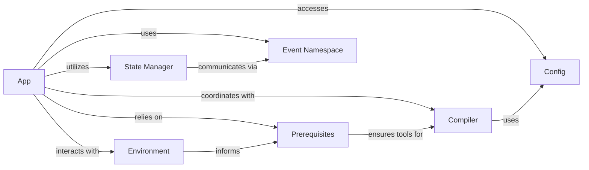

## Component Details

The Application Lifecycle Manager in Reflex is the central orchestrator, responsible for setting up, compiling, and serving the Reflex application. It ensures the development environment is correctly configured, manages application pages and routes, handles real-time communication, and integrates with the FastAPI backend.

### App
The App class (reflex.app.App) is the primary entry point for defining and managing a Reflex application. It registers pages, configures global styles and themes, sets up the FastAPI backend and Socket.IO for real-time communication, and orchestrates the compilation process. It acts as the central hub that ties together all other parts of the Reflex application's lifecycle.

**Related Classes/Methods**:

- <a href="https://github.com/reflex-dev/reflex/blob/master/reflex/app.py#L302-L1675" target="_blank" rel="noopener noreferrer">`reflex.app.App` (302:1675)</a>

### Environment
The Environment module (reflex.environment) manages the application's operational context. It provides utilities to determine the current mode (development/production), retrieve various file paths, and interpret environment variables that influence the application's behavior, such as hot reloading settings and socket configurations.

**Related Classes/Methods**:

- <a href="https://github.com/reflex-dev/reflex/blob/master/reflex/environment.py#L1-L1" target="_blank" rel="noopener noreferrer">`reflex.environment` (1:1)</a>

### Prerequisites
The Prerequisites module (reflex.utils.prerequisites) is a utility responsible for verifying and installing external dependencies (like Node.js, npm) and ensuring the system meets the necessary configurations for building and running the Reflex application. It plays a crucial role in setting up the development environment and validating system readiness.

**Related Classes/Methods**:

- <a href="https://github.com/reflex-dev/reflex/blob/master/reflex/utils/prerequisites.py#L1-L1" target="_blank" rel="noopener noreferrer">`reflex.utils.prerequisites` (1:1)</a>

### Compiler
The Compiler module (reflex.compiler.compiler) is responsible for transforming Python components and pages into their corresponding frontend (JavaScript/React) code. It handles the compilation of individual pages, stateful components, and the overall application structure, preparing them for deployment or development serving.

**Related Classes/Methods**:

- <a href="https://github.com/reflex-dev/reflex/blob/master/reflex/compiler/compiler.py#L1-L1" target="_blank" rel="noopener noreferrer">`reflex.compiler.compiler` (1:1)</a>

### State Manager
The State Manager (reflex.istate.manager.StateManager) is responsible for managing the application's state across different clients and sessions. It handles state updates, ensures data consistency, and facilitates the communication of state changes between the backend and frontend via Socket.IO.

**Related Classes/Methods**:

- <a href="https://github.com/reflex-dev/reflex/blob/master/reflex/istate/manager.py#L32-L103" target="_blank" rel="noopener noreferrer">`reflex.istate.manager.StateManager` (32:103)</a>

### Config
The Config module (reflex.config) manages the application's configuration settings. It loads and provides access to various parameters, such as database settings, API URLs, CORS origins, and compilation options, influencing how the application behaves and is built.

**Related Classes/Methods**:

- <a href="https://github.com/reflex-dev/reflex/blob/master/reflex/config.py#L1-L1" target="_blank" rel="noopener noreferrer">`reflex.config` (1:1)</a>

### Event Namespace
The Event Namespace (reflex.event.EventNamespace) is a Socket.IO namespace specifically designed to handle real-time events and updates between the backend and frontend. It processes incoming events from the client and emits state updates back to the connected clients.

**Related Classes/Methods**:

- <a href="https://github.com/reflex-dev/reflex/blob/master/reflex/event.py#L2180-L2306" target="_blank" rel="noopener noreferrer">`reflex.event.EventNamespace` (2180:2306)</a>

### [FAQ](https://github.com/CodeBoarding/GeneratedOnBoardings/tree/main?tab=readme-ov-file#faq)