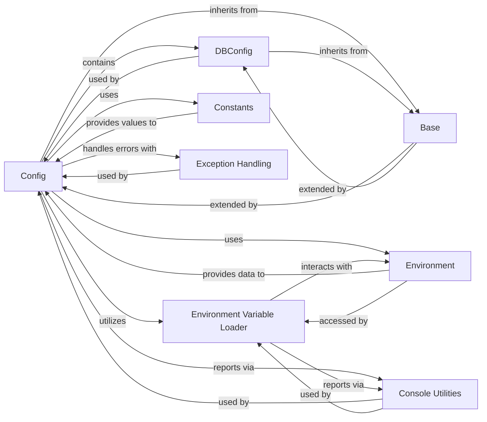

## Component Details

The `Configuration Manager` subsystem in `reflex` is primarily responsible for centralizing and managing all application-wide settings, ensuring consistency and providing a flexible way to configure the application. It handles everything from environment variables and database settings to various build and runtime parameters.

### Config
This is the core class of the Configuration Manager. It defines and holds all runtime settings for the Reflex application, such as API URLs, database configurations, and logging levels. It supports loading settings from an `rxconfig.py` file and allows overriding these settings via environment variables.

**Related Classes/Methods**:

- <a href="https://github.com/reflex-dev/reflex/blob/master/reflex/config.py#L176-L445" target="_blank" rel="noopener noreferrer">`reflex.config.Config` (176:445)</a>

### DBConfig
A specialized configuration component nested within the `Config` class, dedicated to managing database connection parameters. It provides methods to construct database URLs for different engines (e.g., PostgreSQL, SQLite).

**Related Classes/Methods**:

- <a href="https://github.com/reflex-dev/reflex/blob/master/reflex/config.py#L64-L169" target="_blank" rel="noopener noreferrer">`reflex.config.DBConfig` (64:169)</a>

### Environment Variable Loader
This refers to the internal functions (`_load_dotenv_from_str`, `_load_dotenv_from_env`) within `reflex/config.py` that are responsible for loading environment variables from `.env` files. This mechanism allows for externalizing and managing environment-specific configurations.

**Related Classes/Methods**:

- <a href="https://github.com/reflex-dev/reflex/blob/master/reflex/config.py#L35-L50" target="_blank" rel="noopener noreferrer">`reflex.config._load_dotenv_from_str` (35:50)</a>
- <a href="https://github.com/reflex-dev/reflex/blob/master/reflex/config.py#L53-L57" target="_blank" rel="noopener noreferrer">`reflex.config._load_dotenv_from_env` (53:57)</a>

### Base
The foundational class from which both `Config` and `DBConfig` inherit. It provides common utilities and likely integrates Pydantic for robust data validation and serialization of configuration objects.

**Related Classes/Methods**:

- <a href="https://github.com/reflex-dev/reflex/blob/master/reflex/base.py#L5-L46" target="_blank" rel="noopener noreferrer">`reflex.base.Base` (5:46)</a>

### Environment
This module is responsible for interpreting and managing environment-specific variables. The `Config` class leverages this to process environment variable overrides for its settings.

**Related Classes/Methods**:

- <a href="https://github.com/reflex-dev/reflex/blob/master/reflex/environment.py#L0-L0" target="_blank" rel="noopener noreferrer">`reflex.environment` (0:0)</a>

### Constants
A module providing predefined constant values used across the Reflex framework, including those relevant to configuration, such as default paths or log levels. The `Config` class utilizes these constants.

**Related Classes/Methods**:

- <a href="https://github.com/reflex-dev/reflex/blob/master/reflex/reflex.py#L0-L0" target="_blank" rel="noopener noreferrer">`reflex.constants` (0:0)</a>
- <a href="https://github.com/reflex-dev/reflex/blob/master/reflex/reflex.py#L0-L0" target="_blank" rel="noopener noreferrer">`reflex.constants` (0:0)</a>

### Console Utilities
A utility module for printing messages to the console, including errors and warnings. The Configuration Manager uses this for reporting issues, such as missing dependencies for `.env` file loading.

**Related Classes/Methods**:

- <a href="https://github.com/reflex-dev/reflex/blob/master/reflex/utils/console.py#L0-L0" target="_blank" rel="noopener noreferrer">`reflex.utils.console` (0:0)</a>

### Exception Handling
This module defines custom exception types for the Reflex framework. The Configuration Manager uses it to raise specific errors (e.g., `ConfigError`) when configuration issues are detected.

**Related Classes/Methods**:

- <a href="https://github.com/reflex-dev/reflex/blob/master/reflex/utils/exceptions.py#L0-L0" target="_blank" rel="noopener noreferrer">`reflex.utils.exceptions` (0:0)</a>
- <a href="https://github.com/reflex-dev/reflex/blob/master/reflex/utils/exceptions.py#L14-L15" target="_blank" rel="noopener noreferrer">`reflex.utils.exceptions.ConfigError` (14:15)</a>

### [FAQ](https://github.com/CodeBoarding/GeneratedOnBoardings/tree/main?tab=readme-ov-file#faq)