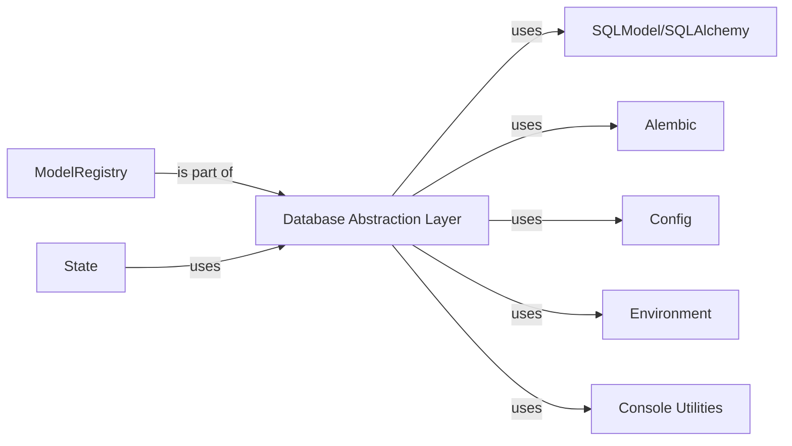

## Component Details

Abstract Components Overview

### Database Abstraction Layer
The central component responsible for abstracting database interactions. It manages the creation of synchronous and asynchronous database engines, handles session factories, and provides methods for checking database status. It acts as the primary interface for Reflex applications to interact with the underlying database.

**Related Classes/Methods**:

- <a href="https://github.com/reflex-dev/reflex/blob/master/reflex/model.py#L0-L0" target="_blank" rel="noopener noreferrer">`reflex.model` (0:0)</a>
- `sqlmodel.create_engine` (0:0)
- `sqlalchemy.ext.asyncio.create_async_engine` (0:0)
- `alembic` (0:0)
- <a href="https://github.com/reflex-dev/reflex/blob/master/reflex/config.py#L0-L0" target="_blank" rel="noopener noreferrer">`reflex.config.Config.db_url` (0:0)</a>
- <a href="https://github.com/reflex-dev/reflex/blob/master/reflex/config.py#L0-L0" target="_blank" rel="noopener noreferrer">`reflex.config.Config.async_db_url` (0:0)</a>
- <a href="https://github.com/reflex-dev/reflex/blob/master/reflex/environment.py#L0-L0" target="_blank" rel="noopener noreferrer">`reflex.environment.SQLALCHEMY_ECHO` (0:0)</a>
- <a href="https://github.com/reflex-dev/reflex/blob/master/reflex/environment.py#L0-L0" target="_blank" rel="noopener noreferrer">`reflex.environment.SQLALCHEMY_POOL_PRE_PING` (0:0)</a>
- <a href="https://github.com/reflex-dev/reflex/blob/master/reflex/model.py#L169-L243" target="_blank" rel="noopener noreferrer">`reflex.model.ModelRegistry` (169:243)</a>

### SQLModel/SQLAlchemy
External Python libraries that provide Object Relational Mapping (ORM) capabilities. `SQLModel` builds on `SQLAlchemy` and `Pydantic`, allowing developers to define database tables as Python classes with type hints. These libraries are used by the `Database Abstraction Layer` for defining models, creating database engines, and performing CRUD (Create, Read, Update, Delete) operations.

**Related Classes/Methods**:

- `sqlmodel` (0:0)
- `sqlalchemy` (0:0)

### Alembic
An external library integrated with `SQLAlchemy` for database schema migrations. The `Database Abstraction Layer` uses Alembic to manage changes to the database schema over time, ensuring that the database structure remains consistent with the defined models.

**Related Classes/Methods**:

- `alembic` (0:0)

### Config
This component provides global configuration settings for the Reflex application, including the database connection URL (`db_url` and `async_db_url`). The `Database Abstraction Layer` retrieves these settings to establish connections to the database.

**Related Classes/Methods**:

- <a href="https://github.com/reflex-dev/reflex/blob/master/reflex/config.py#L0-L0" target="_blank" rel="noopener noreferrer">`reflex.config` (0:0)</a>
- <a href="https://github.com/reflex-dev/reflex/blob/master/reflex/config.py#L0-L0" target="_blank" rel="noopener noreferrer">`reflex.config.Config.db_url` (0:0)</a>
- <a href="https://github.com/reflex-dev/reflex/blob/master/reflex/config.py#L0-L0" target="_blank" rel="noopener noreferrer">`reflex.config.Config.async_db_url` (0:0)</a>

### Environment
This component provides access to environment-specific settings, such as `SQLALCHEMY_ECHO` (for logging SQL queries) and `SQLALCHEMY_POOL_PRE_PING` (for checking connection health). These settings influence how the database engines are configured.

**Related Classes/Methods**:

- <a href="https://github.com/reflex-dev/reflex/blob/master/reflex/environment.py#L0-L0" target="_blank" rel="noopener noreferrer">`reflex.environment` (0:0)</a>
- <a href="https://github.com/reflex-dev/reflex/blob/master/reflex/environment.py#L0-L0" target="_blank" rel="noopener noreferrer">`reflex.environment.SQLALCHEMY_ECHO` (0:0)</a>
- <a href="https://github.com/reflex-dev/reflex/blob/master/reflex/environment.py#L0-L0" target="_blank" rel="noopener noreferrer">`reflex.environment.SQLALCHEMY_POOL_PRE_PING` (0:0)</a>

### Console Utilities
A utility module used for printing warnings and informational messages to the console, particularly when the database is not initialized or when there are potential configuration issues.

**Related Classes/Methods**:

- <a href="https://github.com/reflex-dev/reflex/blob/master/reflex/utils/console.py#L0-L0" target="_blank" rel="noopener noreferrer">`reflex.utils.console` (0:0)</a>

### ModelRegistry
An inner class within `reflex.model.py` responsible for registering and keeping track of all `SQLModel` or `SQLAlchemy` declarative base models defined in the Reflex application. This registry is crucial for Alembic to discover models for migrations and for the application to interact with its defined data structures.

**Related Classes/Methods**:

- <a href="https://github.com/reflex-dev/reflex/blob/master/reflex/model.py#L169-L243" target="_blank" rel="noopener noreferrer">`reflex.model.ModelRegistry` (169:243)</a>

### State
The core component that defines and manages the application's dynamic data. It holds variables, computed properties, and event handlers. `State` instances are responsible for tracking changes, handling user interactions, and orchestrating updates across the application. It supports hierarchical state management (parent and substates) and integrates with the `Model` component (part of the Database Abstraction Layer) to define data structures that can be persisted to the database. It also handles serialization and deserialization for persistence (e.g., with Redis).

**Related Classes/Methods**:

- <a href="https://github.com/reflex-dev/reflex/blob/master/reflex/state.py#L301-L2295" target="_blank" rel="noopener noreferrer">`reflex.state.BaseState` (301:2295)</a>
- <a href="https://github.com/reflex-dev/reflex/blob/master/reflex/state.py#L175-L250" target="_blank" rel="noopener noreferrer">`reflex.state.EventHandlerSetVar` (175:250)</a>
- <a href="https://github.com/reflex-dev/reflex/blob/master/reflex/event.py#L60-L83" target="_blank" rel="noopener noreferrer">`reflex.event.Event` (60:83)</a>
- <a href="https://github.com/reflex-dev/reflex/blob/master/reflex/event.py#L172-L295" target="_blank" rel="noopener noreferrer">`reflex.event.EventHandler` (172:295)</a>
- <a href="https://github.com/reflex-dev/reflex/blob/master/reflex/model.py#L246-L504" target="_blank" rel="noopener noreferrer">`reflex.model.Model` (246:504)</a>
- <a href="https://github.com/reflex-dev/reflex/blob/master/reflex/istate/proxy.py#L343-L685" target="_blank" rel="noopener noreferrer">`reflex.istate.proxy.MutableProxy` (343:685)</a>
- <a href="https://github.com/reflex-dev/reflex/blob/master/reflex/istate/proxy.py#L32-L310" target="_blank" rel="noopener noreferrer">`reflex.istate.proxy.StateProxy` (32:310)</a>
- <a href="https://github.com/reflex-dev/reflex/blob/master/reflex/istate/storage.py#L9-L20" target="_blank" rel="noopener noreferrer">`reflex.istate.storage.ClientStorageBase` (9:20)</a>
- <a href="https://github.com/reflex-dev/reflex/blob/master/reflex/reflex.py#L63-L72" target="_blank" rel="noopener noreferrer">`reflex.vars.Var` (63:72)</a>
- <a href="https://github.com/reflex-dev/reflex/blob/master/reflex/reflex.py#L65-L72" target="_blank" rel="noopener noreferrer">`reflex.vars.ComputedVar` (65:72)</a>
- <a href="https://github.com/reflex-dev/reflex/blob/master/reflex/reflex.py#L66-L72" target="_blank" rel="noopener noreferrer">`reflex.vars.DynamicRouteVar` (66:72)</a>
- <a href="https://github.com/reflex-dev/reflex/blob/master/reflex/reflex.py#L1286-L1286" target="_blank" rel="noopener noreferrer">`reflex.constants.ROUTER_DATA` (1286:1286)</a>
- <a href="https://github.com/reflex-dev/reflex/blob/master/reflex/environment.py#L358-L363" target="_blank" rel="noopener noreferrer">`reflex.environment.PerformanceMode` (358:363)</a>
- <a href="https://github.com/reflex-dev/reflex/blob/master/reflex/environment.py#L32-L32" target="_blank" rel="noopener noreferrer">`reflex.environment.environment` (32:32)</a>
- <a href="https://github.com/reflex-dev/reflex/blob/master/reflex/utils/console.py#L45-L45" target="_blank" rel="noopener noreferrer">`reflex.utils.console` (45:45)</a>
- <a href="https://github.com/reflex-dev/reflex/blob/master/reflex/utils/format.py#L45-L45" target="_blank" rel="noopener noreferrer">`reflex.utils.format` (45:45)</a>
- <a href="https://github.com/reflex-dev/reflex/blob/master/reflex/utils/types.py#L45-L45" target="_blank" rel="noopener noreferrer">`reflex.utils.types` (45:45)</a>
- <a href="https://github.com/reflex-dev/reflex/blob/master/reflex/utils/exceptions.py#L46-L60" target="_blank" rel="noopener noreferrer">`reflex.utils.exceptions` (46:60)</a>

### [FAQ](https://github.com/CodeBoarding/GeneratedOnBoardings/tree/main?tab=readme-ov-file#faq)