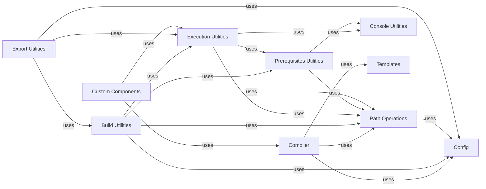

## Component Details

The `Frontend Build & Deployment System` in Reflex is a sophisticated subsystem responsible for transforming Python-defined components and application state into a functional React/JavaScript frontend. Its core purpose is to bridge the gap between Python development and web deployment, handling everything from code generation to orchestrating external build tools and managing deployment artifacts.

### Compiler
The central orchestrator for code generation. It translates the Python application's structure, components, state, and event handlers into optimized JavaScript and React code. It resolves imports, manages component properties, and prepares the frontend for rendering.

**Related Classes/Methods**:

- <a href="https://github.com/reflex-dev/reflex/blob/master/reflex/compiler/compiler.py#L0-L0" target="_blank" rel="noopener noreferrer">`reflex.compiler.compiler` (0:0)</a>

### Build Utilities
Manages the physical construction of the frontend application. This includes creating necessary directories, copying static assets, and invoking external build commands (e.g., `npm install`, `next build`) to compile the generated JavaScript/React code.

**Related Classes/Methods**:

- <a href="https://github.com/reflex-dev/reflex/blob/master/reflex/utils/build.py#L173-L201" target="_blank" rel="noopener noreferrer">`reflex.utils.build` (173:201)</a>

### Path Operations
Provides a robust set of utilities for handling file and directory paths within the project. It ensures consistent and cross-platform file system interactions, crucial for locating source files, outputting generated code, and managing assets during the build process.

**Related Classes/Methods**:

- <a href="https://github.com/reflex-dev/reflex/blob/master/reflex/utils/path_ops.py#L0-L0" target="_blank" rel="noopener noreferrer">`reflex.utils.path_ops` (0:0)</a>

### Execution Utilities
Facilitates the execution of external shell commands. This is vital for integrating with standard frontend toolchains like Node.js, npm, and Next.js, allowing Reflex to trigger their build and dependency management processes.

**Related Classes/Methods**:

- <a href="https://github.com/reflex-dev/reflex/blob/master/reflex/utils/exec.py#L0-L0" target="_blank" rel="noopener noreferrer">`reflex.utils.exec` (0:0)</a>

### Console Utilities
Provides standardized methods for logging information, warnings, and errors to the console. This is crucial for providing user feedback during the potentially long-running build and deployment processes.

**Related Classes/Methods**:

- <a href="https://github.com/reflex-dev/reflex/blob/master/reflex/utils/console.py#L0-L0" target="_blank" rel="noopener noreferrer">`reflex.utils.console` (0:0)</a>

### Templates
Manages the Jinja2 templates that serve as blueprints for generating various frontend files, including React components, JavaScript modules for state management, routing, and theme definitions.

**Related Classes/Methods**:

- <a href="https://github.com/reflex-dev/reflex/blob/master/reflex/compiler/templates.py#L0-L0" target="_blank" rel="noopener noreferrer">`reflex.compiler.templates` (0:0)</a>

### Config
A centralized module for managing application-wide settings and configurations. For the build system, this includes parameters like build directories, asset paths, and deployment-specific options.

**Related Classes/Methods**:

- <a href="https://github.com/reflex-dev/reflex/blob/master/reflex/config.py#L0-L0" target="_blank" rel="noopener noreferrer">`reflex.config` (0:0)</a>

### Export Utilities
Specifically handles the final steps of preparing the application for deployment, such as static site generation, packaging, and potentially uploading artifacts.

**Related Classes/Methods**:

- <a href="https://github.com/reflex-dev/reflex/blob/master/reflex/utils/export.py#L10-L76" target="_blank" rel="noopener noreferrer">`reflex.utils.export` (10:76)</a>

### Prerequisites Utilities
Verifies that all external dependencies and tools (e.g., Node.js, npm) required for the build and deployment process are installed and correctly configured in the environment.

**Related Classes/Methods**:

- <a href="https://github.com/reflex-dev/reflex/blob/master/reflex/utils/prerequisites.py#L0-L0" target="_blank" rel="noopener noreferrer">`reflex.utils.prerequisites` (0:0)</a>

### Custom Components
Manages the integration and compilation of user-defined custom React components written in Python. It ensures these components are correctly processed and included in the final frontend build.

**Related Classes/Methods**:

- <a href="https://github.com/reflex-dev/reflex/blob/master/reflex/custom_components/custom_components.py#L0-L0" target="_blank" rel="noopener noreferrer">`reflex.custom_components.custom_components` (0:0)</a>

### [FAQ](https://github.com/CodeBoarding/GeneratedOnBoardings/tree/main?tab=readme-ov-file#faq)