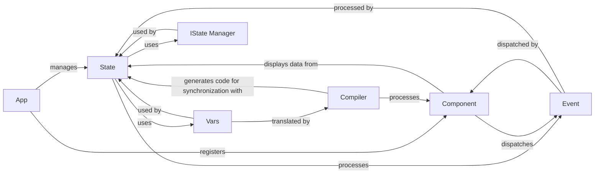

## Component Details

The Reactive State System in Reflex is fundamental to its dynamic behavior, enabling automatic UI updates in response to data changes. These components are fundamental because they collectively define the entire reactive data flow: from how data is declared (Vars), stored and managed (State, IState Manager), updated (Event), rendered (Component), and synchronized between the backend and frontend (Compiler). The App component ties all these pieces together to form a functional Reflex application.

### State
The central repository for application data and logic. It holds reactive variables and defines event handlers that modify this data. Changes within the State automatically trigger UI updates.

**Related Classes/Methods**:

- <a href="https://github.com/reflex-dev/reflex/blob/master/reflex/state.py#L1-L1" target="_blank" rel="noopener noreferrer">`reflex/state.py` (1:1)</a>

### Vars
Manages the definition, representation, and dependency tracking of reactive variables (`Var`, `ComputedVar`) and expressions. This allows Reflex to efficiently track data changes and determine what parts of the UI need to be re-rendered.

**Related Classes/Methods**:

- <a href="https://github.com/reflex-dev/reflex/blob/master/reflex/vars/base.py#L1-L1" target="_blank" rel="noopener noreferrer">`reflex/vars/base.py` (1:1)</a>
- <a href="https://github.com/reflex-dev/reflex/blob/master/reflex/vars/dep_tracking.py#L1-L1" target="_blank" rel="noopener noreferrer">`reflex/vars/dep_tracking.py` (1:1)</a>

### IState Manager
Handles the internal representation, persistence, and synchronization of the application state. It abstracts the underlying storage mechanism (in-memory, disk, Redis) and ensures state consistency across the application.

**Related Classes/Methods**:

- <a href="https://github.com/reflex-dev/reflex/blob/master/reflex/istate/manager.py#L1-L1" target="_blank" rel="noopener noreferrer">`reflex/istate/manager.py` (1:1)</a>

### Event
Represents actions or occurrences within the application (e.g., user interactions, timer events). Events are dispatched by components and processed by State methods, leading to modifications in the application's state.

**Related Classes/Methods**:

- <a href="https://github.com/reflex-dev/reflex/blob/master/reflex/event.py#L1-L1" target="_blank" rel="noopener noreferrer">`reflex/event.py` (1:1)</a>

### Compiler
Responsible for generating the necessary frontend assets (JavaScript, HTML, CSS) from the Python-defined application. Crucially, it generates the client-side code for state synchronization, ensuring that changes in the backend state are reflected in the frontend UI.

**Related Classes/Methods**:

- <a href="https://github.com/reflex-dev/reflex/blob/master/reflex/compiler/compiler.py#L1-L1" target="_blank" rel="noopener noreferrer">`reflex/compiler/compiler.py` (1:1)</a>

### Component
The building blocks of the UI. Components display data from the State (via Vars) and dispatch Events that can modify the State. They are the visual representation of the application's state.

**Related Classes/Methods**:

- <a href="https://github.com/reflex-dev/reflex/blob/master/reflex/components/component.py#L1-L1" target="_blank" rel="noopener noreferrer">`reflex/components/component.py` (1:1)</a>

### App
The entry point for defining a Reflex application. It registers pages, handles routing, and manages the global application State. It orchestrates how the State, Components, and Events come together to form a complete application.

**Related Classes/Methods**:

- <a href="https://github.com/reflex-dev/reflex/blob/master/reflex/app.py#L1-L1" target="_blank" rel="noopener noreferrer">`reflex/app.py` (1:1)</a>

### [FAQ](https://github.com/CodeBoarding/GeneratedOnBoardings/tree/main?tab=readme-ov-file#faq)