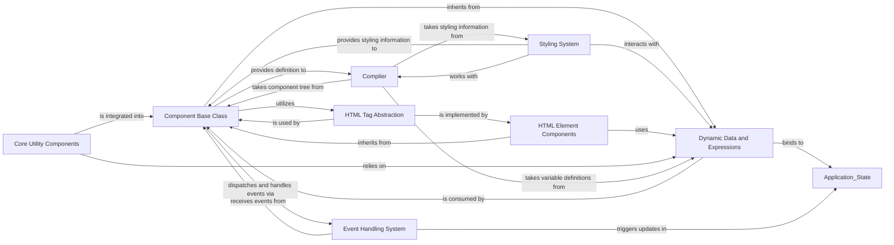

## Component Details

The UI Component Core Framework in Reflex is the bedrock upon which all user interface elements are constructed. It provides the fundamental classes, utilities, and mechanisms for defining, rendering, styling, and managing the interactive behavior of UI components. This framework ensures a consistent and efficient way to translate Python code into dynamic web interfaces.

### Component Base Class
The foundational abstract class (Component) from which all Reflex UI elements inherit. It defines the core properties (e.g., children, props, style), lifecycle methods, and rendering logic that every component must adhere to. It manages the component's identity, event handlers, and integration within the component tree.

**Related Classes/Methods**:

- <a href="https://github.com/reflex-dev/reflex/blob/master/reflex/components/component.py#L1-L1" target="_blank" rel="noopener noreferrer">`reflex.components.component` (1:1)</a>

### Styling System
Manages the visual presentation of components. It defines how style properties are applied, handles responsive design, color modes, and converts Python-defined styles into frontend-compatible CSS. This system ensures that components can be consistently styled across the application.

**Related Classes/Methods**:

- <a href="https://github.com/reflex-dev/reflex/blob/master/reflex/style.py#L1-L1" target="_blank" rel="noopener noreferrer">`reflex.style` (1:1)</a>

### HTML Tag Abstraction
Provides a Pythonic representation of standard HTML tags. This abstraction allows developers to construct HTML structures directly within Reflex components using Python objects, facilitating conditional rendering, iteration, and pattern matching. It bridges the gap between Python component definitions and their underlying HTML representation.

**Related Classes/Methods**:

- <a href="https://github.com/reflex-dev/reflex/blob/master/reflex/components/tags/tag.py#L1-L1" target="_blank" rel="noopener noreferrer">`reflex.components.tags.tag` (1:1)</a>
- <a href="https://github.com/reflex-dev/reflex/blob/master/reflex/components/tags/cond_tag.py#L1-L1" target="_blank" rel="noopener noreferrer">`reflex.components.tags.cond_tag` (1:1)</a>
- <a href="https://github.com/reflex-dev/reflex/blob/master/reflex/components/tags/iter_tag.py#L1-L1" target="_blank" rel="noopener noreferrer">`reflex.components.tags.iter_tag` (1:1)</a>
- <a href="https://github.com/reflex-dev/reflex/blob/master/reflex/components/tags/match_tag.py#L1-L1" target="_blank" rel="noopener noreferrer">`reflex.components.tags.match_tag` (1:1)</a>

### HTML Element Components
Concrete implementations of standard HTML elements (e.g., Div, Button, Input) as Reflex components. These components directly map to their HTML counterparts, providing a convenient and type-safe way to include common web elements in Reflex applications while inheriting the core functionalities from the Component Base Class.

**Related Classes/Methods**:

- <a href="https://github.com/reflex-dev/reflex/blob/master/reflex/components/el/element.py#L1-L1" target="_blank" rel="noopener noreferrer">`reflex.components.el.element` (1:1)</a>
- <a href="https://github.com/reflex-dev/reflex/blob/master/reflex/components/el/elements/base.py#L1-L1" target="_blank" rel="noopener noreferrer">`reflex.components.el.elements.base` (1:1)</a>

### Core Utility Components
Offers fundamental control flow and data manipulation capabilities for UI rendering. This includes components for conditional rendering (cond), looping over data (foreach), and pattern matching (match), enabling dynamic and reactive UI updates based on application state.

**Related Classes/Methods**:

- <a href="https://github.com/reflex-dev/reflex/blob/master/reflex/components/core/cond.py#L102-L102" target="_blank" rel="noopener noreferrer">`reflex.components.core.cond` (102:102)</a>
- <a href="https://github.com/reflex-dev/reflex/blob/master/reflex/components/core/foreach.py#L1-L1" target="_blank" rel="noopener noreferrer">`reflex.components.core.foreach` (1:1)</a>
- <a href="https://github.com/reflex-dev/reflex/blob/master/reflex/components/core/match.py#L1-L1" target="_blank" rel="noopener noreferrer">`reflex.components.core.match` (1:1)</a>

### Dynamic Data and Expressions
Handles the binding of application state and dynamic expressions to component properties and styles. This system allows components to react to changes in data, enabling interactive and data-driven user interfaces without manual DOM manipulation. It manages the conversion of Python variables into frontend-compatible expressions.

**Related Classes/Methods**:

- <a href="https://github.com/reflex-dev/reflex/blob/master/reflex/vars/base.py#L1-L1" target="_blank" rel="noopener noreferrer">`reflex.vars.base` (1:1)</a>

### Event Handling System
Manages the dispatching and handling of user interactions (events) on components. It defines how events are captured, processed, and how they trigger state updates or other actions within the application, forming the backbone of interactivity.

**Related Classes/Methods**:

- <a href="https://github.com/reflex-dev/reflex/blob/master/reflex/event.py#L1-L1" target="_blank" rel="noopener noreferrer">`reflex.event` (1:1)</a>

### Compiler
Translates the Python component tree, styling information, and dynamic variable definitions into frontend code (React/JavaScript, HTML, CSS) that can be rendered by a web browser. It's responsible for optimizing the generated code and ensuring efficient rendering.

**Related Classes/Methods**:

- <a href="https://github.com/reflex-dev/reflex/blob/master/reflex/compiler/compiler.py#L1-L1" target="_blank" rel="noopener noreferrer">`reflex.compiler.compiler` (1:1)</a>

### [FAQ](https://github.com/CodeBoarding/GeneratedOnBoardings/tree/main?tab=readme-ov-file#faq)