```mermaid
graph LR
    Application_Lifecycle_Manager["Application Lifecycle Manager"]
    Configuration_Manager["Configuration Manager"]
    Reactive_State_System["Reactive State System"]
    Event_Processing_System["Event Processing System"]
    UI_Component_Core_Framework["UI Component Core Framework"]
    Frontend_Build_Deployment_System["Frontend Build & Deployment System"]
    Database_Abstraction_Layer["Database Abstraction Layer"]
    Application_Lifecycle_Manager -- "Uses" --> Configuration_Manager
    Application_Lifecycle_Manager -- "Initializes and interacts with" --> Reactive_State_System
    Application_Lifecycle_Manager -- "Initiates compilation with" --> Frontend_Build_Deployment_System
    Configuration_Manager -- "Influences" --> Application_Lifecycle_Manager
    Configuration_Manager -- "Provides settings to" --> Reactive_State_System
    Configuration_Manager -- "Provides settings to" --> Database_Abstraction_Layer
    Reactive_State_System -- "Provides data to" --> UI_Component_Core_Framework
    Reactive_State_System -- "Is modified by" --> Event_Processing_System
    Reactive_State_System -- "Interacts with" --> Database_Abstraction_Layer
    Event_Processing_System -- "Triggers updates in" --> Reactive_State_System
    Event_Processing_System -- "Receives input from" --> UI_Component_Core_Framework
    UI_Component_Core_Framework -- "Binds to" --> Reactive_State_System
    UI_Component_Core_Framework -- "Generates events for" --> Event_Processing_System
    UI_Component_Core_Framework -- "Provides definitions to" --> Frontend_Build_Deployment_System
    Frontend_Build_Deployment_System -- "Consumes definitions from" --> UI_Component_Core_Framework
    Frontend_Build_Deployment_System -- "Consumes definitions from" --> Reactive_State_System
    Frontend_Build_Deployment_System -- "Prepares assets for" --> Application_Lifecycle_Manager
    Database_Abstraction_Layer -- "Provides persistence for" --> Reactive_State_System
    Database_Abstraction_Layer -- "Uses" --> Configuration_Manager
    click Application_Lifecycle_Manager href "https://github.com/CodeBoarding/GeneratedOnBoardings/blob/main//reflex/Application_Lifecycle_Manager.md" "Details"
    click Configuration_Manager href "https://github.com/CodeBoarding/GeneratedOnBoardings/blob/main//reflex/Configuration_Manager.md" "Details"
    click Reactive_State_System href "https://github.com/CodeBoarding/GeneratedOnBoardings/blob/main//reflex/Reactive_State_System.md" "Details"
    click UI_Component_Core_Framework href "https://github.com/CodeBoarding/GeneratedOnBoardings/blob/main//reflex/UI_Component_Core_Framework.md" "Details"
    click Frontend_Build_Deployment_System href "https://github.com/CodeBoarding/GeneratedOnBoardings/blob/main//reflex/Frontend_Build_Deployment_System.md" "Details"
    click Database_Abstraction_Layer href "https://github.com/CodeBoarding/GeneratedOnBoardings/blob/main//reflex/Database_Abstraction_Layer.md" "Details"
```

## Component Details

The architecture of `reflex` is fundamentally built around a reactive, component-based paradigm, enabling Python developers to create full-stack web applications. The core design principles revolve around a clear separation of concerns while maintaining tight integration for seamless data flow and UI updates.

### Application Lifecycle Manager
This is the central orchestrator of a Reflex application. It manages the application's lifecycle, registers pages, handles global exception handlers, and coordinates the compilation and serving processes. It acts as the primary entry point for defining and running a Reflex app, integrating the FastAPI backend and SocketIO for real-time communication. It also ensures the development environment is correctly set up by interacting with prerequisites.

**Related Classes/Methods**:

- <a href="https://github.com/reflex-dev/reflex/blob/master/reflex/app.py#L1-L1" target="_blank" rel="noopener noreferrer">`reflex/app.py` (1:1)</a>
- <a href="https://github.com/reflex-dev/reflex/blob/master/reflex/environment.py#L1-L1" target="_blank" rel="noopener noreferrer">`reflex/environment.py` (1:1)</a>
- <a href="https://github.com/reflex-dev/reflex/blob/master/reflex/utils/prerequisites.py#L1-L1" target="_blank" rel="noopener noreferrer">`reflex/utils/prerequisites.py` (1:1)</a>

### Configuration Manager
Responsible for loading, managing, and providing access to application-wide configurations. This includes environment variables, database settings, and logging levels. It ensures that all parts of the application operate with consistent and correct settings, acting as a single source of truth for application parameters.

**Related Classes/Methods**:

- <a href="https://github.com/reflex-dev/reflex/blob/master/reflex/config.py#L1-L1" target="_blank" rel="noopener noreferrer">`reflex/config.py` (1:1)</a>

### Reactive State System
The core of Reflex's reactivity. It defines how application data is stored, updated, and accessed using reactive variables (`Var` and `ComputedVar`). It manages state persistence (in-memory, disk, or Redis) and tracks changes to trigger automatic UI updates, forming the backbone of the application's dynamic behavior.

**Related Classes/Methods**:

- <a href="https://github.com/reflex-dev/reflex/blob/master/reflex/state.py#L1-L1" target="_blank" rel="noopener noreferrer">`reflex/state.py` (1:1)</a>
- <a href="https://github.com/reflex-dev/reflex/blob/master/reflex/istate/manager.py#L1-L1" target="_blank" rel="noopener noreferrer">`reflex/istate/manager.py` (1:1)</a>
- <a href="https://github.com/reflex-dev/reflex/blob/master/reflex/vars/base.py#L1-L1" target="_blank" rel="noopener noreferrer">`reflex/vars/base.py` (1:1)</a>

### Event Processing System
Defines and processes all user interactions and backend logic triggers. It provides the mechanisms for defining event handlers that modify the application state in response to actions (e.g., button clicks, form submissions). It ensures that user actions are translated into state changes, driving the application's interactivity.

**Related Classes/Methods**:

- <a href="https://github.com/reflex-dev/reflex/blob/master/reflex/event.py#L1-L1" target="_blank" rel="noopener noreferrer">`reflex/event.py` (1:1)</a>

### UI Component Core Framework
Provides the foundational classes and utilities for building all user interface elements in Reflex. It defines how components are created, rendered, manage their properties, and handle their internal logic and dependencies. This component also integrates the styling system, managing visual properties, color modes, and converting Python styles to frontend-compatible CSS.

**Related Classes/Methods**:

- <a href="https://github.com/reflex-dev/reflex/blob/master/reflex/components/component.py#L1-L1" target="_blank" rel="noopener noreferrer">`reflex/components/component.py` (1:1)</a>
- <a href="https://github.com/reflex-dev/reflex/blob/master/reflex/style.py#L1-L1" target="_blank" rel="noopener noreferrer">`reflex/style.py` (1:1)</a>

### Frontend Build & Deployment System
The engine that translates Python-defined Reflex components and state into a runnable frontend application (React/JavaScript). It handles code generation for pages, components, state contexts, and themes, resolving imports and optimizing the output for deployment. It also includes utilities for packaging, file system operations, and executing external commands necessary for the build process.

**Related Classes/Methods**:

- <a href="https://github.com/reflex-dev/reflex/blob/master/reflex/compiler/compiler.py#L1-L1" target="_blank" rel="noopener noreferrer">`reflex/compiler/compiler.py` (1:1)</a>
- <a href="https://github.com/reflex-dev/reflex/blob/master/reflex/utils/build.py#L1-L1" target="_blank" rel="noopener noreferrer">`reflex/utils/build.py` (1:1)</a>
- <a href="https://github.com/reflex-dev/reflex/blob/master/reflex/utils/path_ops.py#L1-L1" target="_blank" rel="noopener noreferrer">`reflex/utils/path_ops.py` (1:1)</a>
- <a href="https://github.com/reflex-dev/reflex/blob/master/reflex/utils/exec.py#L1-L1" target="_blank" rel="noopener noreferrer">`reflex/utils/exec.py` (1:1)</a>
- <a href="https://github.com/reflex-dev/reflex/blob/master/reflex/utils/console.py#L1-L1" target="_blank" rel="noopener noreferrer">`reflex/utils/console.py` (1:1)</a>

### Database Abstraction Layer
Provides an abstraction layer for interacting with databases, primarily using SQLModel/SQLAlchemy. It handles database engine creation, session management, and migration capabilities, allowing developers to define and interact with database models directly within their Reflex application, ensuring data persistence.

**Related Classes/Methods**:

- <a href="https://github.com/reflex-dev/reflex/blob/master/reflex/model.py#L1-L1" target="_blank" rel="noopener noreferrer">`reflex/model.py` (1:1)</a>

### [FAQ](https://github.com/CodeBoarding/GeneratedOnBoardings/tree/main?tab=readme-ov-file#faq)