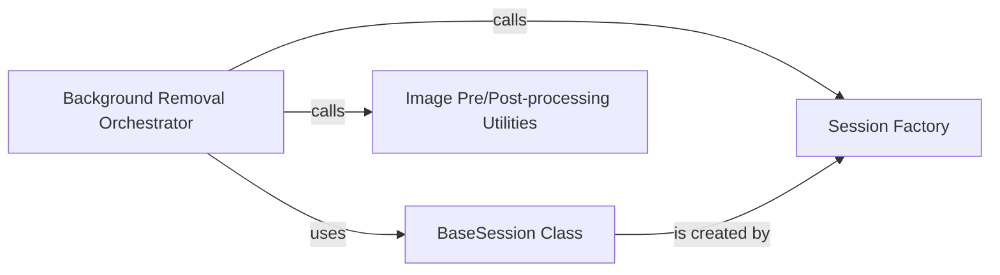

## Component Details

The `Background Removal Orchestrator` is the central processing unit responsible for the entire background removal pipeline within the `rembg` project. It orchestrates the end-to-end process, from initial image loading and pre-processing to invoking the AI model for inference, applying the generated mask, and performing various post-processing steps. This component abstracts the complexities of image manipulation and AI model interaction, providing a unified interface for background removal.

### Background Removal Orchestrator
This is the core function that orchestrates the entire background removal process. It handles input data conversion, image orientation correction, session management for AI model inference, mask post-processing, and applying various cutout techniques (alpha matting, naive cutout, putalpha cutout) and background colors. It serves as the primary entry point for users to remove backgrounds from images.

**Related Classes/Methods**:

- <a href="https://github.com/danielgatis/rembg/blob/master/rembg/bg.py#L218-L327" target="_blank" rel="noopener noreferrer">`rembg.bg.remove` (218:327)</a>

### BaseSession Class
An abstract base class that defines the interface and common functionalities for handling ONNX Runtime inference sessions. It manages model loading, device selection (CPU/GPU), and provides the `predict` method signature that concrete session implementations must follow. It's crucial for abstracting the underlying AI model's execution.

**Related Classes/Methods**:

- <a href="https://github.com/danielgatis/rembg/blob/master/rembg/sessions/base.py#L9-L84" target="_blank" rel="noopener noreferrer">`rembg.sessions.base.BaseSession` (9:84)</a>

### Session Factory
This component is responsible for creating and returning an appropriate `BaseSession` instance based on the specified model name (e.g., 'u2net'). It abstracts the instantiation logic of specific AI model sessions, ensuring that the correct model is loaded and prepared for inference.

**Related Classes/Methods**:

- <a href="https://github.com/danielgatis/rembg/blob/master/rembg/session_factory.py#L10-L47" target="_blank" rel="noopener noreferrer">`rembg.session_factory.new_session` (10:47)</a>

### Image Pre/Post-processing Utilities
A collection of helper functions within the `rembg.bg` module that perform various image manipulations. These include correcting image orientation, refining masks, and applying different methods to create the final cutout image (e.g., using alpha matting for precise edges, or simpler naive cutouts), and applying solid background colors.

**Related Classes/Methods**:

- <a href="https://github.com/danielgatis/rembg/blob/master/rembg/bg.py#L184-L194" target="_blank" rel="noopener noreferrer">`rembg.bg.fix_image_orientation` (184:194)</a>
- <a href="https://github.com/danielgatis/rembg/blob/master/rembg/bg.py#L154-L164" target="_blank" rel="noopener noreferrer">`rembg.bg.post_process` (154:164)</a>
- <a href="https://github.com/danielgatis/rembg/blob/master/rembg/bg.py#L37-L87" target="_blank" rel="noopener noreferrer">`rembg.bg.alpha_matting_cutout` (37:87)</a>
- <a href="https://github.com/danielgatis/rembg/blob/master/rembg/bg.py#L90-L103" target="_blank" rel="noopener noreferrer">`rembg.bg.naive_cutout` (90:103)</a>
- <a href="https://github.com/danielgatis/rembg/blob/master/rembg/bg.py#L106-L118" target="_blank" rel="noopener noreferrer">`rembg.bg.putalpha_cutout` (106:118)</a>
- <a href="https://github.com/danielgatis/rembg/blob/master/rembg/bg.py#L167-L181" target="_blank" rel="noopener noreferrer">`rembg.bg.apply_background_color` (167:181)</a>

### [FAQ](https://github.com/CodeBoarding/GeneratedOnBoardings/tree/main?tab=readme-ov-file#faq)