```mermaid
graph LR
    CLI_Entry_Point["CLI Entry Point"]
    Command_Registry["Command Registry"]
    Byte_Stream_Command["Byte Stream Command"]
    File_Input_Command["File Input Command"]
    Background_Removal_Core["Background Removal Core"]
    Session_Factory["Session Factory"]
    CLI_Entry_Point -- "Dispatches commands to" --> Command_Registry
    CLI_Entry_Point -- "Uses" --> Command_Registry
    Command_Registry -- "Registers commands from" --> Byte_Stream_Command
    Command_Registry -- "Registers commands from" --> File_Input_Command
    Byte_Stream_Command -- "Delegates processing to" --> Background_Removal_Core
    Byte_Stream_Command -- "Obtains session from" --> Session_Factory
    File_Input_Command -- "Delegates processing to" --> Background_Removal_Core
    File_Input_Command -- "Obtains session from" --> Session_Factory
    Background_Removal_Core -- "Processes data for" --> Byte_Stream_Command
    Background_Removal_Core -- "Processes data for" --> File_Input_Command
    Session_Factory -- "Provides sessions to" --> Byte_Stream_Command
    Session_Factory -- "Provides sessions to" --> File_Input_Command
```

## Component Details

This component serves as the primary user interface for command-line interactions. It is responsible for parsing user input, managing application version display, and dispatching commands to their respective processing logic. It acts as the initial entry point and orchestrator of user-driven workflows, delegating specific tasks to individual command modules.

### CLI Entry Point
The main entry point for the `rembg` command-line application. It uses the `click` library to define the root command group, handles version display, and dynamically registers all available subcommands. It's the initial orchestrator of user-driven workflows.

**Related Classes/Methods**:

- `` (0:0)

### Command Registry
A central module that collects and exposes all individual command functions (e.g., `b_command`, `i_command`). It acts as a directory for the CLI Entry Point, allowing it to easily discover and register all available commands, promoting extensibility.

**Related Classes/Methods**:

- `` (0:0)

### Byte Stream Command
Implements the `b` command, specifically designed to process image data provided as a byte stream (e.g., via standard input). It parses command-line options related to model selection, alpha matting, and output formatting, then delegates the core background removal task to the Background Removal Core.

**Related Classes/Methods**:

- `` (0:0)

### File Input Command
Implements the `i` command, which handles background removal for images specified by file paths or standard input. It manages command-line arguments and options, then passes the image data to the Background Removal Core for processing.

**Related Classes/Methods**:

- `` (0:0)

### Background Removal Core
The fundamental component responsible for executing the actual background removal algorithms. It takes an image and a session object (which encapsulates the chosen model) and performs the necessary operations to separate the foreground from the background. This is the core functionality of the `rembg` application.

**Related Classes/Methods**:

- `` (0:0)

### Session Factory
Manages the creation and retrieval of processing sessions, each configured with a specific background removal model. This component abstracts away the complexities of model loading and ensures that the correct model is efficiently provided to the command handlers for image processing.

**Related Classes/Methods**:

- `` (0:0)

### [FAQ](https://github.com/CodeBoarding/GeneratedOnBoardings/tree/main?tab=readme-ov-file#faq)