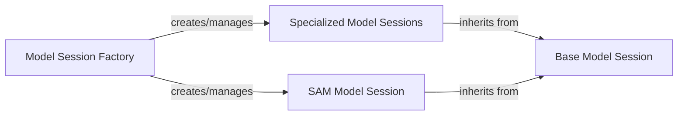

## Component Details

This component is the backbone for integrating and managing various AI models within the `rembg` project. It provides a structured, extensible way to handle different background removal models, ensuring consistency in their usage while accommodating their unique characteristics.

### Base Model Session
This is the abstract foundation (`rembg.sessions.base.BaseSession`) for all model sessions. It defines the common interface and core functionalities, including the initialization of the ONNX Runtime inference session, selection of appropriate execution providers (CPU/GPU), and abstract methods for image normalization (`normalize`), model prediction (`predict`), and model downloading (`download_models`). It ensures a consistent structure and behavior across diverse model implementations, promoting reusability and maintainability.

**Related Classes/Methods**:

- <a href="https://github.com/danielgatis/rembg/blob/master/rembg/sessions/base.py#L9-L84" target="_blank" rel="noopener noreferrer">`rembg.sessions.base.BaseSession` (9:84)</a>

### Specialized Model Sessions
This component comprises various concrete model session implementations (e.g., `U2netSession`, `BiRefNet` variants, `BRIA-RMBG`, `DIS` variants, `Silueta`). Each class inherits from `Base Model Session` and implements model-specific logic for the `predict` method and handles the `download_models` method to fetch their respective ONNX model files. They leverage the foundational capabilities provided by `Base Model Session` while encapsulating their unique inference and preprocessing steps.

**Related Classes/Methods**:

- <a href="https://github.com/danielgatis/rembg/blob/master/rembg/sessions/u2net.py#L11-L87" target="_blank" rel="noopener noreferrer">`rembg.sessions.u2net.U2netSession` (11:87)</a>
- <a href="https://github.com/danielgatis/rembg/blob/master/rembg/sessions/ben_custom.py#L11-L91" target="_blank" rel="noopener noreferrer">`rembg.sessions.ben_custom.BenCustomSession` (11:91)</a>
- <a href="https://github.com/danielgatis/rembg/blob/master/rembg/sessions/birefnet_cod.py#L1-L1" target="_blank" rel="noopener noreferrer">`rembg.sessions.birefnet_cod.BiRefNetCOD` (1:1)</a>
- <a href="https://github.com/danielgatis/rembg/blob/master/rembg/sessions/birefnet_dis.py#L1-L1" target="_blank" rel="noopener noreferrer">`rembg.sessions.birefnet_dis.BiRefNetDIS` (1:1)</a>
- <a href="https://github.com/danielgatis/rembg/blob/master/rembg/sessions/birefnet_general.py#L1-L1" target="_blank" rel="noopener noreferrer">`rembg.sessions.birefnet_general.BiRefNetGeneral` (1:1)</a>
- <a href="https://github.com/danielgatis/rembg/blob/master/rembg/sessions/birefnet_general_lite.py#L1-L1" target="_blank" rel="noopener noreferrer">`rembg.sessions.birefnet_general_lite.BiRefNetGeneralLite` (1:1)</a>
- <a href="https://github.com/danielgatis/rembg/blob/master/rembg/sessions/birefnet_hrsod.py#L1-L1" target="_blank" rel="noopener noreferrer">`rembg.sessions.birefnet_hrsod.BiRefNetHRSOD` (1:1)</a>
- <a href="https://github.com/danielgatis/rembg/blob/master/rembg/sessions/birefnet_massive.py#L1-L1" target="_blank" rel="noopener noreferrer">`rembg.sessions.birefnet_massive.BiRefNetMassive` (1:1)</a>
- <a href="https://github.com/danielgatis/rembg/blob/master/rembg/sessions/birefnet_portrait.py#L1-L1" target="_blank" rel="noopener noreferrer">`rembg.sessions.birefnet_portrait.BiRefNetPortrait` (1:1)</a>
- <a href="https://github.com/danielgatis/rembg/blob/master/rembg/sessions/bria_rmbg.py#L1-L1" target="_blank" rel="noopener noreferrer">`rembg.sessions.bria_rmbg.BriaRMBG` (1:1)</a>
- <a href="https://github.com/danielgatis/rembg/blob/master/rembg/sessions/dis_anime.py#L1-L1" target="_blank" rel="noopener noreferrer">`rembg.sessions.dis_anime.DISAnime` (1:1)</a>
- <a href="https://github.com/danielgatis/rembg/blob/master/rembg/sessions/dis_custom.py#L1-L1" target="_blank" rel="noopener noreferrer">`rembg.sessions.dis_custom.DISCustom` (1:1)</a>
- <a href="https://github.com/danielgatis/rembg/blob/master/rembg/sessions/dis_general_use.py#L1-L1" target="_blank" rel="noopener noreferrer">`rembg.sessions.dis_general_use.DISGeneralUse` (1:1)</a>
- <a href="https://github.com/danielgatis/rembg/blob/master/rembg/sessions/silueta.py#L11-L91" target="_blank" rel="noopener noreferrer">`rembg.sessions.silueta.SiluetaSession` (11:91)</a>
- <a href="https://github.com/danielgatis/rembg/blob/master/rembg/sessions/u2net_cloth_seg.py#L1-L1" target="_blank" rel="noopener noreferrer">`rembg.sessions.u2net_cloth_seg.U2netClothSegSession` (1:1)</a>
- <a href="https://github.com/danielgatis/rembg/blob/master/rembg/sessions/u2net_custom.py#L12-L96" target="_blank" rel="noopener noreferrer">`rembg.sessions.u2net_custom.U2netCustomSession` (12:96)</a>
- <a href="https://github.com/danielgatis/rembg/blob/master/rembg/sessions/u2net_human_seg.py#L11-L87" target="_blank" rel="noopener noreferrer">`rembg.sessions.u2net_human_seg.U2netHumanSegSession` (11:87)</a>
- <a href="https://github.com/danielgatis/rembg/blob/master/rembg/sessions/u2netp.py#L11-L75" target="_blank" rel="noopener noreferrer">`rembg.sessions.u2netp.U2netpSession` (11:75)</a>

### SAM Model Session
A highly specialized concrete implementation (`rembg.sessions.sam.SamSession`) of `Base Model Session` tailored for the Segment Anything Model (SAM). This session manages the unique requirements of SAM, including handling separate ONNX sessions for its encoder and decoder, processing user prompts (points/labels), and performing complex image transformations (scaling, coordinate application, mask transformation) before and after model inference. Its distinct two-part model and prompt-based interaction warrant its separation from other specialized sessions.

**Related Classes/Methods**:

- <a href="https://github.com/danielgatis/rembg/blob/master/rembg/sessions/sam.py#L74-L339" target="_blank" rel="noopener noreferrer">`rembg.sessions.sam.SamSession` (74:339)</a>

### Model Session Factory
This component, primarily the `new_session` function in `rembg.session_factory.py`, acts as a central factory for creating and managing model instances. It abstracts away the direct instantiation of specific model sessions from the rest of the application. It takes a model name, looks up the corresponding session class, and instantiates it with appropriate ONNX Runtime session options. This centralizes model lookup and lifecycle management, allowing for easy integration of new models without modifying client code.

**Related Classes/Methods**:

- <a href="https://github.com/danielgatis/rembg/blob/master/rembg/session_factory.py#L10-L47" target="_blank" rel="noopener noreferrer">`rembg.session_factory.new_session` (10:47)</a>

### [FAQ](https://github.com/CodeBoarding/GeneratedOnBoardings/tree/main?tab=readme-ov-file#faq)