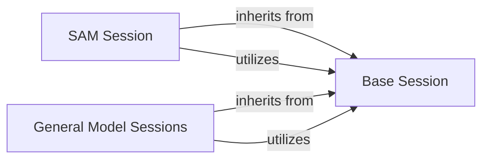

## Component Details

This subsystem is responsible for providing concrete implementations of AI models for background removal, adhering to a common interface while handling model-specific intricacies. It is fundamental because it encapsulates the diverse range of machine learning models that perform the core task of image segmentation and background removal.

### Base Session
This is the abstract base class (`rembg.sessions.base.BaseSession`) that defines the fundamental contract and common functionalities for all model sessions. It handles the initialization of the ONNX Runtime inference session, determines the optimal execution provider (CPU/GPU), and provides a standardized interface for image normalization, model prediction (as an abstract method), and model downloading utilities.

**Related Classes/Methods**:

- <a href="https://github.com/danielgatis/rembg/blob/master/rembg/sessions/base.py#L9-L84" target="_blank" rel="noopener noreferrer">`rembg.sessions.base.BaseSession` (9:84)</a>

### SAM Session
A specialized concrete implementation (`rembg.sessions.sam.SamSession`) for the Segment Anything Model (SAM). Unlike other models, SAM requires managing separate ONNX sessions for its encoder and decoder components. This session handles complex model-specific preprocessing, including scaling and coordinate transformations, and post-processing of masks, as well as processing user prompts (points/labels) for interactive segmentation.

**Related Classes/Methods**:

- <a href="https://github.com/danielgatis/rembg/blob/master/rembg/sessions/sam.py#L74-L339" target="_blank" rel="noopener noreferrer">`rembg.sessions.sam.SamSession` (74:339)</a>

### General Model Sessions
This component groups all other concrete model session implementations (e.g., `rembg.sessions.u2net.U2netSession`, `rembg.sessions.birefnet_general.BiRefNetSessionGeneral`, `rembg.sessions.bria_rmbg.BriaRmBgSession`, `rembg.sessions.dis_general_use.DisSession`). Each class in this group inherits from `BaseSession` and is responsible for encapsulating the specific logic for its particular background removal model, including model-specific preprocessing, executing the inference step, and post-processing the model's raw output into a usable mask. They implement the `predict` method with their unique inference pipelines and the `download_models` method to fetch their respective ONNX model files.

**Related Classes/Methods**:

- <a href="https://github.com/danielgatis/rembg/blob/master/rembg/sessions/u2net.py#L11-L87" target="_blank" rel="noopener noreferrer">`rembg.sessions.u2net.U2netSession` (11:87)</a>
- <a href="https://github.com/danielgatis/rembg/blob/master/rembg/sessions/birefnet_general.py#L11-L90" target="_blank" rel="noopener noreferrer">`rembg.sessions.birefnet_general.BiRefNetSessionGeneral` (11:90)</a>
- <a href="https://github.com/danielgatis/rembg/blob/master/rembg/sessions/bria_rmbg.py#L11-L87" target="_blank" rel="noopener noreferrer">`rembg.sessions.bria_rmbg.BriaRmBgSession` (11:87)</a>
- <a href="https://github.com/danielgatis/rembg/blob/master/rembg/sessions/dis_general_use.py#L11-L85" target="_blank" rel="noopener noreferrer">`rembg.sessions.dis_general_use.DisSession` (11:85)</a>
- <a href="https://github.com/danielgatis/rembg/blob/master/rembg/sessions/dis_anime.py#L1-L1" target="_blank" rel="noopener noreferrer">`rembg.sessions.dis_anime.DisAnimeSession` (1:1)</a>
- <a href="https://github.com/danielgatis/rembg/blob/master/rembg/sessions/dis_custom.py#L11-L90" target="_blank" rel="noopener noreferrer">`rembg.sessions.dis_custom.DisCustomSession` (11:90)</a>
- <a href="https://github.com/danielgatis/rembg/blob/master/rembg/sessions/silueta.py#L11-L91" target="_blank" rel="noopener noreferrer">`rembg.sessions.silueta.SiluetaSession` (11:91)</a>
- <a href="https://github.com/danielgatis/rembg/blob/master/rembg/sessions/u2net_cloth_seg.py#L1-L1" target="_blank" rel="noopener noreferrer">`rembg.sessions.u2net_cloth_seg.U2netClothSegSession` (1:1)</a>
- <a href="https://github.com/danielgatis/rembg/blob/master/rembg/sessions/u2net_custom.py#L12-L96" target="_blank" rel="noopener noreferrer">`rembg.sessions.u2net_custom.U2netCustomSession` (12:96)</a>
- <a href="https://github.com/danielgatis/rembg/blob/master/rembg/sessions/u2net_human_seg.py#L11-L87" target="_blank" rel="noopener noreferrer">`rembg.sessions.u2net_human_seg.U2netHumanSegSession` (11:87)</a>
- <a href="https://github.com/danielgatis/rembg/blob/master/rembg/sessions/u2netp.py#L11-L75" target="_blank" rel="noopener noreferrer">`rembg.sessions.u2netp.U2netpSession` (11:75)</a>
- <a href="https://github.com/danielgatis/rembg/blob/master/rembg/sessions/ben_custom.py#L11-L91" target="_blank" rel="noopener noreferrer">`rembg.sessions.ben_custom.BenCustomSession` (11:91)</a>

### [FAQ](https://github.com/CodeBoarding/GeneratedOnBoardings/tree/main?tab=readme-ov-file#faq)