```mermaid
graph LR
    CLI_Command_Dispatcher["CLI & Command Dispatcher"]
    Background_Removal_Orchestrator["Background Removal Orchestrator"]
    Model_Management_Abstraction["Model Management & Abstraction"]
    Specific_Model_Implementations["Specific Model Implementations"]
    Version_Management["Version Management"]
    CLI_Command_Dispatcher -- "dispatches commands to" --> Background_Removal_Orchestrator
    CLI_Command_Dispatcher -- "interacts with" --> Model_Management_Abstraction
    CLI_Command_Dispatcher -- "utilizes" --> Version_Management
    Background_Removal_Orchestrator -- "requests model sessions from" --> Model_Management_Abstraction
    Background_Removal_Orchestrator -- "utilizes" --> Specific_Model_Implementations
    Model_Management_Abstraction -- "instantiates" --> Specific_Model_Implementations
    Model_Management_Abstraction -- "provides model sessions to" --> Background_Removal_Orchestrator
    Specific_Model_Implementations -- "inherits from" --> Model_Management_Abstraction
    Specific_Model_Implementations -- "performs inference for" --> Background_Removal_Orchestrator
    Version_Management -- "provides version information to" --> CLI_Command_Dispatcher
    click CLI_Command_Dispatcher href "https://github.com/CodeBoarding/GeneratedOnBoardings/blob/main//rembg/CLI_Command_Dispatcher.md" "Details"
    click Background_Removal_Orchestrator href "https://github.com/CodeBoarding/GeneratedOnBoardings/blob/main//rembg/Background_Removal_Orchestrator.md" "Details"
    click Model_Management_Abstraction href "https://github.com/CodeBoarding/GeneratedOnBoardings/blob/main//rembg/Model_Management_Abstraction.md" "Details"
    click Specific_Model_Implementations href "https://github.com/CodeBoarding/GeneratedOnBoardings/blob/main//rembg/Specific_Model_Implementations.md" "Details"
```

## Component Details

These five components are fundamental to `rembg`'s operation for the following reasons:

*   **Core Functionality:** The **Background Removal Orchestrator** and **Specific Model Implementations** directly embody the application's primary purpose: removing backgrounds from images using various AI models. They are the "brains" of the operation.
*   **User Interaction:** The **CLI & Command Dispatcher** is the sole entry point for user interaction, making it indispensable for the application's usability and accessibility.
*   **Extensibility and Maintainability:** **Model Management & Abstraction** is critical for the project's extensibility. By providing a factory and a base interface, it allows new AI models to be integrated seamlessly without requiring significant changes to the core background removal logic. This abstraction promotes a clean, modular design.
*   **Application Metadata:** While not directly involved in image processing, **Version Management** is crucial for application identity, debugging, and user information, making it a necessary supporting component.

Together, these components form a cohesive architecture that efficiently handles user commands, manages diverse AI models, and executes the complex task of background removal.

### CLI & Command Dispatcher
This component serves as the primary user interface, handling all command-line interactions. It parses user input, manages the display of application version information, and dispatches commands to the appropriate internal processing logic. It acts as the initial entry point and orchestrator of user-driven workflows.

**Related Classes/Methods**:

- <a href="https://github.com/danielgatis/rembg/blob/master/rembg/cli.py#L1-L1" target="_blank" rel="noopener noreferrer">`rembg.cli` (1:1)</a>
- <a href="https://github.com/danielgatis/rembg/blob/master/rembg.py#L1-L1" target="_blank" rel="noopener noreferrer">`rembg.commands` (1:1)</a>

### Background Removal Orchestrator
This is the core processing unit responsible for the entire background removal pipeline. It orchestrates image loading, pre-processing, invoking the selected AI model for inference, applying the generated mask, and performing various post-processing steps (e.g., alpha matting, applying solid color backgrounds, resizing). It abstracts the complexities of image manipulation and model interaction.

**Related Classes/Methods**:

- <a href="https://github.com/danielgatis/rembg/blob/master/rembg/bg.py#L1-L1" target="_blank" rel="noopener noreferrer">`rembg.bg` (1:1)</a>

### Model Management & Abstraction
This component is crucial for managing and providing access to different AI models. It includes a session factory responsible for creating and caching model instances, and an abstract base class (`BaseSession`) that defines a common interface for all background removal models. This ensures consistency and allows for easy integration of new models.

**Related Classes/Methods**:

- <a href="https://github.com/danielgatis/rembg/blob/master/rembg/session_factory.py#L1-L1" target="_blank" rel="noopener noreferrer">`rembg.session_factory` (1:1)</a>
- <a href="https://github.com/danielgatis/rembg/blob/master/rembg/sessions/base.py#L1-L1" target="_blank" rel="noopener noreferrer">`rembg.sessions.base` (1:1)</a>

### Specific Model Implementations
These are the concrete implementations of the `BaseSession` interface, each encapsulating a particular AI model (e.g., U2Net, BiRefNet, SAM, BriaRmbg). Each class handles the model-specific logic for loading weights, performing model-specific preprocessing of input images, executing the inference step, and post-processing the model's raw output into a usable mask.

**Related Classes/Methods**:

- <a href="https://github.com/danielgatis/rembg/blob/master/rembg/sessions/u2net.py#L1-L1" target="_blank" rel="noopener noreferrer">`rembg.sessions.u2net` (1:1)</a>
- <a href="https://github.com/danielgatis/rembg/blob/master/rembg/sessions/birefnet_general.py#L1-L1" target="_blank" rel="noopener noreferrer">`rembg.sessions.birefnet_general` (1:1)</a>
- <a href="https://github.com/danielgatis/rembg/blob/master/rembg/sessions/sam.py#L1-L1" target="_blank" rel="noopener noreferrer">`rembg.sessions.sam` (1:1)</a>
- <a href="https://github.com/danielgatis/rembg/blob/master/rembg.py#L1-L1" target="_blank" rel="noopener noreferrer">`rembg.sessions.brnet` (1:1)</a>

### Version Management
This utility module is dedicated to programmatically retrieving and managing the project's version information. It's primarily used by the CLI to display the current application version to the user.

**Related Classes/Methods**:

- <a href="https://github.com/danielgatis/rembg/blob/master/rembg/_version.py#L1-L1" target="_blank" rel="noopener noreferrer">`rembg._version` (1:1)</a>

### [FAQ](https://github.com/CodeBoarding/GeneratedOnBoardings/tree/main?tab=readme-ov-file#faq)