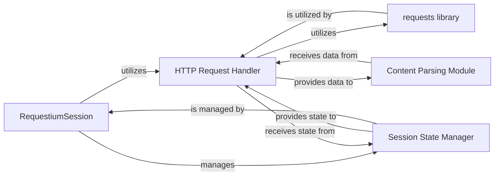

## Details

The `requestium` library provides a unified interface for web automation, integrating direct HTTP requests with browser automation capabilities. At its core, the `RequestiumSession` acts as the central orchestrator, managing the overall session state and coordinating interactions between the `HTTP Request Handler` and the `Browser Automation Module`. The `HTTP Request Handler` leverages the external `requests library` for efficient HTTP communication, while the `Session State Manager` ensures consistent session configurations across all interactions. The `Content Parsing Module` is responsible for processing and extracting data from responses, often utilizing external parsing libraries. This modular design allows for flexible and robust web interactions.

### RequestiumSession
The central orchestrator and primary entry point for the requestium library. It provides a unified interface for both direct HTTP requests and browser automation, managing the overall session state. It acts as a facade, integrating various underlying functionalities.

**Related Classes/Methods**:

- <a href="https://github.com/tryolabs/requestium/blob/master/requestium/requestium.py" target="_blank" rel="noopener noreferrer">`requestium.requestium.Requestium`</a>

### HTTP Request Handler [[Expand]](./HTTP_Request_Handler.md)
Responsible for executing direct, efficient HTTP requests by wrapping and integrating with the requests library. It handles standard HTTP methods (GET, POST, PUT, DELETE, etc.), manages request parameters, headers, and processes raw HTTP responses. It forms a crucial part of the integration layer, providing the core HTTP communication capabilities.

**Related Classes/Methods**:

- <a href="https://github.com/tryolabs/requestium/blob/master/requestium/requestium.py" target="_blank" rel="noopener noreferrer">`requestium.requestium.Requestium:get`</a>
- <a href="https://github.com/tryolabs/requestium/blob/master/requestium/requestium.py" target="_blank" rel="noopener noreferrer">`requestium.requestium.Requestium:post`</a>
- <a href="https://github.com/tryolabs/requestium/blob/master/requestium/requestium.py" target="_blank" rel="noopener noreferrer">`requestium.requestium.Requestium:put`</a>
- <a href="https://github.com/tryolabs/requestium/blob/master/requestium/requestium.py" target="_blank" rel="noopener noreferrer">`requestium.requestium.Requestium:delete`</a>
- <a href="https://github.com/tryolabs/requestium/blob/master/requestium/requestium.py" target="_blank" rel="noopener noreferrer">`requestium.requestium.Requestium:head`</a>
- <a href="https://github.com/tryolabs/requestium/blob/master/requestium/requestium.py" target="_blank" rel="noopener noreferrer">`requestium.requestium.Requestium:options`</a>
- <a href="https://github.com/tryolabs/requestium/blob/master/requestium/requestium.py" target="_blank" rel="noopener noreferrer">`requestium.requestium.Requestium:patch`</a>

### requests library
An external, third-party Python library that provides the fundamental capabilities for making HTTP requests. The HTTP Request Handler component directly utilizes this library for all its core HTTP communication. This component is an external dependency and does not have source code within the requestium project.

**Related Classes/Methods**: _None_

### Session State Manager
Manages session-level HTTP configurations, such as cookies, headers, and proxies, ensuring consistency of session data between direct HTTP requests and browser-based interactions. It provides the necessary context for the HTTP Request Handler to maintain state across requests.

**Related Classes/Methods**:

- <a href="https://github.com/tryolabs/requestium/blob/master/requestium/requestium.py" target="_blank" rel="noopener noreferrer">`requestium.requestium.Requestium`</a>

### Content Parsing Module
Responsible for processing raw HTML or JSON responses received from HTTP requests. It provides functionalities to parse and extract data from the response content, often utilizing libraries like Parsel. This functionality is primarily handled by the RequestiumResponse class, which wraps the raw response and provides methods for content access and parsing.

**Related Classes/Methods**:

- <a href="https://github.com/tryolabs/requestium/blob/master/requestium/requestium_response.py#L8-L34" target="_blank" rel="noopener noreferrer">`requestium.requestium_response.RequestiumResponse`:8-34</a>

### [FAQ](https://github.com/CodeBoarding/GeneratedOnBoardings/tree/main?tab=readme-ov-file#faq)