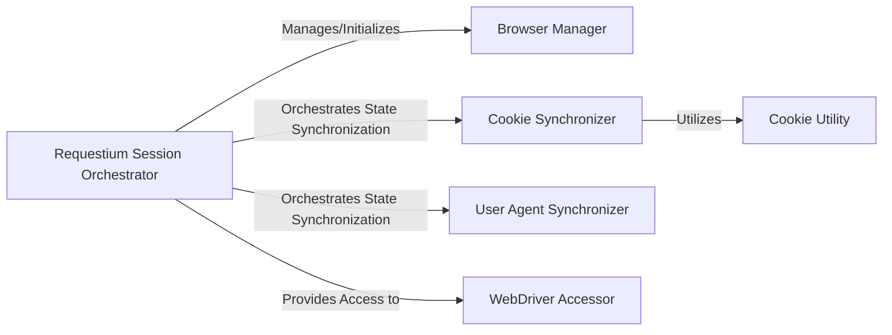

## Details

The `Requestium Session Orchestrator` subsystem is centered around the `requestium.requestium_session.RequestiumSession` class, which acts as the primary facade for unifying HTTP requests and browser automation.

### Requestium Session Orchestrator [[Expand]](./Requestium_Session_Orchestrator.md)
The central facade and control hub of the `requestium` library. It unifies and orchestrates interactions between HTTP requests and browser automation, managing the overall session state and providing a high-level API for users. It directly manages the Selenium WebDriver instance and integrates the HTTP request capabilities.

**Related Classes/Methods**:

- <a href="https://github.com/tryolabs/requestium/blob/master/requestium/requestium_session.py" target="_blank" rel="noopener noreferrer">`requestium.requestium_session.RequestiumSession`</a>

### Browser Manager
Responsible for initiating and configuring the Chrome browser instance, which is a critical part of the web automation capabilities.

**Related Classes/Methods**:

- <a href="https://github.com/tryolabs/requestium/blob/master/requestium/requestium_session.py" target="_blank" rel="noopener noreferrer">`requestium.requestium_session.RequestiumSession:_start_chrome_browser`</a>

### Cookie Synchronizer
Responsible for coordinating the bidirectional transfer of cookies between the HTTP session (managed by `requests`) and the WebDriver (managed by Selenium), ensuring consistent session state across both interaction methods.

**Related Classes/Methods**:

- <a href="https://github.com/tryolabs/requestium/blob/master/requestium/requestium_session.py" target="_blank" rel="noopener noreferrer">`requestium.requestium_session.RequestiumSession:transfer_session_cookies_to_driver`</a>
- <a href="https://github.com/tryolabs/requestium/blob/master/requestium/requestium_session.py" target="_blank" rel="noopener noreferrer">`requestium.requestium_session.RequestiumSession:transfer_driver_cookies_to_session`</a>

### User Agent Synchronizer
Responsible for ensuring user agent consistency between the WebDriver and the HTTP session, which is crucial for mimicking real browser behavior and avoiding detection.

**Related Classes/Methods**:

- <a href="https://github.com/tryolabs/requestium/blob/master/requestium/requestium_session.py" target="_blank" rel="noopener noreferrer">`requestium.requestium_session.RequestiumSession:copy_user_agent_from_driver`</a>

### WebDriver Accessor
Provides controlled access to the active Selenium WebDriver instance managed by the Requestium Session Orchestrator, allowing users to interact directly with the browser when needed.

**Related Classes/Methods**:

- <a href="https://github.com/tryolabs/requestium/blob/master/requestium/requestium_session.py" target="_blank" rel="noopener noreferrer">`requestium.requestium_session.RequestiumSession:driver`</a>

### Cookie Utility
A helper component providing utility functions specifically for cookie management, supporting the `Cookie Synchronizer` in its operations.

**Related Classes/Methods**:

- <a href="https://github.com/tryolabs/requestium/blob/master/requestium/requestium_mixin.py#L43-L92" target="_blank" rel="noopener noreferrer">`requestium.requestium_mixin.ensure_add_cookie`:43-92</a>

### [FAQ](https://github.com/CodeBoarding/GeneratedOnBoardings/tree/main?tab=readme-ov-file#faq)