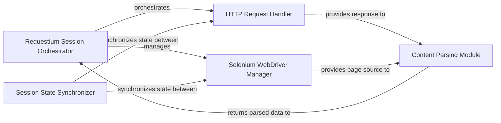

## Details

The `requestium` library's architecture is centered around the **Requestium Session Orchestrator**, which acts as the primary facade, unifying and coordinating both direct HTTP requests and browser automation. This orchestrator leverages an **HTTP Request Handler** for efficient, standard HTTP interactions and integrates a **Selenium WebDriver Manager** for dynamic content loading and complex browser-based operations. A critical **Session State Synchronizer** ensures seamless state consistency (e.g., cookies, user agent) between the HTTP and WebDriver components, enabling smooth transitions between interaction modes. Finally, a **Content Parsing Module** provides robust data extraction capabilities from both raw HTTP responses and live browser page sources, delivering parsed data back to the orchestrator for further processing. This design promotes a clear separation of concerns while maintaining a unified, high-level API for users.

### Requestium Session Orchestrator [[Expand]](./Requestium_Session_Orchestrator.md)
The central facade and control hub of the `requestium` library, embodied by `requestium.requestium_session.RequestiumSession`. It unifies and orchestrates interactions between HTTP requests and browser automation, managing the overall session state and providing a high-level API for users. It directly manages the Selenium WebDriver instance and integrates the HTTP request capabilities.

**Related Classes/Methods**:

- <a href="https://github.com/tryolabs/requestium/blob/master/requestium/requestium_session.py" target="_blank" rel="noopener noreferrer">`requestium.requestium_session.RequestiumSession`</a>

### HTTP Request Handler [[Expand]](./HTTP_Request_Handler.md)
Responsible for executing direct, efficient HTTP requests using the underlying `requests` library. It handles standard HTTP methods and manages session-level HTTP configurations, often integrated or utilized by the `Requestium Session Orchestrator`.

**Related Classes/Methods**:

- <a href="https://github.com/tryolabs/requestium/blob/master/requestium/requestium.py" target="_blank" rel="noopener noreferrer">`requestium.requestium.Requestium`</a>

### Selenium WebDriver Manager
Manages the interaction with the web browser via Selenium WebDriver. This component handles dynamic content loading, JavaScript execution, and complex user interactions requiring a full browser environment. Its functionality is directly controlled and exposed through the `Requestium Session Orchestrator`.

**Related Classes/Methods**: _None_

### Session State Synchronizer
A crucial utility component, represented by `requestium.requestium_mixin.RequestiumMixin`, that ensures consistent session state, particularly cookies and user agent, between the HTTP Request Handler and Selenium WebDriver Manager. This enables seamless transitions between direct HTTP and browser-based interactions.

**Related Classes/Methods**:

- <a href="https://github.com/tryolabs/requestium/blob/master/requestium/requestium_mixin.py" target="_blank" rel="noopener noreferrer">`requestium.requestium_mixin.RequestiumMixin`</a>

### Content Parsing Module
Provides robust capabilities for extracting data from HTML/XML content using various selectors (XPath, CSS, Regex) via the Parsel library. It operates on both raw HTTP responses and the current browser page source, often encapsulated within `requestium.requestium_response.RequestiumResponse`.

**Related Classes/Methods**:

- <a href="https://github.com/tryolabs/requestium/blob/master/requestium/requestium_response.py#L8-L34" target="_blank" rel="noopener noreferrer">`requestium.requestium_response.RequestiumResponse`:8-34</a>

### [FAQ](https://github.com/CodeBoarding/GeneratedOnBoardings/tree/main?tab=readme-ov-file#faq)