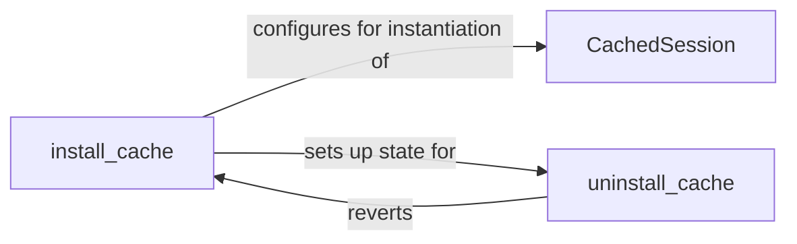

## Details

The `requests-cache` subsystem primarily focuses on transparently integrating HTTP caching into applications using the `requests` library.

### install_cache
manages the global state modification that enables or disables this caching behavior across the application.

**Related Classes/Methods**: _None_

### CachedSession
is the central element providing the caching logic

**Related Classes/Methods**: _None_

### uninstall_cache
manages the global state modification that enables or disables this caching behavior across the application.

**Related Classes/Methods**: _None_

### [FAQ](https://github.com/CodeBoarding/GeneratedOnBoardings/tree/main?tab=readme-ov-file#faq)