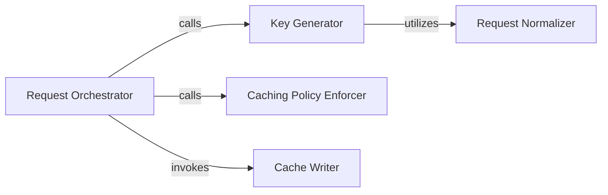

## Details

The `requests-cache` subsystem primarily revolves around an `Request Orchestrator` that manages the lifecycle of HTTP requests, deciding whether to serve from cache or make a new request. This orchestrator relies on a `Key Generator` to create unique identifiers for caching, which in turn uses a `Request Normalizer` to standardize request attributes for consistent key generation. A `Caching Policy Enforcer` is crucial for evaluating cacheability, freshness, and expiration of responses, guiding the orchestrator's decisions. Finally, a `Cache Writer` is responsible for persisting new responses into the cache. This architecture ensures efficient and policy-driven caching of HTTP responses.

### Request Orchestrator
Intercepts HTTP requests and serves as the primary decision-maker for the caching workflow. It coordinates cache lookups, handles cache misses, and triggers cache writes, effectively managing the flow of a request through the caching mechanism.

**Related Classes/Methods**:

- <a href="https://github.com/requests-cache/requests-cache/blob/main/requests_cache/session.py" target="_blank" rel="noopener noreferrer">`requests_cache/session.py:send`</a>
- <a href="https://github.com/requests-cache/requests-cache/blob/main/requests_cache/session.py" target="_blank" rel="noopener noreferrer">`requests_cache/session.py:_send_and_cache`</a>
- <a href="https://github.com/requests-cache/requests-cache/blob/main/requests_cache/session.py" target="_blank" rel="noopener noreferrer">`requests_cache/session.py:_resend`</a>

### Key Generator
Responsible for creating a unique, deterministic cache key for each HTTP request. This key is essential for efficient storage and retrieval of cached responses.

**Related Classes/Methods**:

- <a href="https://github.com/requests-cache/requests-cache/blob/main/requests_cache/cache_keys.py" target="_blank" rel="noopener noreferrer">`requests_cache/cache_keys.py:create_key`</a>

### Caching Policy Enforcer
Applies and evaluates various caching policies, including determining if a request is cacheable, assessing the validity and freshness of cached responses, and calculating expiration times based on HTTP headers and configuration.

**Related Classes/Methods**:

- <a href="https://github.com/requests-cache/requests-cache/blob/main/requests_cache/policy.py" target="_blank" rel="noopener noreferrer">`requests_cache.policy.actions.CacheActions.from_request`</a>
- <a href="https://github.com/requests-cache/requests-cache/blob/main/requests_cache/policy.py" target="_blank" rel="noopener noreferrer">`requests_cache.policy.actions.CacheActions.is_usable`</a>

### Cache Writer
Manages the process of persisting new HTTP responses into the configured cache backend. It acts as the bridge between the core caching logic and the underlying storage layer.

**Related Classes/Methods**:

- <a href="https://github.com/requests-cache/requests-cache/blob/main/requests_cache/session.py" target="_blank" rel="noopener noreferrer">`requests_cache/session.py:_send_and_cache`</a>

### Request Normalizer
Standardizes various aspects of an HTTP request (e.g., URL, headers, body) to ensure that minor variations in request formulation do not lead to different cache keys for semantically identical requests.

**Related Classes/Methods**:

- <a href="https://github.com/requests-cache/requests-cache/blob/main/requests_cache/cache_keys.py" target="_blank" rel="noopener noreferrer">`requests_cache/cache_keys.py:normalize_request`</a>

### [FAQ](https://github.com/CodeBoarding/GeneratedOnBoardings/tree/main?tab=readme-ov-file#faq)