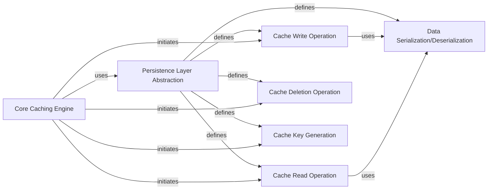

## Details

The `requests-cache` subsystem is designed with a clear separation of concerns, centralizing caching logic while providing a flexible persistence mechanism. The `Core Caching Engine` (represented by `requests_cache.session.CacheMixin`) extends the standard `requests.Session` to incorporate caching functionalities. It orchestrates all caching operations by interacting with the `Persistence Layer Abstraction` (`requests_cache.backends.base.BaseCache`), which defines a standardized interface for various cache storage backends. This design allows for interchangeable storage solutions without altering the core caching logic. The `Core Caching Engine` initiates specific `Cache Operations` (Read, Write, Delete, Key Generation, and Query/Filter) through this abstraction. `Data Serialization/Deserialization` are fundamental processes implicitly handled during these operations to convert data for storage and retrieval.

### Persistence Layer Abstraction [[Expand]](./Persistence_Layer_Abstraction.md)
The abstract base class that serves as the core interface for all cache storage backends. It defines the contract for how cached data is stored, retrieved, and managed, enabling pluggable storage solutions.

**Related Classes/Methods**:

- <a href="https://github.com/requests-cache/requests-cache/blob/main/requests_cache/backends/base.py#L31-L285" target="_blank" rel="noopener noreferrer">`requests_cache.backends.base.BaseCache`:31-285</a>

### Core Caching Engine [[Expand]](./Core_Caching_Engine.md)
The central component responsible for orchestrating caching operations. It extends `requests.Session` and interacts with the `Persistence Layer Abstraction` to store, retrieve, and manage cached HTTP responses, acting as the primary consumer of the defined backend interface.

**Related Classes/Methods**:

- <a href="https://github.com/requests-cache/requests-cache/blob/main/requests_cache/session.py#L39-L356" target="_blank" rel="noopener noreferrer">`requests_cache.session.CacheMixin`:39-356</a>

### Cache Write Operation
An abstract method within `BaseCache` responsible for persisting a `CachedResponse` object to the underlying storage. It defines the contract for how data is written.

**Related Classes/Methods**:

- <a href="https://github.com/requests-cache/requests-cache/blob/main/requests_cache/backends/base.py#L76-L97" target="_blank" rel="noopener noreferrer">`requests_cache.backends.base.save_response`:76-97</a>

### Cache Read Operation
An abstract method within `BaseCache` for retrieving a `CachedResponse` object from storage based on a key. It defines the contract for data retrieval.

**Related Classes/Methods**:

- <a href="https://github.com/requests-cache/requests-cache/blob/main/requests_cache/backends/base.py#L61-L74" target="_blank" rel="noopener noreferrer">`requests_cache.backends.base.get_response`:61-74</a>

### Cache Deletion Operation
An abstract method within `BaseCache` for removing one or more cached responses from storage. It defines the contract for data invalidation or removal.

**Related Classes/Methods**:

- <a href="https://github.com/requests-cache/requests-cache/blob/main/requests_cache/backends/base.py#L152-L193" target="_blank" rel="noopener noreferrer">`requests_cache.backends.base.delete`:152-193</a>

### Cache Key Generation
An abstract method within `BaseCache` responsible for generating a unique key for an HTTP request. This key is crucial for identifying and retrieving cached responses.

**Related Classes/Methods**:

- <a href="https://github.com/requests-cache/requests-cache/blob/main/requests_cache/backends/base.py#L111-L126" target="_blank" rel="noopener noreferrer">`requests_cache.backends.base.create_key`:111-126</a>

### Data Serialization/Deserialization
Abstract methods within `BaseCache` that define the contract for converting Python objects into a storable format (serialization) and converting stored data back into Python objects (deserialization). These are fundamental for data persistence.

**Related Classes/Methods**:

- <a href="https://github.com/requests-cache/requests-cache/blob/main/requests_cache/backends/base.py#L336-L340" target="_blank" rel="noopener noreferrer">`requests_cache.backends.base.serialize`:336-340</a>
- <a href="https://github.com/requests-cache/requests-cache/blob/main/requests_cache/backends/base.py#L342-L364" target="_blank" rel="noopener noreferrer">`requests_cache.backends.base.deserialize`:342-364</a>

### [FAQ](https://github.com/CodeBoarding/GeneratedOnBoardings/tree/main?tab=readme-ov-file#faq)