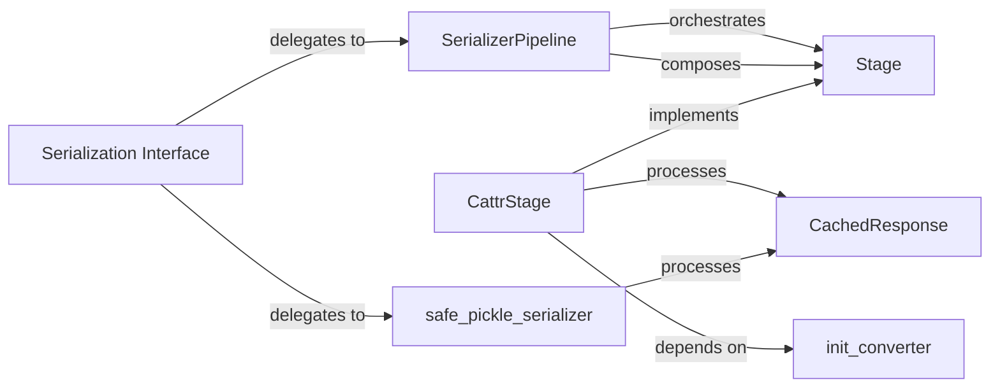

## Details

The `requests-cache` serialization subsystem is designed to efficiently convert `CachedResponse` objects for storage and retrieval. At its core, the `SerializerPipeline` orchestrates a series of `Stage` components, each performing a specific transformation step. `CattrStage` is a key implementation of `Stage`, leveraging `cattrs` for robust object conversion, with `init_converter` providing essential configuration for type handling, especially for `requests.Response` objects encapsulated within `CachedResponse`. Alternatively, `safe_pickle_serializer` offers a simpler, pre-configured serialization path. The `Serialization Interface` acts as the public entry point, delegating serialization and deserialization tasks to either the `SerializerPipeline` or `safe_pickle_serializer` based on the chosen backend. This modular design allows for flexible and extensible handling of cached HTTP responses.

### SerializerPipeline
The core orchestrator for multi-step serialization and deserialization. It manages and executes a chain of `Stage` objects, allowing for complex and flexible transformations of `CachedResponse` objects to and from a storable format.

**Related Classes/Methods**:

- <a href="https://github.com/requests-cache/requests-cache/blob/main/requests_cache/serializers/pipeline.py" target="_blank" rel="noopener noreferrer">`requests_cache.serializers.pipeline.Stage`</a>

### Stage
An abstract base class that defines the interface for individual, atomic transformation steps within the `SerializerPipeline`. Concrete implementations of `Stage` handle specific data conversions (e.g., converting `datetime` objects or handling `requests.Response` attributes).

**Related Classes/Methods**:

- <a href="https://github.com/requests-cache/requests-cache/blob/main/requests_cache/serializers/pipeline.py#L37-L82" target="_blank" rel="noopener noreferrer">`requests_cache.serializers.pipeline.SerializerPipeline`:37-82</a>

### CattrStage
A concrete implementation of the `Stage` interface that leverages the `cattrs` library for robust object conversion. It is specifically designed to convert `CachedResponse` objects to and from a dictionary-like structure, handling complex nested objects and custom types.

**Related Classes/Methods**:

- <a href="https://github.com/requests-cache/requests-cache/blob/main/requests_cache/serializers/pipeline.py" target="_blank" rel="noopener noreferrer">`requests_cache.serializers.pipeline.Stage`</a>
- <a href="https://github.com/requests-cache/requests-cache/blob/main/requests_cache/models/response.py#L68-L198" target="_blank" rel="noopener noreferrer">`requests_cache.models.response.CachedResponse`:68-198</a>
- <a href="https://github.com/requests-cache/requests-cache/blob/main/requests_cache/serializers/cattrs.py#L91-L154" target="_blank" rel="noopener noreferrer">`requests_cache.serializers.cattrs.init_converter`:91-154</a>

### CachedResponse
The primary data model representing a cached HTTP response. This object encapsulates the original `requests.Response` object along with additional metadata (e.g., request history, creation time). It is the central data structure that undergoes all serialization and deserialization operations within the subsystem.

**Related Classes/Methods**:

- <a href="https://github.com/requests-cache/requests-cache/blob/main/examples/log_requests.py" target="_blank" rel="noopener noreferrer">`requests.Response`</a>

### safe_pickle_serializer
A pre-configured, simpler serializer that utilizes Python's built-in `pickle` module. It offers a straightforward, alternative mechanism for serializing and deserializing `CachedResponse` objects, bypassing the multi-stage pipeline for simpler use cases.

**Related Classes/Methods**:

- <a href="https://github.com/requests-cache/requests-cache/blob/main/requests_cache/models/response.py#L68-L198" target="_blank" rel="noopener noreferrer">`requests_cache.models.response.CachedResponse`:68-198</a>

### Serialization Interface
This conceptual component represents the abstract `serialize` and `deserialize` methods defined in `requests_cache.backends.base`. These methods serve as the public entry points for `Storage Backends` to initiate the serialization of `CachedResponse` objects before storage and their deserialization upon retrieval.

**Related Classes/Methods**:

- <a href="https://github.com/requests-cache/requests-cache/blob/main/requests_cache/models/response.py#L68-L198" target="_blank" rel="noopener noreferrer">`requests_cache.models.response.CachedResponse`:68-198</a>
- <a href="https://github.com/requests-cache/requests-cache/blob/main/requests_cache/serializers/pipeline.py#L37-L82" target="_blank" rel="noopener noreferrer">`requests_cache.serializers.pipeline.SerializerPipeline`:37-82</a>
- <a href="https://github.com/requests-cache/requests-cache/blob/main/requests_cache/serializers/preconf.py#L65-L73" target="_blank" rel="noopener noreferrer">`requests_cache.serializers.preconf.safe_pickle_serializer`:65-73</a>

### init_converter
A utility function critical for configuring the `cattrs` converter instance used by `CattrStage`. It sets up custom type handlers, ensuring that specific Python types within the `CachedResponse` object (e.g., `requests.Response` attributes) are correctly handled during the `cattrs`-based conversion process.

**Related Classes/Methods**:

- <a href="https://github.com/requests-cache/requests-cache/blob/main/requests_cache/serializers/cattrs.py#L39-L88" target="_blank" rel="noopener noreferrer">`requests_cache.serializers.cattrs.CattrStage`:39-88</a>
- <a href="https://github.com/requests-cache/requests-cache/blob/main/requests_cache/models/response.py#L68-L198" target="_blank" rel="noopener noreferrer">`requests_cache.models.response.CachedResponse`:68-198</a>
- <a href="https://github.com/requests-cache/requests-cache/blob/main/examples/log_requests.py" target="_blank" rel="noopener noreferrer">`requests.Response`</a>

### [FAQ](https://github.com/CodeBoarding/GeneratedOnBoardings/tree/main?tab=readme-ov-file#faq)