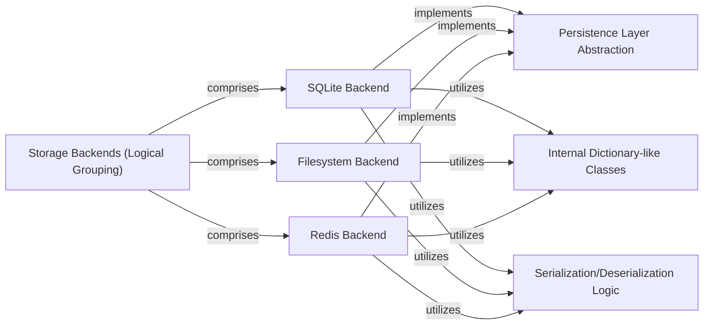

## Details

The `Storage Backends` subsystem in `requests-cache` is a critical part of the library's architecture, embodying the Strategy Pattern to provide flexible and extensible data persistence.

### Storage Backends (Logical Grouping)
This is the overarching logical component representing the collection of all concrete storage implementations. It highlights the pluggable nature of `requests-cache`, allowing users to choose different persistence mechanisms based on their needs.

**Related Classes/Methods**:

- <a href="https://github.com/requests-cache/requests-cache/blob/main/requests_cache/backends/sqlite.py" target="_blank" rel="noopener noreferrer">`requests_cache/backends/sqlite.py`</a>
- <a href="https://github.com/requests-cache/requests-cache/blob/main/requests_cache/backends/filesystem.py" target="_blank" rel="noopener noreferrer">`requests_cache/backends/filesystem.py`</a>
- <a href="https://github.com/requests-cache/requests-cache/blob/main/requests_cache/backends/redis.py" target="_blank" rel="noopener noreferrer">`requests_cache/backends/redis.py`</a>
- <a href="https://github.com/requests-cache/requests-cache/blob/main/requests_cache/backends/mongodb.py" target="_blank" rel="noopener noreferrer">`requests_cache/backends/mongodb.py`</a>
- <a href="https://github.com/requests-cache/requests-cache/blob/main/requests_cache/backends/dynamodb.py" target="_blank" rel="noopener noreferrer">`requests_cache/backends/dynamodb.py`</a>
- <a href="https://github.com/requests-cache/requests-cache/blob/main/requests_cache/backends/gridfs.py" target="_blank" rel="noopener noreferrer">`requests_cache/backends/gridfs.py`</a>

### Persistence Layer Abstraction [[Expand]](./Persistence_Layer_Abstraction.md)
Defines the common interface (`BaseCache`) that all concrete storage backends must implement. This abstraction is fundamental to the Strategy Pattern, ensuring that the core caching logic can interact with any backend uniformly without needing to know its specific implementation details. It specifies methods for storing, retrieving, deleting, and clearing cached responses.

**Related Classes/Methods**:

- <a href="https://github.com/requests-cache/requests-cache/blob/main/requests_cache/backends/base.py" target="_blank" rel="noopener noreferrer">`requests_cache/backends/base.py`</a>

### SQLite Backend
A concrete implementation of the `Persistence Layer Abstraction` that uses SQLite databases for storing cached HTTP responses. It is responsible for managing SQLite connections and performing CRUD operations on the cached data within the database.

**Related Classes/Methods**:

- <a href="https://github.com/requests-cache/requests-cache/blob/main/requests_cache/backends/sqlite.py" target="_blank" rel="noopener noreferrer">`requests_cache/backends/sqlite.py`</a>

### Filesystem Backend
A concrete implementation of the `Persistence Layer Abstraction` that persists cached HTTP responses directly to the local filesystem. It handles file I/O operations for storing and retrieving cached data.

**Related Classes/Methods**:

- <a href="https://github.com/requests-cache/requests-cache/blob/main/requests_cache/backends/filesystem.py" target="_blank" rel="noopener noreferrer">`requests_cache/backends/filesystem.py`</a>

### Redis Backend
A concrete implementation of the `Persistence Layer Abstraction` that utilizes a Redis server for caching. It manages connections to Redis and performs key-value operations to store and retrieve cached responses.

**Related Classes/Methods**:

- <a href="https://github.com/requests-cache/requests-cache/blob/main/requests_cache/backends/redis.py" target="_blank" rel="noopener noreferrer">`requests_cache/backends/redis.py`</a>

### Internal Dictionary-like Classes
These are utility classes (e.g., `DbDict`, `DbFileDict`) used internally by concrete backends to provide a consistent, dictionary-like interface for interacting with their specific storage primitives. They abstract away the low-level details of data access for each backend.

**Related Classes/Methods**:

- <a href="https://github.com/requests-cache/requests-cache/blob/main/requests_cache/backends/sqlite.py" target="_blank" rel="noopener noreferrer">`requests_cache/backends/sqlite.py`</a>
- <a href="https://github.com/requests-cache/requests-cache/blob/main/requests_cache/backends/filesystem.py" target="_blank" rel="noopener noreferrer">`requests_cache/backends/filesystem.py`</a>

### Serialization/Deserialization Logic
This component is responsible for converting Python objects (specifically HTTP responses) into a format suitable for storage (serialization) and converting them back into Python objects upon retrieval (deserialization). It is crucial for all backends to handle complex data types effectively.

**Related Classes/Methods**:

- <a href="https://github.com/requests-cache/requests-cache/blob/main/requests_cache/serializers" target="_blank" rel="noopener noreferrer">`requests_cache/serializers`</a>

### [FAQ](https://github.com/CodeBoarding/GeneratedOnBoardings/tree/main?tab=readme-ov-file#faq)