```mermaid
graph LR
    Client_Integration_Layer["Client Integration Layer"]
    Core_Caching_Engine["Core Caching Engine"]
    Persistence_Layer_Abstraction["Persistence Layer Abstraction"]
    Storage_Backends["Storage Backends"]
    Serialization_Deserialization["Serialization/Deserialization"]
    Client_Integration_Layer -- "passes requests to" --> Core_Caching_Engine
    Core_Caching_Engine -- "interacts with" --> Persistence_Layer_Abstraction
    Persistence_Layer_Abstraction -- "delegates to" --> Storage_Backends
    Core_Caching_Engine -- "utilizes" --> Serialization_Deserialization
    Serialization_Deserialization -- "interacts with" --> Storage_Backends
    click Client_Integration_Layer href "https://github.com/CodeBoarding/GeneratedOnBoardings/blob/main/requests-cache/Client_Integration_Layer.md" "Details"
    click Core_Caching_Engine href "https://github.com/CodeBoarding/GeneratedOnBoardings/blob/main/requests-cache/Core_Caching_Engine.md" "Details"
    click Persistence_Layer_Abstraction href "https://github.com/CodeBoarding/GeneratedOnBoardings/blob/main/requests-cache/Persistence_Layer_Abstraction.md" "Details"
    click Storage_Backends href "https://github.com/CodeBoarding/GeneratedOnBoardings/blob/main/requests-cache/Storage_Backends.md" "Details"
    click Serialization_Deserialization href "https://github.com/CodeBoarding/GeneratedOnBoardings/blob/main/requests-cache/Serialization_Deserialization.md" "Details"
```

## Details

The `requests-cache` library provides a robust and flexible caching mechanism for HTTP requests, seamlessly integrating with the popular `requests` library. Its architecture is designed around several key components that work in concert to intercept, cache, and serve HTTP responses. The `Client Integration Layer` acts as the primary entry point, intercepting requests and delegating them to the `Core Caching Engine`. This engine is responsible for applying caching policies, generating cache keys, and orchestrating interactions with the `Persistence Layer Abstraction`. The `Persistence Layer Abstraction` defines a consistent interface for various `Storage Backends`, allowing for pluggable storage solutions. Finally, the `Serialization/Deserialization` component ensures that HTTP responses can be efficiently stored and retrieved from these backends. This modular design facilitates extensibility and maintainability, making `requests-cache` adaptable to diverse caching requirements.

### Client Integration Layer [[Expand]](./Client_Integration_Layer.md)
The entry point for `requests-cache`, responsible for intercepting HTTP requests from the standard `requests` library. It provides the user-facing API, primarily through the `CachedSession` object, which seamlessly integrates caching capabilities into existing `requests` workflows.

**Related Classes/Methods**:

- <a href="https://github.com/requests-cache/requests-cache/blob/main/requests_cache/patcher.py" target="_blank" rel="noopener noreferrer">`requests_cache/patcher.py`</a>
- <a href="https://github.com/requests-cache/requests-cache/blob/main/requests_cache/session.py" target="_blank" rel="noopener noreferrer">`requests_cache/session.py`</a>

### Core Caching Engine [[Expand]](./Core_Caching_Engine.md)
The central orchestrator of the caching process. This component determines whether a request should be cached, generates unique cache keys, applies caching policies (e.g., expiration, revalidation), and manages the interaction with the persistence layer. It decides if a response can be served from the cache or if a new HTTP request is necessary.

**Related Classes/Methods**:

- <a href="https://github.com/requests-cache/requests-cache/blob/main/requests_cache/session.py" target="_blank" rel="noopener noreferrer">`requests_cache/session.py`</a>
- <a href="https://github.com/requests-cache/requests-cache/blob/main/requests_cache/cache_keys.py" target="_blank" rel="noopener noreferrer">`requests_cache/cache_keys.py`</a>
- <a href="https://github.com/requests-cache/requests-cache/blob/main/requests_cache/policy.py" target="_blank" rel="noopener noreferrer">`requests_cache/policy.py`</a>

### Persistence Layer Abstraction [[Expand]](./Persistence_Layer_Abstraction.md)
An abstract interface that defines the contract for all storage backends. This component ensures a consistent API for the `Core Caching Engine` to store and retrieve cached data, regardless of the underlying storage technology. It embodies the pluggable nature of `requests-cache`'s storage.

**Related Classes/Methods**:

- <a href="https://github.com/requests-cache/requests-cache/blob/main/requests_cache/backends/base.py" target="_blank" rel="noopener noreferrer">`requests_cache/backends/base.py`</a>

### Storage Backends [[Expand]](./Storage_Backends.md)
A logical grouping of concrete implementations of the `Persistence Layer Abstraction`. Each backend provides the actual mechanism for persisting and retrieving cached HTTP responses using specific technologies (e.g., SQLite, Redis, MongoDB, Filesystem, DynamoDB, GridFS). This component highlights the flexibility and extensibility of `requests-cache` to support diverse storage needs.

**Related Classes/Methods**:

- <a href="https://github.com/requests-cache/requests-cache/blob/main/requests_cache/backends/sqlite.py" target="_blank" rel="noopener noreferrer">`requests_cache/backends/sqlite.py`</a>
- <a href="https://github.com/requests-cache/requests-cache/blob/main/requests_cache/backends/filesystem.py" target="_blank" rel="noopener noreferrer">`requests_cache/backends/filesystem.py`</a>
- <a href="https://github.com/requests-cache/requests-cache/blob/main/requests_cache/backends/redis.py" target="_blank" rel="noopener noreferrer">`requests_cache/backends/redis.py`</a>
- <a href="https://github.com/requests-cache/requests-cache/blob/main/requests_cache/backends/mongodb.py" target="_blank" rel="noopener noreferrer">`requests_cache/backends/mongodb.py`</a>
- <a href="https://github.com/requests-cache/requests-cache/blob/main/requests_cache/backends/dynamodb.py" target="_blank" rel="noopener noreferrer">`requests_cache/backends/dynamodb.py`</a>
- <a href="https://github.com/requests-cache/requests-cache/blob/main/requests_cache/backends/gridfs.py" target="_blank" rel="noopener noreferrer">`requests_cache/backends/gridfs.py`</a>

### Serialization/Deserialization [[Expand]](./Serialization_Deserialization.md)
Handles the conversion of Python objects (specifically `requests.Response` objects and associated metadata) into a format suitable for storage by the `Storage Backends`, and their subsequent reconstruction back into Python objects upon retrieval. This ensures that complex objects can be persistently stored and accurately reconstructed.

**Related Classes/Methods**:

- <a href="https://github.com/requests-cache/requests-cache/blob/main/requests_cache/serializers/pipeline.py" target="_blank" rel="noopener noreferrer">`requests_cache/serializers/pipeline.py`</a>
- <a href="https://github.com/requests-cache/requests-cache/blob/main/requests_cache/serializers/cattrs.py" target="_blank" rel="noopener noreferrer">`requests_cache/serializers/cattrs.py`</a>
- <a href="https://github.com/requests-cache/requests-cache/blob/main/requests_cache/models/response.py" target="_blank" rel="noopener noreferrer">`requests_cache/models/response.py`</a>

### [FAQ](https://github.com/CodeBoarding/GeneratedOnBoardings/tree/main?tab=readme-ov-file#faq)