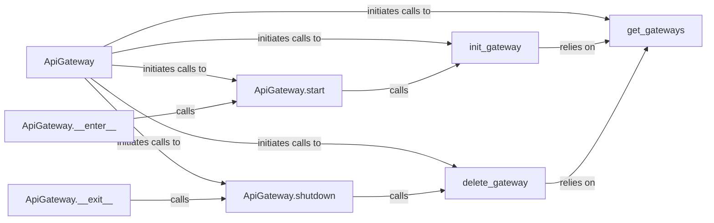

## Details

The `API Gateway Provisioner` subsystem is responsible for the lifecycle management of AWS API Gateway and IAM resources, specifically for enabling IP rotation. It encapsulates the direct interactions with AWS services to provision, retrieve, and de-provision the necessary cloud infrastructure.

### ApiGateway
The central orchestrator for managing the lifecycle of AWS API Gateway and IAM resources. It provides the primary interface for provisioning, de-provisioning, and querying gateway instances. It acts as a context manager for automated resource handling.

**Related Classes/Methods**:

- <a href="https://github.com/Ge0rg3/requests-ip-rotator/blob/main/requests_ip_rotator/ip_rotator.py#L33-L318" target="_blank" rel="noopener noreferrer">`requests_ip_rotator.ip_rotator.ApiGateway`:33-318</a>

### ApiGateway.__enter__
The entry point for the `ApiGateway` context manager. When an `ApiGateway` object is used in a `with` statement, this method is invoked to initiate the provisioning process.

**Related Classes/Methods**:

- <a href="https://github.com/Ge0rg3/requests-ip-rotator/blob/main/requests_ip_rotator/ip_rotator.py" target="_blank" rel="noopener noreferrer">`requests_ip_rotator.ip_rotator.ApiGateway:__enter__`</a>

### ApiGateway.start
Handles the initial setup and configuration steps for the API Gateway, acting as an intermediary that calls the core provisioning logic.

**Related Classes/Methods**:

- <a href="https://github.com/Ge0rg3/requests-ip-rotator/blob/main/requests_ip_rotator/ip_rotator.py" target="_blank" rel="noopener noreferrer">`requests_ip_rotator.ip_rotator.ApiGateway:start`</a>

### init_gateway
Contains the core logic for creating and configuring a new AWS API Gateway instance, including setting up necessary IAM roles and permissions. This is where the actual AWS API calls for creation are made.

**Related Classes/Methods**:

- <a href="https://github.com/Ge0rg3/requests-ip-rotator/blob/main/requests_ip_rotator/ip_rotator.py#L77-L197" target="_blank" rel="noopener noreferrer">`requests_ip_rotator.ip_rotator.init_gateway`:77-197</a>

### ApiGateway.__exit__
The exit point for the `ApiGateway` context manager. When an `ApiGateway` object exits a `with` statement, this method is invoked to initiate the de-provisioning process.

**Related Classes/Methods**:

- <a href="https://github.com/Ge0rg3/requests-ip-rotator/blob/main/requests_ip_rotator/ip_rotator.py" target="_blank" rel="noopener noreferrer">`requests_ip_rotator.ip_rotator.ApiGateway:__exit__`</a>

### ApiGateway.shutdown
Handles the teardown and cleanup steps for the API Gateway, acting as an intermediary that calls the core de-provisioning logic.

**Related Classes/Methods**:

- <a href="https://github.com/Ge0rg3/requests-ip-rotator/blob/main/requests_ip_rotator/ip_rotator.py" target="_blank" rel="noopener noreferrer">`requests_ip_rotator.ip_rotator.ApiGateway:shutdown`</a>

### delete_gateway
Contains the core logic for removing an existing AWS API Gateway instance and associated IAM resources. This is where the actual AWS API calls for deletion are made.

**Related Classes/Methods**:

- <a href="https://github.com/Ge0rg3/requests-ip-rotator/blob/main/requests_ip_rotator/ip_rotator.py#L223-L271" target="_blank" rel="noopener noreferrer">`requests_ip_rotator.ip_rotator.delete_gateway`:223-271</a>

### get_gateways
A utility component responsible for querying AWS to retrieve information about existing API Gateway resources. It supports both provisioning and de-provisioning by providing current state information.

**Related Classes/Methods**:

- <a href="https://github.com/Ge0rg3/requests-ip-rotator/blob/main/requests_ip_rotator/ip_rotator.py#L199-L221" target="_blank" rel="noopener noreferrer">`requests_ip_rotator.ip_rotator.get_gateways`:199-221</a>

### [FAQ](https://github.com/CodeBoarding/GeneratedOnBoardings/tree/main?tab=readme-ov-file#faq)