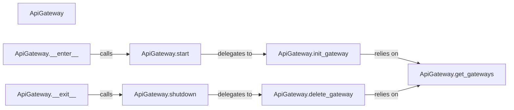

## Details

The `IpRotator Core Orchestrator` subsystem is centered around the `requests_ip_rotator.ip_rotator.ApiGateway` class, which acts as the primary interface for managing the IP rotation lifecycle. This subsystem embodies the Resource Management Pattern, orchestrating the creation, activation, deactivation, and cleanup of AWS API Gateway resources.

### ApiGateway
The overarching component responsible for managing the entire lifecycle of the IP rotation mechanism. It serves as the main entry point for users to interact with the IP rotation functionality, coordinating the setup, operation, and teardown of AWS API Gateway resources.

**Related Classes/Methods**:

- <a href="https://github.com/Ge0rg3/requests-ip-rotator/blob/main/requests_ip_rotator/ip_rotator.py#L33-L318" target="_blank" rel="noopener noreferrer">`requests_ip_rotator.ip_rotator.ApiGateway`:33-318</a>

### ApiGateway.start
Orchestrates the initial setup and activation of the IP rotation process. This involves preparing the necessary environment and invoking the underlying AWS resource provisioning.

**Related Classes/Methods**:

- <a href="https://github.com/Ge0rg3/requests-ip-rotator/blob/main/requests_ip_rotator/ip_rotator.py" target="_blank" rel="noopener noreferrer">`requests_ip_rotator.ip_rotator.ApiGateway:start`</a>

### ApiGateway.shutdown
Manages the graceful deactivation and cleanup of the IP rotation mechanism. Its primary responsibility is to ensure that all associated AWS resources are properly terminated and released.

**Related Classes/Methods**:

- <a href="https://github.com/Ge0rg3/requests-ip-rotator/blob/main/requests_ip_rotator/ip_rotator.py" target="_blank" rel="noopener noreferrer">`requests_ip_rotator.ip_rotator.ApiGateway:shutdown`</a>

### ApiGateway.__enter__
Implements the context management protocol's entry point, allowing the ApiGateway to be used with Python's `with` statement. It triggers the activation of the IP rotation mechanism upon entering the context.

**Related Classes/Methods**:

- <a href="https://github.com/Ge0rg3/requests-ip-rotator/blob/main/requests_ip_rotator/ip_rotator.py" target="_blank" rel="noopener noreferrer">`requests_ip_rotator.ip_rotator.ApiGateway:__enter__`</a>

### ApiGateway.__exit__
Implements the context management protocol's exit point, ensuring proper resource deallocation when exiting a `with` statement. It triggers the shutdown of the IP rotation mechanism.

**Related Classes/Methods**:

- <a href="https://github.com/Ge0rg3/requests-ip-rotator/blob/main/requests_ip_rotator/ip_rotator.py" target="_blank" rel="noopener noreferrer">`requests_ip_rotator.ip_rotator.ApiGateway:__exit__`</a>

### ApiGateway.init_gateway
A delegated component responsible for the low-level initialization and provisioning of AWS API Gateway resources. It encapsulates the direct interaction with AWS APIs to create and configure gateways.

**Related Classes/Methods**:

- <a href="https://github.com/Ge0rg3/requests-ip-rotator/blob/main/requests_ip_rotator/ip_rotator.py" target="_blank" rel="noopener noreferrer">`requests_ip_rotator.ip_rotator.ApiGateway:init_gateway`</a>

### ApiGateway.delete_gateway
A delegated component responsible for the low-level deletion and deprovisioning of AWS API Gateway resources. It handles the direct interaction with AWS APIs to remove deployed gateways.

**Related Classes/Methods**:

- <a href="https://github.com/Ge0rg3/requests-ip-rotator/blob/main/requests_ip_rotator/ip_rotator.py" target="_blank" rel="noopener noreferrer">`requests_ip_rotator.ip_rotator.ApiGateway:delete_gateway`</a>

### ApiGateway.get_gateways
A delegated component responsible for retrieving information about existing AWS API Gateway configurations. It interacts with AWS to fetch details about deployed gateways, supporting both provisioning and deprovisioning operations.

**Related Classes/Methods**:

- <a href="https://github.com/Ge0rg3/requests-ip-rotator/blob/main/requests_ip_rotator/ip_rotator.py" target="_blank" rel="noopener noreferrer">`requests_ip_rotator.ip_rotator.ApiGateway:get_gateways`</a>

### [FAQ](https://github.com/CodeBoarding/GeneratedOnBoardings/tree/main?tab=readme-ov-file#faq)