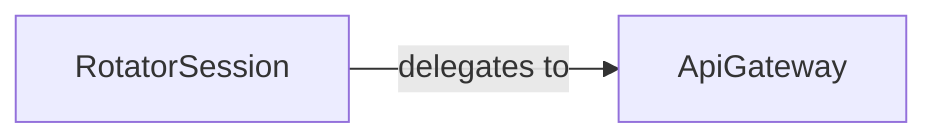

## Details

The requests-ip_rotator library provides an elegant solution for IP rotation by integrating with AWS API Gateway. At its core, the architecture comprises a RotatorSession component, which serves as an adapter for standard HTTP requests, and an ApiGateway component, which orchestrates the dynamic provisioning and management of AWS API Gateway endpoints. The RotatorSession transparently intercepts outgoing requests and delegates their execution to the ApiGateway. This delegation ensures that all requests are routed through the AWS infrastructure, enabling effective IP rotation. The ApiGateway component encapsulates the complex interactions with AWS services, providing a robust and scalable mechanism for managing the IP rotation process. This clear separation of concerns allows for a flexible and maintainable system, where the RotatorSession provides a familiar user interface, and the ApiGateway handles the underlying cloud resource management and IP rotation logic.

### RotatorSession
This component acts as an Adapter for the standard requests.Session object, providing a familiar interface to users while intercepting outgoing HTTP requests. It functions as an Interceptor by delegating the actual request execution to the ApiGateway component, ensuring all requests are routed through dynamically provisioned AWS API Gateway endpoints for IP rotation. This aligns with the "Python Library / Utility Library" pattern by offering an enhanced, drop-in replacement for a standard library component.

**Related Classes/Methods**: _None_

### ApiGateway
This component is the core API Gateway Manager and implements the IP Rotation Logic. It is responsible for provisioning, managing, and de-provisioning AWS API Gateway endpoints. It receives intercepted HTTP requests from RotatorSession and handles their routing through the provisioned gateways, effectively enabling IP rotation by leveraging AWS infrastructure. It encapsulates the interaction with AWS services (boto3) to manage the cloud resources.

**Related Classes/Methods**: _None_

### [FAQ](https://github.com/CodeBoarding/GeneratedOnBoardings/tree/main?tab=readme-ov-file#faq)