```mermaid
graph LR
    User_Application["User Application"]
    IpRotator_Core_Orchestrator["IpRotator Core Orchestrator"]
    API_Gateway_Provisioner["API Gateway Provisioner"]
    Request_Interceptor_Adapter["Request Interceptor/Adapter"]
    Requests_Session_External_["Requests Session (External)"]
    AWS_API_Gateway_Service_External_["AWS API Gateway Service (External)"]
    AWS_IAM_Service_External_["AWS IAM Service (External)"]
    Target_Website["Target Website"]
    User_Application -- "initiates and interacts with" --> IpRotator_Core_Orchestrator
    IpRotator_Core_Orchestrator -- "orchestrates and invokes" --> API_Gateway_Provisioner
    API_Gateway_Provisioner -- "provisions resources in" --> AWS_API_Gateway_Service_External_
    API_Gateway_Provisioner -- "manages permissions via" --> AWS_IAM_Service_External_
    IpRotator_Core_Orchestrator -- "configures" --> Requests_Session_External_
    Requests_Session_External_ -- "routes requests through" --> Request_Interceptor_Adapter
    Request_Interceptor_Adapter -- "forwards requests to" --> AWS_API_Gateway_Service_External_
    AWS_API_Gateway_Service_External_ -- "proxies requests to" --> Target_Website
    Target_Website -- "sends responses to" --> AWS_API_Gateway_Service_External_
    AWS_API_Gateway_Service_External_ -- "returns responses to" --> Request_Interceptor_Adapter
    Request_Interceptor_Adapter -- "passes responses to" --> Requests_Session_External_
    Requests_Session_External_ -- "delivers response to" --> User_Application
    click IpRotator_Core_Orchestrator href "https://github.com/CodeBoarding/GeneratedOnBoardings/blob/main/requests-ip-rotator/IpRotator_Core_Orchestrator.md" "Details"
    click API_Gateway_Provisioner href "https://github.com/CodeBoarding/GeneratedOnBoardings/blob/main/requests-ip-rotator/API_Gateway_Provisioner.md" "Details"
    click Request_Interceptor_Adapter href "https://github.com/CodeBoarding/GeneratedOnBoardings/blob/main/requests-ip-rotator/Request_Interceptor_Adapter.md" "Details"
```

## Details

The requests-ip-rotator library acts as an intermediary between a user application and a target website, dynamically routing HTTP requests through AWS API Gateway endpoints to achieve IP rotation. The core logic resides in the IpRotator Core Orchestrator, which manages the setup and teardown of AWS resources via the API Gateway Provisioner and modifies the standard requests.Session behavior through a Request Interceptor/Adapter. This design clearly separates concerns: library internal operations, interaction with external AWS services, and the standard HTTP request flow.

### User Application
The client-side Python application that consumes the requests-ip-rotator library. As an external consumer, its source code is not part of this project.

**Related Classes/Methods**: _None_

### IpRotator Core Orchestrator [[Expand]](./IpRotator_Core_Orchestrator.md)
The central component of the library, responsible for managing the overall lifecycle of the IP rotation mechanism, including initialization, shutdown, and session configuration.

**Related Classes/Methods**:

- <a href="https://github.com/Ge0rg3/requests-ip-rotator/blob/main/requests_ip_rotator/ip_rotator.py" target="_blank" rel="noopener noreferrer">`requests_ip_rotator.ip_rotator.ApiGateway:start`</a>
- <a href="https://github.com/Ge0rg3/requests-ip-rotator/blob/main/requests_ip_rotator/ip_rotator.py" target="_blank" rel="noopener noreferrer">`requests_ip_rotator.ip_rotator.ApiGateway:shutdown`</a>
- <a href="https://github.com/Ge0rg3/requests-ip-rotator/blob/main/requests_ip_rotator/ip_rotator.py" target="_blank" rel="noopener noreferrer">`requests_ip_rotator.ip_rotator.ApiGateway:__enter__`</a>
- <a href="https://github.com/Ge0rg3/requests-ip-rotator/blob/main/requests_ip_rotator/ip_rotator.py" target="_blank" rel="noopener noreferrer">`requests_ip_rotator.ip_rotator.ApiGateway:__exit__`</a>

### API Gateway Provisioner [[Expand]](./API_Gateway_Provisioner.md)
Handles direct interactions with AWS services (API Gateway and IAM) to provision, retrieve, and de-provision the necessary cloud infrastructure for IP rotation.

**Related Classes/Methods**:

- <a href="https://github.com/Ge0rg3/requests-ip-rotator/blob/main/requests_ip_rotator/ip_rotator.py" target="_blank" rel="noopener noreferrer">`requests_ip_rotator.ip_rotator.ApiGateway:init_gateway`</a>
- <a href="https://github.com/Ge0rg3/requests-ip-rotator/blob/main/requests_ip_rotator/ip_rotator.py" target="_blank" rel="noopener noreferrer">`requests_ip_rotator.ip_rotator.ApiGateway:delete_gateway`</a>
- <a href="https://github.com/Ge0rg3/requests-ip-rotator/blob/main/requests_ip_rotator/ip_rotator.py" target="_blank" rel="noopener noreferrer">`requests_ip_rotator.ip_rotator.ApiGateway:get_gateways`</a>

### Request Interceptor/Adapter [[Expand]](./Request_Interceptor_Adapter.md)
Modifies outgoing HTTP requests from the requests.Session to route them through the provisioned AWS API Gateway endpoints, enabling IP rotation.

**Related Classes/Methods**:

- <a href="https://github.com/Ge0rg3/requests-ip-rotator/blob/main/requests_ip_rotator/ip_rotator.py" target="_blank" rel="noopener noreferrer">`requests_ip_rotator.ip_rotator.ApiGateway:send`</a>

### Requests Session (External)
The standard requests.Session object from the requests library, configured by the IpRotator Core Orchestrator to use the Request Interceptor/Adapter. This is an external library component, and its source code is not managed within this project.

**Related Classes/Methods**: _None_

### AWS API Gateway Service (External)
The external AWS service that acts as a managed proxy, forwarding requests from the Request Interceptor/Adapter to the target website using dynamic IP addresses. As an external cloud service, its implementation details are outside the scope of this project's source code.

**Related Classes/Methods**: _None_

### AWS IAM Service (External)
The external AWS service responsible for managing access control and permissions for the API Gateway Provisioner to interact with other AWS services. As an external cloud service, its implementation details are outside the scope of this project's source code.

**Related Classes/Methods**: _None_

### Target Website
The ultimate destination of the HTTP requests, accessed via the AWS API Gateway Service. This is an external entity, and its source code is not part of this project.

**Related Classes/Methods**: _None_

### [FAQ](https://github.com/CodeBoarding/GeneratedOnBoardings/tree/main?tab=readme-ov-file#faq)