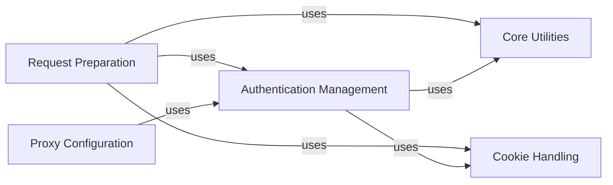

## Component Details

The `requests` library provides a user-friendly HTTP client. This analysis focuses on key internal components responsible for preparing HTTP requests, managing various authentication schemes, handling cookies, configuring proxy settings, and providing core utility functions to support these operations. The main flow involves preparing a request, applying authentication, managing cookies, and routing through proxies before sending.

### Request Preparation
This component is responsible for taking a raw `Request` object and transforming it into a `PreparedRequest` object, which contains the exact bytes that will be sent to the server. This involves preparing the HTTP method, URL, headers, body, authentication, and cookies.

**Related Classes/Methods**:

- <a href="https://github.com/psf/requests/blob/master/src/requests/models.py#L313-L637" target="_blank" rel="noopener noreferrer">`requests.src.requests.models.PreparedRequest` (313:637)</a>
- <a href="https://github.com/psf/requests/blob/master/src/requests/models.py#L588-L608" target="_blank" rel="noopener noreferrer">`requests.src.requests.models.PreparedRequest:prepare_auth` (588:608)</a>
- <a href="https://github.com/psf/requests/blob/master/src/requests/models.py#L572-L586" target="_blank" rel="noopener noreferrer">`requests.src.requests.models.PreparedRequest:prepare_content_length` (572:586)</a>
- <a href="https://github.com/psf/requests/blob/master/src/requests/models.py#L351-L377" target="_blank" rel="noopener noreferrer">`requests.src.requests.models.PreparedRequest:prepare` (351:377)</a>
- <a href="https://github.com/psf/requests/blob/master/src/requests/sessions.py#L457-L498" target="_blank" rel="noopener noreferrer">`requests.src.requests.sessions.Session:prepare_request` (457:498)</a>

### Authentication Management
This component handles various authentication mechanisms, including basic, digest, and proxy authentication. It provides functionalities to generate authentication headers, process authentication challenges, and retrieve authentication credentials from URLs or netrc files.

**Related Classes/Methods**:

- <a href="https://github.com/psf/requests/blob/master/src/requests/auth.py#L69-L73" target="_blank" rel="noopener noreferrer">`requests.src.requests.auth.AuthBase` (69:73)</a>
- <a href="https://github.com/psf/requests/blob/master/src/requests/auth.py#L76-L96" target="_blank" rel="noopener noreferrer">`requests.src.requests.auth.HTTPBasicAuth` (76:96)</a>
- <a href="https://github.com/psf/requests/blob/master/src/requests/auth.py#L94-L96" target="_blank" rel="noopener noreferrer">`requests.src.requests.auth.HTTPBasicAuth:__call__` (94:96)</a>
- <a href="https://github.com/psf/requests/blob/master/src/requests/auth.py#L25-L66" target="_blank" rel="noopener noreferrer">`requests.src.requests.auth._basic_auth_str` (25:66)</a>
- <a href="https://github.com/psf/requests/blob/master/src/requests/auth.py#L99-L104" target="_blank" rel="noopener noreferrer">`requests.src.requests.auth.HTTPProxyAuth` (99:104)</a>
- <a href="https://github.com/psf/requests/blob/master/src/requests/auth.py#L102-L104" target="_blank" rel="noopener noreferrer">`requests.src.requests.auth.HTTPProxyAuth:__call__` (102:104)</a>
- <a href="https://github.com/psf/requests/blob/master/src/requests/auth.py#L107-L314" target="_blank" rel="noopener noreferrer">`requests.src.requests.auth.HTTPDigestAuth` (107:314)</a>
- <a href="https://github.com/psf/requests/blob/master/src/requests/auth.py#L126-L234" target="_blank" rel="noopener noreferrer">`requests.src.requests.auth.HTTPDigestAuth:build_digest_header` (126:234)</a>
- <a href="https://github.com/psf/requests/blob/master/src/requests/auth.py#L241-L283" target="_blank" rel="noopener noreferrer">`requests.src.requests.auth.HTTPDigestAuth:handle_401` (241:283)</a>
- <a href="https://github.com/psf/requests/blob/master/src/requests/auth.py#L285-L303" target="_blank" rel="noopener noreferrer">`requests.src.requests.auth.HTTPDigestAuth:__call__` (285:303)</a>
- `requests.src.requests.auth.HTTPDigestAuth:build_digest_header.<lambda>` (full file reference)
- <a href="https://github.com/psf/requests/blob/master/src/requests/auth.py#L116-L124" target="_blank" rel="noopener noreferrer">`requests.src.requests.auth.HTTPDigestAuth.init_per_thread_state` (116:124)</a>
- <a href="https://github.com/psf/requests/blob/master/src/requests/utils.py#L1021-L1034" target="_blank" rel="noopener noreferrer">`requests.src.requests.utils.get_auth_from_url` (1021:1034)</a>
- <a href="https://github.com/psf/requests/blob/master/src/requests/utils.py#L207-L261" target="_blank" rel="noopener noreferrer">`requests.src.requests.utils.get_netrc_auth` (207:261)</a>
- <a href="https://github.com/psf/requests/blob/master/src/requests/sessions.py#L282-L300" target="_blank" rel="noopener noreferrer">`requests.src.requests.sessions.SessionRedirectMixin:rebuild_auth` (282:300)</a>
- <a href="https://github.com/psf/requests/blob/master/src/requests/sessions.py#L127-L157" target="_blank" rel="noopener noreferrer">`requests.src.requests.sessions.SessionRedirectMixin:should_strip_auth` (127:157)</a>

### Cookie Handling
This component is responsible for managing HTTP cookies. It provides utilities to convert dictionaries to CookieJar objects, merge cookie jars, and extract cookie headers for requests.

**Related Classes/Methods**:

- <a href="https://github.com/psf/requests/blob/master/src/requests/cookies.py#L521-L539" target="_blank" rel="noopener noreferrer">`requests.src.requests.cookies.cookiejar_from_dict` (521:539)</a>
- <a href="https://github.com/psf/requests/blob/master/src/requests/cookies.py#L542-L561" target="_blank" rel="noopener noreferrer">`requests.src.requests.cookies.merge_cookies` (542:561)</a>
- <a href="https://github.com/psf/requests/blob/master/src/requests/cookies.py#L176-L437" target="_blank" rel="noopener noreferrer">`requests.src.requests.cookies.RequestsCookieJar` (176:437)</a>
- <a href="https://github.com/psf/requests/blob/master/src/requests/cookies.py#L124-L137" target="_blank" rel="noopener noreferrer">`requests.src.requests.cookies.extract_cookies_to_jar` (124:137)</a>

### Proxy Configuration
This component manages the configuration and application of proxy settings for HTTP requests. It includes resolving proxy URLs, handling proxy authentication, and generating proxy-related headers.

**Related Classes/Methods**:

- <a href="https://github.com/psf/requests/blob/master/src/requests/sessions.py#L302-L331" target="_blank" rel="noopener noreferrer">`requests.src.requests.sessions.SessionRedirectMixin:rebuild_proxies` (302:331)</a>
- <a href="https://github.com/psf/requests/blob/master/src/requests/utils.py#L867-L891" target="_blank" rel="noopener noreferrer">`requests.src.requests.utils.resolve_proxies` (867:891)</a>
- <a href="https://github.com/psf/requests/blob/master/src/requests/adapters.py#L266-L302" target="_blank" rel="noopener noreferrer">`requests.src.requests.adapters.HTTPAdapter:proxy_manager_for` (266:302)</a>
- <a href="https://github.com/psf/requests/blob/master/src/requests/adapters.py#L592-L611" target="_blank" rel="noopener noreferrer">`requests.src.requests.adapters.HTTPAdapter:proxy_headers` (592:611)</a>

### Core Utilities
This component provides a collection of general utility functions that support various operations within the `requests` library, such as string conversions, and merging settings or hooks.

**Related Classes/Methods**:

- <a href="https://github.com/psf/requests/blob/master/src/requests/_internal_utils.py#L25-L35" target="_blank" rel="noopener noreferrer">`requests.src.requests._internal_utils.to_native_string` (25:35)</a>
- <a href="https://github.com/psf/requests/blob/master/src/requests/sessions.py#L61-L88" target="_blank" rel="noopener noreferrer">`requests.src.requests.sessions.merge_setting` (61:88)</a>
- <a href="https://github.com/psf/requests/blob/master/src/requests/sessions.py#L91-L103" target="_blank" rel="noopener noreferrer">`requests.src.requests.sessions.merge_hooks` (91:103)</a>
- <a href="https://github.com/psf/requests/blob/master/src/requests/utils.py#L410-L441" target="_blank" rel="noopener noreferrer">`requests.src.requests.utils.parse_dict_header` (410:441)</a>

### [FAQ](https://github.com/CodeBoarding/GeneratedOnBoardings/tree/main?tab=readme-ov-file#faq)