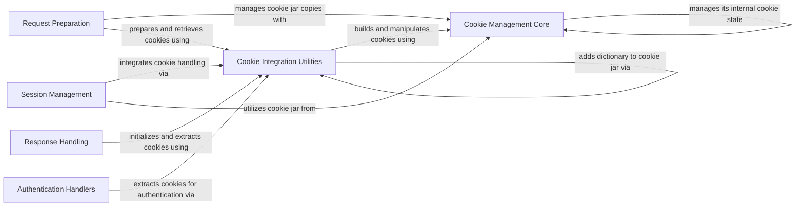

## Component Details

This subsystem handles HTTP cookies, including parsing, storing, and attaching them to requests, ensuring cookies are correctly managed across redirects and subsequent requests within a session. It is composed of core cookie operations, utility functions for integration, request preparation, session management, response handling, and authentication mechanisms, all working together to provide robust cookie management.

### Cookie Management Core
This component is responsible for the fundamental operations related to HTTP cookies, including creating, storing, retrieving, and managing cookies within a CookieJar. It provides the basic building blocks for handling cookies in HTTP requests and responses.

**Related Classes/Methods**:

- <a href="https://github.com/psf/requests/blob/master/src/requests/cookies.py#L176-L437" target="_blank" rel="noopener noreferrer">`requests.src.requests.cookies.RequestsCookieJar` (176:437)</a>
- <a href="https://github.com/psf/requests/blob/master/src/requests/cookies.py#L455-L489" target="_blank" rel="noopener noreferrer">`requests.src.requests.cookies.create_cookie` (455:489)</a>
- <a href="https://github.com/psf/requests/blob/master/src/requests/cookies.py#L492-L518" target="_blank" rel="noopener noreferrer">`requests.src.requests.cookies.morsel_to_cookie` (492:518)</a>
- <a href="https://github.com/psf/requests/blob/master/src/requests/cookies.py#L151-L167" target="_blank" rel="noopener noreferrer">`requests.src.requests.cookies.remove_cookie_by_name` (151:167)</a>
- <a href="https://github.com/psf/requests/blob/master/src/requests/cookies.py#L170-L173" target="_blank" rel="noopener noreferrer">`requests.src.requests.cookies.CookieConflictError` (170:173)</a>
- <a href="https://github.com/psf/requests/blob/master/src/requests/cookies.py#L440-L452" target="_blank" rel="noopener noreferrer">`requests.src.requests.cookies._copy_cookie_jar` (440:452)</a>

### Cookie Integration Utilities
This component provides utility functions that facilitate the integration of cookie management with other parts of the `requests` library, such as converting dictionaries to cookie jars, extracting cookies from responses, and merging cookie jars. It also includes mock objects for interacting with the underlying cookiejar.

**Related Classes/Methods**:

- <a href="https://github.com/psf/requests/blob/master/src/requests/cookies.py#L521-L539" target="_blank" rel="noopener noreferrer">`requests.src.requests.cookies.cookiejar_from_dict` (521:539)</a>
- <a href="https://github.com/psf/requests/blob/master/src/requests/cookies.py#L124-L137" target="_blank" rel="noopener noreferrer">`requests.src.requests.cookies.extract_cookies_to_jar` (124:137)</a>
- <a href="https://github.com/psf/requests/blob/master/src/requests/cookies.py#L140-L148" target="_blank" rel="noopener noreferrer">`requests.src.requests.cookies.get_cookie_header` (140:148)</a>
- <a href="https://github.com/psf/requests/blob/master/src/requests/cookies.py#L542-L561" target="_blank" rel="noopener noreferrer">`requests.src.requests.cookies.merge_cookies` (542:561)</a>
- <a href="https://github.com/psf/requests/blob/master/src/requests/cookies.py#L23-L100" target="_blank" rel="noopener noreferrer">`requests.src.requests.cookies.MockRequest` (23:100)</a>
- <a href="https://github.com/psf/requests/blob/master/src/requests/cookies.py#L103-L121" target="_blank" rel="noopener noreferrer">`requests.src.requests.cookies.MockResponse` (103:121)</a>
- <a href="https://github.com/psf/requests/blob/master/src/requests/utils.py#L481-L489" target="_blank" rel="noopener noreferrer">`requests.src.requests.utils.add_dict_to_cookiejar` (481:489)</a>

### Request Preparation
This component is responsible for preparing HTTP requests before they are sent. This includes handling headers, body data, authentication, and crucially, preparing cookies to be sent with the request.

**Related Classes/Methods**:

- <a href="https://github.com/psf/requests/blob/master/src/requests/models.py#L313-L637" target="_blank" rel="noopener noreferrer">`requests.src.requests.models.PreparedRequest` (313:637)</a>
- <a href="https://github.com/psf/requests/blob/master/src/requests/models.py#L610-L628" target="_blank" rel="noopener noreferrer">`requests.src.requests.models.PreparedRequest:prepare_cookies` (610:628)</a>
- <a href="https://github.com/psf/requests/blob/master/src/requests/models.py#L382-L391" target="_blank" rel="noopener noreferrer">`requests.src.requests.models.PreparedRequest:copy` (382:391)</a>

### Session Management
This component manages persistent settings across multiple HTTP requests, such as cookies, authentication, and proxies. It handles the lifecycle of requests and responses within a session, including redirect handling and cookie persistence.

**Related Classes/Methods**:

- <a href="https://github.com/psf/requests/blob/master/src/requests/sessions.py#L356-L816" target="_blank" rel="noopener noreferrer">`requests.src.requests.sessions.Session` (356:816)</a>
- <a href="https://github.com/psf/requests/blob/master/src/requests/sessions.py#L390-L449" target="_blank" rel="noopener noreferrer">`requests.src.requests.sessions.Session:__init__` (390:449)</a>
- <a href="https://github.com/psf/requests/blob/master/src/requests/sessions.py#L457-L498" target="_blank" rel="noopener noreferrer">`requests.src.requests.sessions.Session:prepare_request` (457:498)</a>
- <a href="https://github.com/psf/requests/blob/master/src/requests/sessions.py#L673-L748" target="_blank" rel="noopener noreferrer">`requests.src.requests.sessions.Session:send` (673:748)</a>
- <a href="https://github.com/psf/requests/blob/master/src/requests/sessions.py#L159-L280" target="_blank" rel="noopener noreferrer">`requests.src.requests.sessions.SessionRedirectMixin:resolve_redirects` (159:280)</a>

### Response Handling
This component is responsible for processing and representing the HTTP response received from a server. It includes initializing the response object and extracting cookies from the received response.

**Related Classes/Methods**:

- <a href="https://github.com/psf/requests/blob/master/src/requests/models.py#L640-L1039" target="_blank" rel="noopener noreferrer">`requests.src.requests.models.Response` (640:1039)</a>
- <a href="https://github.com/psf/requests/blob/master/src/requests/models.py#L658-L703" target="_blank" rel="noopener noreferrer">`requests.src.requests.models.Response:__init__` (658:703)</a>
- <a href="https://github.com/psf/requests/blob/master/src/requests/adapters.py#L359-L394" target="_blank" rel="noopener noreferrer">`requests.src.requests.adapters.HTTPAdapter:build_response` (359:394)</a>

### Authentication Handlers
This component deals with various authentication mechanisms, specifically handling HTTP Digest Authentication and its interaction with cookie management.

**Related Classes/Methods**:

- <a href="https://github.com/psf/requests/blob/master/src/requests/auth.py#L241-L283" target="_blank" rel="noopener noreferrer">`requests.src.requests.auth.HTTPDigestAuth:handle_401` (241:283)</a>

### [FAQ](https://github.com/CodeBoarding/GeneratedOnBoardings/tree/main?tab=readme-ov-file#faq)