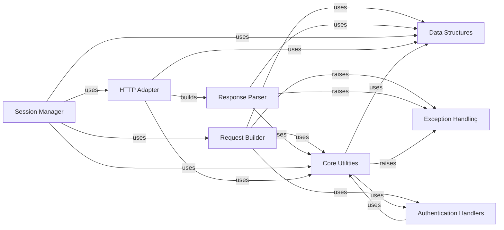

## Component Details

This architecture overview describes the key components of the `requests` library, focusing on how HTTP requests are built, sent, and responses are parsed. It highlights the roles of session management, HTTP adaptation, and core utility functions, along with specialized data structures, authentication handling, and exception management.

### Request Builder
This component is responsible for constructing and preparing HTTP requests. It handles the encoding of parameters and files, the preparation of URLs, headers, and the request body, and integrates authentication details.

**Related Classes/Methods**:

- <a href="https://github.com/psf/requests/blob/master/src/requests/models.py#L107-L134" target="_blank" rel="noopener noreferrer">`requests.src.requests.models.RequestEncodingMixin:_encode_params` (107:134)</a>
- <a href="https://github.com/psf/requests/blob/master/src/requests/models.py#L137-L203" target="_blank" rel="noopener noreferrer">`requests.src.requests.models.RequestEncodingMixin:_encode_files` (137:203)</a>
- <a href="https://github.com/psf/requests/blob/master/src/requests/models.py#L393-L397" target="_blank" rel="noopener noreferrer">`requests.src.requests.models.PreparedRequest:prepare_method` (393:397)</a>
- <a href="https://github.com/psf/requests/blob/master/src/requests/models.py#L409-L481" target="_blank" rel="noopener noreferrer">`requests.src.requests.models.PreparedRequest:prepare_url` (409:481)</a>
- <a href="https://github.com/psf/requests/blob/master/src/requests/models.py#L483-L492" target="_blank" rel="noopener noreferrer">`requests.src.requests.models.PreparedRequest:prepare_headers` (483:492)</a>
- <a href="https://github.com/psf/requests/blob/master/src/requests/models.py#L494-L570" target="_blank" rel="noopener noreferrer">`requests.src.requests.models.PreparedRequest:prepare_body` (494:570)</a>
- <a href="https://github.com/psf/requests/blob/master/src/requests/models.py#L572-L586" target="_blank" rel="noopener noreferrer">`requests.src.requests.models.PreparedRequest:prepare_content_length` (572:586)</a>
- <a href="https://github.com/psf/requests/blob/master/src/requests/models.py#L588-L608" target="_blank" rel="noopener noreferrer">`requests.src.requests.models.PreparedRequest:prepare_auth` (588:608)</a>

### Response Parser
This component focuses on processing and interpreting the HTTP responses received from a server. It provides functionalities to access response content, headers, status codes, and to parse JSON data and links.

**Related Classes/Methods**:

- <a href="https://github.com/psf/requests/blob/master/src/requests/models.py#L658-L703" target="_blank" rel="noopener noreferrer">`requests.src.requests.models.Response:__init__` (658:703)</a>
- <a href="https://github.com/psf/requests/blob/master/src/requests/models.py#L799-L855" target="_blank" rel="noopener noreferrer">`requests.src.requests.models.Response:iter_content` (799:855)</a>
- <a href="https://github.com/psf/requests/blob/master/src/requests/models.py#L947-L980" target="_blank" rel="noopener noreferrer">`requests.src.requests.models.Response:json` (947:980)</a>
- <a href="https://github.com/psf/requests/blob/master/src/requests/models.py#L983-L997" target="_blank" rel="noopener noreferrer">`requests.src.requests.models.Response:links` (983:997)</a>

### Session Manager
This component manages persistent HTTP sessions, allowing for settings to be merged, redirects to be handled, and proxy configurations to be resolved across multiple requests.

**Related Classes/Methods**:

- <a href="https://github.com/psf/requests/blob/master/src/requests/sessions.py#L61-L88" target="_blank" rel="noopener noreferrer">`requests.src.requests.sessions:merge_setting` (61:88)</a>
- <a href="https://github.com/psf/requests/blob/master/src/requests/sessions.py#L107-L125" target="_blank" rel="noopener noreferrer">`requests.src.requests.sessions.SessionRedirectMixin:get_redirect_target` (107:125)</a>
- <a href="https://github.com/psf/requests/blob/master/src/requests/sessions.py#L159-L280" target="_blank" rel="noopener noreferrer">`requests.src.requests.sessions.SessionRedirectMixin:resolve_redirects` (159:280)</a>
- <a href="https://github.com/psf/requests/blob/master/src/requests/sessions.py#L282-L300" target="_blank" rel="noopener noreferrer">`requests.src.requests.sessions.SessionRedirectMixin:rebuild_auth` (282:300)</a>
- <a href="https://github.com/psf/requests/blob/master/src/requests/sessions.py#L302-L331" target="_blank" rel="noopener noreferrer">`requests.src.requests.sessions.SessionRedirectMixin:rebuild_proxies` (302:331)</a>
- <a href="https://github.com/psf/requests/blob/master/src/requests/sessions.py#L390-L449" target="_blank" rel="noopener noreferrer">`requests.src.requests.sessions.Session:__init__` (390:449)</a>
- <a href="https://github.com/psf/requests/blob/master/src/requests/sessions.py#L457-L498" target="_blank" rel="noopener noreferrer">`requests.src.requests.sessions.Session:prepare_request` (457:498)</a>
- <a href="https://github.com/psf/requests/blob/master/src/requests/sessions.py#L673-L748" target="_blank" rel="noopener noreferrer">`requests.src.requests.sessions.Session:send` (673:748)</a>
- <a href="https://github.com/psf/requests/blob/master/src/requests/sessions.py#L750-L779" target="_blank" rel="noopener noreferrer">`requests.src.requests.sessions.Session:merge_environment_settings` (750:779)</a>

### HTTP Adapter
This component acts as an interface for the underlying HTTP connection. It handles the actual sending of requests, managing connections, and building response objects from raw network data, including proxy management.

**Related Classes/Methods**:

- <a href="https://github.com/psf/requests/blob/master/src/requests/adapters.py#L266-L302" target="_blank" rel="noopener noreferrer">`requests.src.requests.adapters.HTTPAdapter:proxy_manager_for` (266:302)</a>
- <a href="https://github.com/psf/requests/blob/master/src/requests/adapters.py#L359-L394" target="_blank" rel="noopener noreferrer">`requests.src.requests.adapters.HTTPAdapter:build_response` (359:394)</a>
- <a href="https://github.com/psf/requests/blob/master/src/requests/adapters.py#L446-L493" target="_blank" rel="noopener noreferrer">`requests.src.requests.adapters.HTTPAdapter:get_connection_with_tls_context` (446:493)</a>
- <a href="https://github.com/psf/requests/blob/master/src/requests/adapters.py#L495-L534" target="_blank" rel="noopener noreferrer">`requests.src.requests.adapters.HTTPAdapter:get_connection` (495:534)</a>
- <a href="https://github.com/psf/requests/blob/master/src/requests/adapters.py#L546-L576" target="_blank" rel="noopener noreferrer">`requests.src.requests.adapters.HTTPAdapter:request_url` (546:576)</a>
- <a href="https://github.com/psf/requests/blob/master/src/requests/adapters.py#L592-L611" target="_blank" rel="noopener noreferrer">`requests.src.requests.adapters.HTTPAdapter:proxy_headers` (592:611)</a>

### Core Utilities
This component provides a wide array of general-purpose helper functions that are utilized across various parts of the requests library for tasks such as data manipulation, URL handling, header validation, and environment variable processing. It leverages specialized data structures, such as case-insensitive dictionaries, provided by the 'Data Structures' component.

**Related Classes/Methods**:

- <a href="https://github.com/psf/requests/blob/master/src/requests/utils.py#L1-L800" target="_blank" rel="noopener noreferrer">`requests.src.requests.utils` (1:800)</a>
- <a href="https://github.com/psf/requests/blob/master/src/requests/_internal_utils.py#L1-L20" target="_blank" rel="noopener noreferrer">`requests.src.requests._internal_utils` (1:20)</a>
- <a href="https://github.com/psf/requests/blob/master/src/requests/structures.py#L13-L80" target="_blank" rel="noopener noreferrer">`requests.src.requests.structures.CaseInsensitiveDict` (13:80)</a>
- <a href="https://github.com/psf/requests/blob/master/src/requests/status_codes.py#L10-L200" target="_blank" rel="noopener noreferrer">`requests.src.requests.status_codes.codes` (10:200)</a>
- <a href="https://github.com/psf/requests/blob/master/src/requests/utils.py#L348-L374" target="_blank" rel="noopener noreferrer">`requests.src.requests.utils.to_key_val_list` (348:374)</a>
- <a href="https://github.com/psf/requests/blob/master/src/requests/utils.py#L264-L268" target="_blank" rel="noopener noreferrer">`requests.src.requests.utils.guess_filename` (264:268)</a>
- <a href="https://github.com/psf/requests/blob/master/src/requests/utils.py#L663-L682" target="_blank" rel="noopener noreferrer">`requests.src.requests.utils.requote_uri` (663:682)</a>
- <a href="https://github.com/psf/requests/blob/master/src/requests/utils.py#L136-L204" target="_blank" rel="noopener noreferrer">`requests.src.requests.utils.super_len` (136:204)</a>
- <a href="https://github.com/psf/requests/blob/master/src/requests/utils.py#L1021-L1034" target="_blank" rel="noopener noreferrer">`requests.src.requests.utils.get_auth_from_url` (1021:1034)</a>
- <a href="https://github.com/psf/requests/blob/master/src/requests/utils.py#L584-L591" target="_blank" rel="noopener noreferrer">`requests.src.requests.utils.iter_slices` (584:591)</a>
- <a href="https://github.com/psf/requests/blob/master/src/requests/utils.py#L567-L581" target="_blank" rel="noopener noreferrer">`requests.src.requests.utils.stream_decode_response_unicode` (567:581)</a>
- <a href="https://github.com/psf/requests/blob/master/src/requests/utils.py#L960-L989" target="_blank" rel="noopener noreferrer">`requests.src.requests.utils.guess_json_utf` (960:989)</a>
- <a href="https://github.com/psf/requests/blob/master/src/requests/utils.py#L917-L951" target="_blank" rel="noopener noreferrer">`requests.src.requests.utils.parse_header_links` (917:951)</a>
- <a href="https://github.com/psf/requests/blob/master/src/requests/utils.py#L207-L261" target="_blank" rel="noopener noreferrer">`requests.src.requests.utils.get_netrc_auth` (207:261)</a>
- <a href="https://github.com/psf/requests/blob/master/src/requests/utils.py#L867-L891" target="_blank" rel="noopener noreferrer">`requests.src.requests.utils.resolve_proxies` (867:891)</a>
- <a href="https://github.com/psf/requests/blob/master/src/requests/utils.py#L903-L914" target="_blank" rel="noopener noreferrer">`requests.src.requests.utils.default_headers` (903:914)</a>
- <a href="https://github.com/psf/requests/blob/master/src/requests/utils.py#L829-L838" target="_blank" rel="noopener noreferrer">`requests.src.requests.utils.get_environ_proxies` (829:838)</a>
- <a href="https://github.com/psf/requests/blob/master/src/requests/utils.py#L271-L305" target="_blank" rel="noopener noreferrer">`requests.src.requests.utils.extract_zipped_paths` (271:305)</a>
- <a href="https://github.com/psf/requests/blob/master/src/requests/utils.py#L309-L318" target="_blank" rel="noopener noreferrer">`requests.src.requests.utils.atomic_open` (309:318)</a>
- <a href="https://github.com/psf/requests/blob/master/src/requests/utils.py#L378-L406" target="_blank" rel="noopener noreferrer">`requests.src.requests.utils.parse_list_header` (378:406)</a>
- <a href="https://github.com/psf/requests/blob/master/src/requests/utils.py#L445-L467" target="_blank" rel="noopener noreferrer">`requests.src.requests.utils.unquote_header_value` (445:467)</a>
- <a href="https://github.com/psf/requests/blob/master/src/requests/utils.py#L410-L441" target="_blank" rel="noopener noreferrer">`requests.src.requests.utils.parse_dict_header` (410:441)</a>
- <a href="https://github.com/psf/requests/blob/master/src/requests/utils.py#L481-L489" target="_blank" rel="noopener noreferrer">`requests.src.requests.utils.add_dict_to_cookiejar` (481:489)</a>
- <a href="https://github.com/psf/requests/blob/master/src/requests/utils.py#L542-L564" target="_blank" rel="noopener noreferrer">`requests.src.requests.utils.get_encoding_from_headers` (542:564)</a>
- <a href="https://github.com/psf/requests/blob/master/src/requests/utils.py#L517-L539" target="_blank" rel="noopener noreferrer">`requests.src.requests.utils._parse_content_type_header` (517:539)</a>
- <a href="https://github.com/psf/requests/blob/master/src/requests/utils.py#L594-L630" target="_blank" rel="noopener noreferrer">`requests.src.requests.utils.get_unicode_from_response` (594:630)</a>
- <a href="https://github.com/psf/requests/blob/master/src/requests/utils.py#L639-L660" target="_blank" rel="noopener noreferrer">`requests.src.requests.utils.unquote_unreserved` (639:660)</a>
- <a href="https://github.com/psf/requests/blob/master/src/requests/utils.py#L685-L697" target="_blank" rel="noopener noreferrer">`requests.src.requests.utils.address_in_network` (685:697)</a>
- <a href="https://github.com/psf/requests/blob/master/src/requests/utils.py#L700-L708" target="_blank" rel="noopener noreferrer">`requests.src.requests.utils.dotted_netmask` (700:708)</a>
- <a href="https://github.com/psf/requests/blob/master/src/requests/utils.py#L768-L826" target="_blank" rel="noopener noreferrer">`requests.src.requests.utils.should_bypass_proxies` (768:826)</a>
- <a href="https://github.com/psf/requests/blob/master/src/requests/utils.py#L777-L778" target="_blank" rel="noopener noreferrer">`requests.src.requests.utils.should_bypass_proxies.get_proxy` (777:778)</a>
- <a href="https://github.com/psf/requests/blob/master/src/requests/utils.py#L711-L719" target="_blank" rel="noopener noreferrer">`requests.src.requests.utils.is_ipv4_address` (711:719)</a>
- <a href="https://github.com/psf/requests/blob/master/src/requests/utils.py#L722-L743" target="_blank" rel="noopener noreferrer">`requests.src.requests.utils.is_valid_cidr` (722:743)</a>
- <a href="https://github.com/psf/requests/blob/master/src/requests/utils.py#L747-L765" target="_blank" rel="noopener noreferrer">`requests.src.requests.utils.set_environ` (747:765)</a>
- <a href="https://github.com/psf/requests/blob/master/src/requests/utils.py#L1037-L1045" target="_blank" rel="noopener noreferrer">`requests.src.requests.utils.check_header_validity` (1037:1045)</a>
- <a href="https://github.com/psf/requests/blob/master/src/requests/utils.py#L1048-L1064" target="_blank" rel="noopener noreferrer">`requests.src.requests.utils._validate_header_part` (1048:1064)</a>
- <a href="https://github.com/psf/requests/blob/master/src/requests/utils.py#L1084-L1099" target="_blank" rel="noopener noreferrer">`requests.src.requests.utils.rewind_body` (1084:1099)</a>
- <a href="https://github.com/psf/requests/blob/master/src/requests/_internal_utils.py#L25-L35" target="_blank" rel="noopener noreferrer">`requests.src.requests._internal_utils.to_native_string` (25:35)</a>
- <a href="https://github.com/psf/requests/blob/master/src/requests/_internal_utils.py#L38-L50" target="_blank" rel="noopener noreferrer">`requests.src.requests._internal_utils.unicode_is_ascii` (38:50)</a>
- <a href="https://github.com/psf/requests/blob/master/src/requests/cookies.py#L49-L67" target="_blank" rel="noopener noreferrer">`requests.src.requests.cookies.MockRequest:get_full_url` (49:67)</a>
- <a href="https://github.com/psf/requests/blob/master/src/requests/status_codes.py#L109-L125" target="_blank" rel="noopener noreferrer">`requests.src.requests.status_codes:_init` (109:125)</a>
- <a href="https://github.com/psf/requests/blob/master/src/requests/status_codes.py#L116-L118" target="_blank" rel="noopener noreferrer">`requests.src.requests.status_codes._init.doc` (116:118)</a>

### Data Structures
This component encapsulates specialized data structures used throughout the requests library, primarily for handling case-insensitive HTTP headers.

**Related Classes/Methods**:

- <a href="https://github.com/psf/requests/blob/master/src/requests/structures.py#L67-L73" target="_blank" rel="noopener noreferrer">`requests.src.requests.structures.CaseInsensitiveDict:__eq__` (67:73)</a>
- <a href="https://github.com/psf/requests/blob/master/src/requests/structures.py#L76-L77" target="_blank" rel="noopener noreferrer">`requests.src.requests.structures.CaseInsensitiveDict:copy` (76:77)</a>
- <a href="https://github.com/psf/requests/blob/master/src/requests/structures.py#L63-L65" target="_blank" rel="noopener noreferrer">`requests.src.requests.structures.CaseInsensitiveDict.lower_items` (63:65)</a>

### Authentication Handlers
This component provides mechanisms for handling different types of HTTP authentication, such as Basic and Digest authentication.

**Related Classes/Methods**:

- <a href="https://github.com/psf/requests/blob/master/src/requests/auth.py#L25-L66" target="_blank" rel="noopener noreferrer">`requests.src.requests.auth:_basic_auth_str` (25:66)</a>
- <a href="https://github.com/psf/requests/blob/master/src/requests/auth.py#L241-L283" target="_blank" rel="noopener noreferrer">`requests.src.requests.auth.HTTPDigestAuth:handle_401` (241:283)</a>

### Exception Handling
This component defines custom exception classes specific to the requests library, used to signal various errors that can occur during HTTP operations.

**Related Classes/Methods**:

- <a href="https://github.com/psf/requests/blob/master/src/requests/exceptions.py#L107-L108" target="_blank" rel="noopener noreferrer">`requests.src.requests.exceptions.InvalidURL` (107:108)</a>
- <a href="https://github.com/psf/requests/blob/master/src/requests/exceptions.py#L135-L136" target="_blank" rel="noopener noreferrer">`requests.src.requests.exceptions.UnrewindableBodyError` (135:136)</a>
- <a href="https://github.com/psf/requests/blob/master/src/requests/exceptions.py#L111-L112" target="_blank" rel="noopener noreferrer">`requests.src.requests.exceptions.InvalidHeader` (111:112)</a>

### [FAQ](https://github.com/CodeBoarding/GeneratedOnBoardings/tree/main?tab=readme-ov-file#faq)