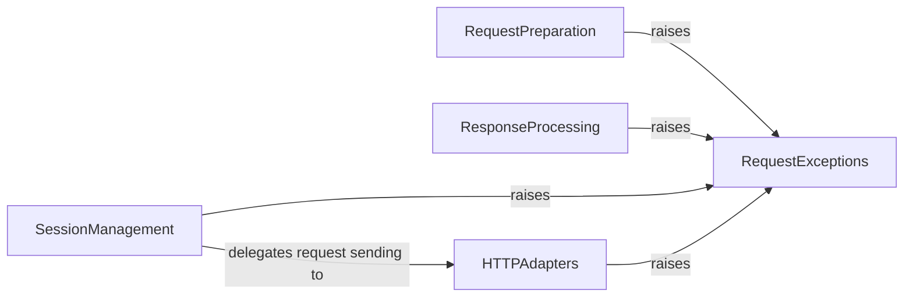

## Component Details

This graph illustrates the Error Handling subsystem within the requests library. The core purpose of this subsystem is to define and manage a comprehensive set of custom exception types. These exceptions provide specific and detailed error information for various failure scenarios encountered during network operations, HTTP communication, and data parsing. By categorizing errors, the system enables robust and precise error management throughout the requests library, allowing for targeted handling of issues like connection problems, timeouts, invalid URLs, HTTP status errors, and content decoding failures. Other components like RequestPreparation, ResponseProcessing, SessionManagement, and HTTPAdapters interact with this component by raising these specific exceptions when errors occur during their respective operations.

### RequestExceptions
This component encapsulates various exceptions that can occur during the lifecycle of an HTTP request. These exceptions cover issues ranging from invalid URLs and JSON parsing errors to connection problems, timeouts, and HTTP status errors.

**Related Classes/Methods**:

- <a href="https://github.com/psf/requests/blob/master/src/requests/exceptions.py#L12-L24" target="_blank" rel="noopener noreferrer">`requests.src.requests.exceptions.RequestException` (12:24)</a>
- <a href="https://github.com/psf/requests/blob/master/src/requests/exceptions.py#L55-L56" target="_blank" rel="noopener noreferrer">`requests.src.requests.exceptions.HTTPError` (55:56)</a>
- <a href="https://github.com/psf/requests/blob/master/src/requests/exceptions.py#L59-L60" target="_blank" rel="noopener noreferrer">`requests.src.requests.exceptions.ConnectionError` (59:60)</a>
- <a href="https://github.com/psf/requests/blob/master/src/requests/exceptions.py#L63-L64" target="_blank" rel="noopener noreferrer">`requests.src.requests.exceptions.ProxyError` (63:64)</a>
- <a href="https://github.com/psf/requests/blob/master/src/requests/exceptions.py#L67-L68" target="_blank" rel="noopener noreferrer">`requests.src.requests.exceptions.SSLError` (67:68)</a>
- <a href="https://github.com/psf/requests/blob/master/src/requests/exceptions.py#L71-L77" target="_blank" rel="noopener noreferrer">`requests.src.requests.exceptions.Timeout` (71:77)</a>
- <a href="https://github.com/psf/requests/blob/master/src/requests/exceptions.py#L80-L84" target="_blank" rel="noopener noreferrer">`requests.src.requests.exceptions.ConnectTimeout` (80:84)</a>
- <a href="https://github.com/psf/requests/blob/master/src/requests/exceptions.py#L87-L88" target="_blank" rel="noopener noreferrer">`requests.src.requests.exceptions.ReadTimeout` (87:88)</a>
- <a href="https://github.com/psf/requests/blob/master/src/requests/exceptions.py#L91-L92" target="_blank" rel="noopener noreferrer">`requests.src.requests.exceptions.URLRequired` (91:92)</a>
- <a href="https://github.com/psf/requests/blob/master/src/requests/exceptions.py#L95-L96" target="_blank" rel="noopener noreferrer">`requests.src.requests.exceptions.TooManyRedirects` (95:96)</a>
- <a href="https://github.com/psf/requests/blob/master/src/requests/exceptions.py#L99-L100" target="_blank" rel="noopener noreferrer">`requests.src.requests.exceptions.MissingSchema` (99:100)</a>
- <a href="https://github.com/psf/requests/blob/master/src/requests/exceptions.py#L103-L104" target="_blank" rel="noopener noreferrer">`requests.src.requests.exceptions.InvalidSchema` (103:104)</a>
- <a href="https://github.com/psf/requests/blob/master/src/requests/exceptions.py#L107-L108" target="_blank" rel="noopener noreferrer">`requests.src.requests.exceptions.InvalidURL` (107:108)</a>
- <a href="https://github.com/psf/requests/blob/master/src/requests/exceptions.py#L111-L112" target="_blank" rel="noopener noreferrer">`requests.src.requests.exceptions.InvalidHeader` (111:112)</a>
- <a href="https://github.com/psf/requests/blob/master/src/requests/exceptions.py#L119-L120" target="_blank" rel="noopener noreferrer">`requests.src.requests.exceptions.ChunkedEncodingError` (119:120)</a>
- <a href="https://github.com/psf/requests/blob/master/src/requests/exceptions.py#L123-L124" target="_blank" rel="noopener noreferrer">`requests.src.requests.exceptions.ContentDecodingError` (123:124)</a>
- <a href="https://github.com/psf/requests/blob/master/src/requests/exceptions.py#L127-L128" target="_blank" rel="noopener noreferrer">`requests.src.requests.exceptions.StreamConsumedError` (127:128)</a>
- <a href="https://github.com/psf/requests/blob/master/src/requests/exceptions.py#L131-L132" target="_blank" rel="noopener noreferrer">`requests.src.requests.exceptions.RetryError` (131:132)</a>
- <a href="https://github.com/psf/requests/blob/master/src/requests/exceptions.py#L135-L136" target="_blank" rel="noopener noreferrer">`requests.src.requests.exceptions.UnrewindableBodyError` (135:136)</a>
- <a href="https://github.com/psf/requests/blob/master/src/requests/exceptions.py#L27-L28" target="_blank" rel="noopener noreferrer">`requests.src.requests.exceptions.InvalidJSONError` (27:28)</a>
- <a href="https://github.com/psf/requests/blob/master/src/requests/exceptions.py#L31-L52" target="_blank" rel="noopener noreferrer">`requests.src.requests.exceptions.JSONDecodeError` (31:52)</a>

### RequestPreparation
This component is responsible for preparing the HTTP request before it is sent. This includes validating and formatting the URL, preparing the request body, and handling various utility functions related to request construction like URL encoding and header validation.

**Related Classes/Methods**:

- <a href="https://github.com/psf/requests/blob/master/src/requests/models.py#L409-L481" target="_blank" rel="noopener noreferrer">`requests.src.requests.models.PreparedRequest:prepare_url` (409:481)</a>
- <a href="https://github.com/psf/requests/blob/master/src/requests/models.py#L494-L570" target="_blank" rel="noopener noreferrer">`requests.src.requests.models.PreparedRequest:prepare_body` (494:570)</a>
- <a href="https://github.com/psf/requests/blob/master/src/requests/utils.py#L639-L660" target="_blank" rel="noopener noreferrer">`requests.src.requests.utils:unquote_unreserved` (639:660)</a>
- <a href="https://github.com/psf/requests/blob/master/src/requests/utils.py#L1048-L1064" target="_blank" rel="noopener noreferrer">`requests.src.requests.utils:_validate_header_part` (1048:1064)</a>
- <a href="https://github.com/psf/requests/blob/master/src/requests/utils.py#L1084-L1099" target="_blank" rel="noopener noreferrer">`requests.src.requests.utils:rewind_body` (1084:1099)</a>

### ResponseProcessing
This component handles the processing of the HTTP response received from the server. It includes iterating over content streams, parsing JSON responses, and raising exceptions for undesirable HTTP statuses or decoding errors.

**Related Classes/Methods**:

- <a href="https://github.com/psf/requests/blob/master/src/requests/models.py#L799-L855" target="_blank" rel="noopener noreferrer">`requests.src.requests.models.Response:iter_content` (799:855)</a>
- <a href="https://github.com/psf/requests/blob/master/src/requests/models.py#L947-L980" target="_blank" rel="noopener noreferrer">`requests.src.requests.models.Response:json` (947:980)</a>
- <a href="https://github.com/psf/requests/blob/master/src/requests/models.py#L999-L1026" target="_blank" rel="noopener noreferrer">`requests.src.requests.models.Response:raise_for_status` (999:1026)</a>

### SessionManagement
This component manages the HTTP session, providing persistence for certain parameters across requests. It orchestrates the sending of requests, handles redirects, and determines the appropriate HTTP adapter for a given URL scheme.

**Related Classes/Methods**:

- <a href="https://github.com/psf/requests/blob/master/src/requests/sessions.py#L673-L748" target="_blank" rel="noopener noreferrer">`requests.src.requests.sessions.Session:send` (673:748)</a>
- <a href="https://github.com/psf/requests/blob/master/src/requests/sessions.py#L781-L792" target="_blank" rel="noopener noreferrer">`requests.src.requests.sessions.Session:get_adapter` (781:792)</a>
- <a href="https://github.com/psf/requests/blob/master/src/requests/sessions.py#L159-L280" target="_blank" rel="noopener noreferrer">`requests.src.requests.sessions.SessionRedirectMixin:resolve_redirects` (159:280)</a>

### HTTPAdapters
This component provides the interface for the actual transport of HTTP requests. It handles the low-level details of sending requests and receiving responses, including connection management, retries, and proxy handling.

**Related Classes/Methods**:

- <a href="https://github.com/psf/requests/blob/master/src/requests/adapters.py#L613-L719" target="_blank" rel="noopener noreferrer">`requests.src.requests.adapters.HTTPAdapter:send` (613:719)</a>

### [FAQ](https://github.com/CodeBoarding/GeneratedOnBoardings/tree/main?tab=readme-ov-file#faq)