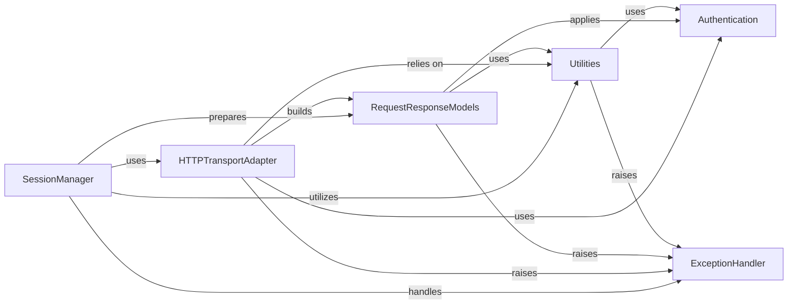

## Component Details

The `requests` library provides a user-friendly way to send HTTP requests. The `SessionManager` acts as the primary interface, preparing requests and dispatching them to `HTTPTransportAdapter`. The `HTTPTransportAdapter` handles the low-level communication, including connection pooling, SSL, and proxies, building `RequestResponseModels` from the raw data. `Utilities` provide helper functions, `ExceptionHandler` manages errors, and `Authentication` handles various authentication schemes, all working together to facilitate robust and flexible HTTP communication.

### SessionManager
This component is responsible for managing persistent settings across requests, such as cookies, authentication, and proxies. It acts as the primary interface for users to send HTTP requests and handles request preparation, redirection logic, and dispatching to appropriate adapters.

**Related Classes/Methods**:

- <a href="https://github.com/psf/requests/blob/master/src/requests/sessions.py#L356-L816" target="_blank" rel="noopener noreferrer">`requests.src.requests.sessions.Session` (356:816)</a>
- <a href="https://github.com/psf/requests/blob/master/src/requests/sessions.py#L390-L449" target="_blank" rel="noopener noreferrer">`requests.src.requests.sessions.Session:__init__` (390:449)</a>
- <a href="https://github.com/psf/requests/blob/master/src/requests/sessions.py#L673-L748" target="_blank" rel="noopener noreferrer">`requests.src.requests.sessions.Session:send` (673:748)</a>
- <a href="https://github.com/psf/requests/blob/master/src/requests/sessions.py#L106-L353" target="_blank" rel="noopener noreferrer">`requests.src.requests.sessions.SessionRedirectMixin` (106:353)</a>
- <a href="https://github.com/psf/requests/blob/master/src/requests/sessions.py#L107-L125" target="_blank" rel="noopener noreferrer">`requests.src.requests.sessions.SessionRedirectMixin:get_redirect_target` (107:125)</a>
- <a href="https://github.com/psf/requests/blob/master/src/requests/sessions.py#L127-L157" target="_blank" rel="noopener noreferrer">`requests.src.requests.sessions.SessionRedirectMixin:should_strip_auth` (127:157)</a>
- <a href="https://github.com/psf/requests/blob/master/src/requests/sessions.py#L159-L280" target="_blank" rel="noopener noreferrer">`requests.src.requests.sessions.SessionRedirectMixin:resolve_redirects` (159:280)</a>
- <a href="https://github.com/psf/requests/blob/master/src/requests/sessions.py#L282-L300" target="_blank" rel="noopener noreferrer">`requests.src.requests.sessions.SessionRedirectMixin:rebuild_auth` (282:300)</a>
- <a href="https://github.com/psf/requests/blob/master/src/requests/sessions.py#L302-L331" target="_blank" rel="noopener noreferrer">`requests.src.requests.sessions.SessionRedirectMixin:rebuild_proxies` (302:331)</a>
- <a href="https://github.com/psf/requests/blob/master/src/requests/sessions.py#L333-L353" target="_blank" rel="noopener noreferrer">`requests.src.requests.sessions.SessionRedirectMixin:rebuild_method` (333:353)</a>
- <a href="https://github.com/psf/requests/blob/master/src/requests/sessions.py#L457-L498" target="_blank" rel="noopener noreferrer">`requests.src.requests.sessions.Session:prepare_request` (457:498)</a>
- <a href="https://github.com/psf/requests/blob/master/src/requests/sessions.py#L500-L591" target="_blank" rel="noopener noreferrer">`requests.src.requests.sessions.Session:request` (500:591)</a>
- <a href="https://github.com/psf/requests/blob/master/src/requests/sessions.py#L750-L779" target="_blank" rel="noopener noreferrer">`requests.src.requests.sessions.Session:merge_environment_settings` (750:779)</a>
- <a href="https://github.com/psf/requests/blob/master/src/requests/sessions.py#L781-L792" target="_blank" rel="noopener noreferrer">`requests.src.requests.sessions.Session:get_adapter` (781:792)</a>
- <a href="https://github.com/psf/requests/blob/master/src/requests/sessions.py#L794-L797" target="_blank" rel="noopener noreferrer">`requests.src.requests.sessions.Session:close` (794:797)</a>
- <a href="https://github.com/psf/requests/blob/master/src/requests/sessions.py#L799-L808" target="_blank" rel="noopener noreferrer">`requests.src.requests.sessions.Session:mount` (799:808)</a>

### HTTPTransportAdapter
This component handles the actual sending of HTTP requests and receiving of responses. It manages connection pooling, retries, SSL verification, and proxy handling, acting as an intermediary between the Session and the underlying network communication (urllib3).

**Related Classes/Methods**:

- <a href="https://github.com/psf/requests/blob/master/src/requests/adapters.py#L167-L719" target="_blank" rel="noopener noreferrer">`requests.src.requests.adapters.HTTPAdapter` (167:719)</a>
- <a href="https://github.com/psf/requests/blob/master/src/requests/adapters.py#L202-L222" target="_blank" rel="noopener noreferrer">`requests.src.requests.adapters.HTTPAdapter:__init__` (202:222)</a>
- <a href="https://github.com/psf/requests/blob/master/src/requests/adapters.py#L227-L238" target="_blank" rel="noopener noreferrer">`requests.src.requests.adapters.HTTPAdapter:__setstate__` (227:238)</a>
- <a href="https://github.com/psf/requests/blob/master/src/requests/adapters.py#L240-L264" target="_blank" rel="noopener noreferrer">`requests.src.requests.adapters.HTTPAdapter:init_poolmanager` (240:264)</a>
- <a href="https://github.com/psf/requests/blob/master/src/requests/adapters.py#L266-L302" target="_blank" rel="noopener noreferrer">`requests.src.requests.adapters.HTTPAdapter:proxy_manager_for` (266:302)</a>
- <a href="https://github.com/psf/requests/blob/master/src/requests/adapters.py#L304-L357" target="_blank" rel="noopener noreferrer">`requests.src.requests.adapters.HTTPAdapter:cert_verify` (304:357)</a>
- <a href="https://github.com/psf/requests/blob/master/src/requests/adapters.py#L359-L394" target="_blank" rel="noopener noreferrer">`requests.src.requests.adapters.HTTPAdapter:build_response` (359:394)</a>
- <a href="https://github.com/psf/requests/blob/master/src/requests/adapters.py#L396-L444" target="_blank" rel="noopener noreferrer">`requests.src.requests.adapters.HTTPAdapter:build_connection_pool_key_attributes` (396:444)</a>
- <a href="https://github.com/psf/requests/blob/master/src/requests/adapters.py#L446-L493" target="_blank" rel="noopener noreferrer">`requests.src.requests.adapters.HTTPAdapter:get_connection_with_tls_context` (446:493)</a>
- <a href="https://github.com/psf/requests/blob/master/src/requests/adapters.py#L495-L534" target="_blank" rel="noopener noreferrer">`requests.src.requests.adapters.HTTPAdapter:get_connection` (495:534)</a>
- <a href="https://github.com/psf/requests/blob/master/src/requests/adapters.py#L536-L544" target="_blank" rel="noopener noreferrer">`requests.src.requests.adapters.HTTPAdapter:close` (536:544)</a>
- <a href="https://github.com/psf/requests/blob/master/src/requests/adapters.py#L546-L576" target="_blank" rel="noopener noreferrer">`requests.src.requests.adapters.HTTPAdapter:request_url` (546:576)</a>
- <a href="https://github.com/psf/requests/blob/master/src/requests/adapters.py#L578-L590" target="_blank" rel="noopener noreferrer">`requests.src.requests.adapters.HTTPAdapter:add_headers` (578:590)</a>
- <a href="https://github.com/psf/requests/blob/master/src/requests/adapters.py#L592-L611" target="_blank" rel="noopener noreferrer">`requests.src.requests.adapters.HTTPAdapter:proxy_headers` (592:611)</a>
- <a href="https://github.com/psf/requests/blob/master/src/requests/adapters.py#L613-L719" target="_blank" rel="noopener noreferrer">`requests.src.requests.adapters.HTTPAdapter:send` (613:719)</a>
- <a href="https://github.com/psf/requests/blob/master/src/requests/adapters.py#L90-L134" target="_blank" rel="noopener noreferrer">`requests.src.requests.adapters._urllib3_request_context` (90:134)</a>

### RequestResponseModels
This component defines the data structures for HTTP requests and responses, including headers, body, URL, and status codes. It provides methods for preparing requests for transmission and parsing received responses.

**Related Classes/Methods**:

- <a href="https://github.com/psf/requests/blob/master/src/requests/models.py#L230-L310" target="_blank" rel="noopener noreferrer">`requests.src.requests.models.Request` (230:310)</a>
- <a href="https://github.com/psf/requests/blob/master/src/requests/models.py#L295-L310" target="_blank" rel="noopener noreferrer">`requests.src.requests.models.Request:prepare` (295:310)</a>
- <a href="https://github.com/psf/requests/blob/master/src/requests/models.py#L313-L637" target="_blank" rel="noopener noreferrer">`requests.src.requests.models.PreparedRequest` (313:637)</a>
- <a href="https://github.com/psf/requests/blob/master/src/requests/models.py#L351-L377" target="_blank" rel="noopener noreferrer">`requests.src.requests.models.PreparedRequest:prepare` (351:377)</a>
- <a href="https://github.com/psf/requests/blob/master/src/requests/models.py#L393-L397" target="_blank" rel="noopener noreferrer">`requests.src.requests.models.PreparedRequest:prepare_method` (393:397)</a>
- <a href="https://github.com/psf/requests/blob/master/src/requests/models.py#L409-L481" target="_blank" rel="noopener noreferrer">`requests.src.requests.models.PreparedRequest:prepare_url` (409:481)</a>
- <a href="https://github.com/psf/requests/blob/master/src/requests/models.py#L483-L492" target="_blank" rel="noopener noreferrer">`requests.src.requests.models.PreparedRequest:prepare_headers` (483:492)</a>
- <a href="https://github.com/psf/requests/blob/master/src/requests/models.py#L494-L570" target="_blank" rel="noopener noreferrer">`requests.src.requests.models.PreparedRequest:prepare_body` (494:570)</a>
- <a href="https://github.com/psf/requests/blob/master/src/requests/models.py#L572-L586" target="_blank" rel="noopener noreferrer">`requests.src.requests.models.PreparedRequest:prepare_content_length` (572:586)</a>
- <a href="https://github.com/psf/requests/blob/master/src/requests/models.py#L588-L608" target="_blank" rel="noopener noreferrer">`requests.src.requests.models.PreparedRequest:prepare_auth` (588:608)</a>
- <a href="https://github.com/psf/requests/blob/master/src/requests/models.py#L610-L628" target="_blank" rel="noopener noreferrer">`requests.src.requests.models.PreparedRequest:prepare_cookies` (610:628)</a>
- <a href="https://github.com/psf/requests/blob/master/src/requests/models.py#L630-L637" target="_blank" rel="noopener noreferrer">`requests.src.requests.models.PreparedRequest:prepare_hooks` (630:637)</a>
- <a href="https://github.com/psf/requests/blob/master/src/requests/models.py#L640-L1039" target="_blank" rel="noopener noreferrer">`requests.src.requests.models.Response` (640:1039)</a>
- <a href="https://github.com/psf/requests/blob/master/src/requests/models.py#L658-L703" target="_blank" rel="noopener noreferrer">`requests.src.requests.models.Response:__init__` (658:703)</a>
- <a href="https://github.com/psf/requests/blob/master/src/requests/models.py#L755-L767" target="_blank" rel="noopener noreferrer">`requests.src.requests.models.Response:ok` (755:767)</a>
- <a href="https://github.com/psf/requests/blob/master/src/requests/models.py#L770-L774" target="_blank" rel="noopener noreferrer">`requests.src.requests.models.Response:is_redirect` (770:774)</a>
- <a href="https://github.com/psf/requests/blob/master/src/requests/models.py#L777-L782" target="_blank" rel="noopener noreferrer">`requests.src.requests.models.Response:is_permanent_redirect` (777:782)</a>
- <a href="https://github.com/psf/requests/blob/master/src/requests/models.py#L785-L787" target="_blank" rel="noopener noreferrer">`requests.src.requests.models.Response:next` (785:787)</a>
- <a href="https://github.com/psf/requests/blob/master/src/requests/models.py#L790-L797" target="_blank" rel="noopener noreferrer">`requests.src.requests.models.Response:apparent_encoding` (790:797)</a>
- <a href="https://github.com/psf/requests/blob/master/src/requests/models.py#L799-L855" target="_blank" rel="noopener noreferrer">`requests.src.requests.models.Response:iter_content` (799:855)</a>
- <a href="https://github.com/psf/requests/blob/master/src/requests/models.py#L857-L888" target="_blank" rel="noopener noreferrer">`requests.src.requests.models.Response:iter_lines` (857:888)</a>
- <a href="https://github.com/psf/requests/blob/master/src/requests/models.py#L891-L907" target="_blank" rel="noopener noreferrer">`requests.src.requests.models.Response:content` (891:907)</a>
- <a href="https://github.com/psf/requests/blob/master/src/requests/models.py#L910-L945" target="_blank" rel="noopener noreferrer">`requests.src.requests.models.Response:text` (910:945)</a>
- <a href="https://github.com/psf/requests/blob/master/src/requests/models.py#L947-L980" target="_blank" rel="noopener noreferrer">`requests.src.requests.models.Response:json` (947:980)</a>
- <a href="https://github.com/psf/requests/blob/master/src/requests/models.py#L983-L997" target="_blank" rel="noopener noreferrer">`requests.src.requests.models.Response:links` (983:997)</a>
- <a href="https://github.com/psf/requests/blob/master/src/requests/models.py#L999-L1026" target="_blank" rel="noopener noreferrer">`requests.src.requests.models.Response:raise_for_status` (999:1026)</a>
- <a href="https://github.com/psf/requests/blob/master/src/requests/models.py#L1028-L1039" target="_blank" rel="noopener noreferrer">`requests.src.requests.models.Response:close` (1028:1039)</a>
- <a href="https://github.com/psf/requests/blob/master/src/requests/models.py#L84-L203" target="_blank" rel="noopener noreferrer">`requests.src.requests.models.RequestEncodingMixin` (84:203)</a>
- <a href="https://github.com/psf/requests/blob/master/src/requests/models.py#L86-L104" target="_blank" rel="noopener noreferrer">`requests.src.requests.models.RequestEncodingMixin:path_url` (86:104)</a>
- <a href="https://github.com/psf/requests/blob/master/src/requests/models.py#L107-L134" target="_blank" rel="noopener noreferrer">`requests.src.requests.models.RequestEncodingMixin:_encode_params` (107:134)</a>
- <a href="https://github.com/psf/requests/blob/master/src/requests/models.py#L137-L203" target="_blank" rel="noopener noreferrer">`requests.src.requests.models.RequestEncodingMixin:_encode_files` (137:203)</a>
- <a href="https://github.com/psf/requests/blob/master/src/requests/models.py#L206-L227" target="_blank" rel="noopener noreferrer">`requests.src.requests.models.RequestHooksMixin` (206:227)</a>
- <a href="https://github.com/psf/requests/blob/master/src/requests/models.py#L207-L216" target="_blank" rel="noopener noreferrer">`requests.src.requests.models.RequestHooksMixin:register_hook` (207:216)</a>
- <a href="https://github.com/psf/requests/blob/master/src/requests/models.py#L218-L227" target="_blank" rel="noopener noreferrer">`requests.src.requests.models.RequestHooksMixin:deregister_hook` (218:227)</a>

### Utilities
This component provides various helper functions used across the requests library, including URL parsing, encoding/decoding, cookie handling, environment variable management, and header validation.

**Related Classes/Methods**:

- <a href="https://github.com/psf/requests/blob/master/src/requests/utils.py#L1021-L1034" target="_blank" rel="noopener noreferrer">`requests.src.requests.utils.get_auth_from_url` (1021:1034)</a>
- <a href="https://github.com/psf/requests/blob/master/src/requests/utils.py#L542-L564" target="_blank" rel="noopener noreferrer">`requests.src.requests.utils.get_encoding_from_headers` (542:564)</a>
- <a href="https://github.com/psf/requests/blob/master/src/requests/utils.py#L992-L1018" target="_blank" rel="noopener noreferrer">`requests.src.requests.utils.prepend_scheme_if_needed` (992:1018)</a>
- <a href="https://github.com/psf/requests/blob/master/src/requests/utils.py#L841-L864" target="_blank" rel="noopener noreferrer">`requests.src.requests.utils.select_proxy` (841:864)</a>
- <a href="https://github.com/psf/requests/blob/master/src/requests/utils.py#L1067-L1081" target="_blank" rel="noopener noreferrer">`requests.src.requests.utils.urldefragauth` (1067:1081)</a>
- <a href="https://github.com/psf/requests/blob/master/src/requests/utils.py#L271-L305" target="_blank" rel="noopener noreferrer">`requests.src.requests.utils.extract_zipped_paths` (271:305)</a>
- <a href="https://github.com/psf/requests/blob/master/src/requests/utils.py#L264-L268" target="_blank" rel="noopener noreferrer">`requests.src.requests.utils.guess_filename` (264:268)</a>
- <a href="https://github.com/psf/requests/blob/master/src/requests/utils.py#L348-L374" target="_blank" rel="noopener noreferrer">`requests.src.requests.utils.to_key_val_list` (348:374)</a>
- <a href="https://github.com/psf/requests/blob/master/src/requests/utils.py#L136-L204" target="_blank" rel="noopener noreferrer">`requests.src.requests.utils.super_len` (136:204)</a>
- <a href="https://github.com/psf/requests/blob/master/src/requests/utils.py#L1037-L1045" target="_blank" rel="noopener noreferrer">`requests.src.requests.utils.check_header_validity` (1037:1045)</a>
- <a href="https://github.com/psf/requests/blob/master/src/requests/utils.py#L960-L989" target="_blank" rel="noopener noreferrer">`requests.src.requests.utils.guess_json_utf` (960:989)</a>
- <a href="https://github.com/psf/requests/blob/master/src/requests/utils.py#L917-L951" target="_blank" rel="noopener noreferrer">`requests.src.requests.utils.parse_header_links` (917:951)</a>
- <a href="https://github.com/psf/requests/blob/master/src/requests/utils.py#L663-L682" target="_blank" rel="noopener noreferrer">`requests.src.requests.utils.requote_uri` (663:682)</a>
- <a href="https://github.com/psf/requests/blob/master/src/requests/utils.py#L567-L581" target="_blank" rel="noopener noreferrer">`requests.src.requests.utils.stream_decode_response_unicode` (567:581)</a>
- <a href="https://github.com/psf/requests/blob/master/src/requests/utils.py#L829-L838" target="_blank" rel="noopener noreferrer">`requests.src.requests.utils.get_environ_proxies` (829:838)</a>
- <a href="https://github.com/psf/requests/blob/master/src/requests/utils.py#L867-L891" target="_blank" rel="noopener noreferrer">`requests.src.requests.utils.resolve_proxies` (867:891)</a>
- <a href="https://github.com/psf/requests/blob/master/src/requests/utils.py#L903-L914" target="_blank" rel="noopener noreferrer">`requests.src.requests.utils.default_headers` (903:914)</a>
- <a href="https://github.com/psf/requests/blob/master/src/requests/utils.py#L378-L406" target="_blank" rel="noopener noreferrer">`requests.src.requests.utils.parse_list_header` (378:406)</a>
- <a href="https://github.com/psf/requests/blob/master/src/requests/utils.py#L410-L441" target="_blank" rel="noopener noreferrer">`requests.src.requests.utils.parse_dict_header` (410:441)</a>
- <a href="https://github.com/psf/requests/blob/master/src/requests/utils.py#L445-L467" target="_blank" rel="noopener noreferrer">`requests.src.requests.utils.unquote_header_value` (445:467)</a>
- <a href="https://github.com/psf/requests/blob/master/src/requests/utils.py#L470-L478" target="_blank" rel="noopener noreferrer">`requests.src.requests.utils.dict_from_cookiejar` (470:478)</a>
- <a href="https://github.com/psf/requests/blob/master/src/requests/utils.py#L481-L489" target="_blank" rel="noopener noreferrer">`requests.src.requests.utils.add_dict_to_cookiejar` (481:489)</a>
- <a href="https://github.com/psf/requests/blob/master/src/requests/utils.py#L517-L539" target="_blank" rel="noopener noreferrer">`requests.src.requests.utils._parse_content_type_header` (517:539)</a>
- <a href="https://github.com/psf/requests/blob/master/src/requests/utils.py#L584-L591" target="_blank" rel="noopener noreferrer">`requests.src.requests.utils.iter_slices` (584:591)</a>
- <a href="https://github.com/psf/requests/blob/master/src/requests/utils.py#L594-L630" target="_blank" rel="noopener noreferrer">`requests.src.requests.utils.get_unicode_from_response` (594:630)</a>
- <a href="https://github.com/psf/requests/blob/master/src/requests/utils.py#L639-L660" target="_blank" rel="noopener noreferrer">`requests.src.requests.utils.unquote_unreserved` (639:660)</a>
- <a href="https://github.com/psf/requests/blob/master/src/requests/utils.py#L685-L697" target="_blank" rel="noopener noreferrer">`requests.src.requests.utils.address_in_network` (685:697)</a>
- <a href="https://github.com/psf/requests/blob/master/src/requests/utils.py#L700-L708" target="_blank" rel="noopener noreferrer">`requests.src.requests.utils.dotted_netmask` (700:708)</a>
- <a href="https://github.com/psf/requests/blob/master/src/requests/utils.py#L711-L719" target="_blank" rel="noopener noreferrer">`requests.src.requests.utils.is_ipv4_address` (711:719)</a>
- <a href="https://github.com/psf/requests/blob/master/src/requests/utils.py#L722-L743" target="_blank" rel="noopener noreferrer">`requests.src.requests.utils.is_valid_cidr` (722:743)</a>
- <a href="https://github.com/psf/requests/blob/master/src/requests/utils.py#L747-L765" target="_blank" rel="noopener noreferrer">`requests.src.requests.utils.set_environ` (747:765)</a>
- <a href="https://github.com/psf/requests/blob/master/src/requests/utils.py#L768-L826" target="_blank" rel="noopener noreferrer">`requests.src.requests.utils.should_bypass_proxies` (768:826)</a>
- <a href="https://github.com/psf/requests/blob/master/src/requests/utils.py#L894-L900" target="_blank" rel="noopener noreferrer">`requests.src.requests.utils.default_user_agent` (894:900)</a>
- <a href="https://github.com/psf/requests/blob/master/src/requests/utils.py#L1084-L1099" target="_blank" rel="noopener noreferrer">`requests.src.requests.utils.rewind_body` (1084:1099)</a>
- <a href="https://github.com/psf/requests/blob/master/src/requests/cookies.py#L124-L137" target="_blank" rel="noopener noreferrer">`requests.src.requests.cookies.extract_cookies_to_jar` (124:137)</a>
- <a href="https://github.com/psf/requests/blob/master/src/requests/structures.py#L13-L80" target="_blank" rel="noopener noreferrer">`requests.src.requests.structures.CaseInsensitiveDict` (13:80)</a>

### ExceptionHandler
This component defines custom exception classes for various error conditions that can occur during HTTP requests, such as connection errors, timeouts, and invalid URLs, providing a structured way to handle errors.

**Related Classes/Methods**:

- <a href="https://github.com/psf/requests/blob/master/src/requests/exceptions.py#L12-L24" target="_blank" rel="noopener noreferrer">`requests.src.requests.exceptions.RequestException` (12:24)</a>
- <a href="https://github.com/psf/requests/blob/master/src/requests/exceptions.py#L27-L28" target="_blank" rel="noopener noreferrer">`requests.src.requests.exceptions.InvalidJSONError` (27:28)</a>
- <a href="https://github.com/psf/requests/blob/master/src/requests/exceptions.py#L31-L52" target="_blank" rel="noopener noreferrer">`requests.src.requests.exceptions.JSONDecodeError` (31:52)</a>
- <a href="https://github.com/psf/requests/blob/master/src/requests/exceptions.py#L55-L56" target="_blank" rel="noopener noreferrer">`requests.src.requests.exceptions.HTTPError` (55:56)</a>
- <a href="https://github.com/psf/requests/blob/master/src/requests/exceptions.py#L59-L60" target="_blank" rel="noopener noreferrer">`requests.src.requests.exceptions.ConnectionError` (59:60)</a>
- <a href="https://github.com/psf/requests/blob/master/src/requests/exceptions.py#L63-L64" target="_blank" rel="noopener noreferrer">`requests.src.requests.exceptions.ProxyError` (63:64)</a>
- <a href="https://github.com/psf/requests/blob/master/src/requests/exceptions.py#L67-L68" target="_blank" rel="noopener noreferrer">`requests.src.requests.exceptions.SSLError` (67:68)</a>
- <a href="https://github.com/psf/requests/blob/master/src/requests/exceptions.py#L71-L77" target="_blank" rel="noopener noreferrer">`requests.src.requests.exceptions.Timeout` (71:77)</a>
- <a href="https://github.com/psf/requests/blob/master/src/requests/exceptions.py#L80-L84" target="_blank" rel="noopener noreferrer">`requests.src.requests.exceptions.ConnectTimeout` (80:84)</a>
- <a href="https://github.com/psf/requests/blob/master/src/requests/exceptions.py#L87-L88" target="_blank" rel="noopener noreferrer">`requests.src.requests.exceptions.ReadTimeout` (87:88)</a>
- <a href="https://github.com/psf/requests/blob/master/src/requests/exceptions.py#L91-L92" target="_blank" rel="noopener noreferrer">`requests.src.requests.exceptions.URLRequired` (91:92)</a>
- <a href="https://github.com/psf/requests/blob/master/src/requests/exceptions.py#L95-L96" target="_blank" rel="noopener noreferrer">`requests.src.requests.exceptions.TooManyRedirects` (95:96)</a>
- <a href="https://github.com/psf/requests/blob/master/src/requests/exceptions.py#L99-L100" target="_blank" rel="noopener noreferrer">`requests.src.requests.exceptions.MissingSchema` (99:100)</a>
- <a href="https://github.com/psf/requests/blob/master/src/requests/exceptions.py#L103-L104" target="_blank" rel="noopener noreferrer">`requests.src.requests.exceptions.InvalidSchema` (103:104)</a>
- <a href="https://github.com/psf/requests/blob/master/src/requests/exceptions.py#L107-L108" target="_blank" rel="noopener noreferrer">`requests.src.requests.exceptions.InvalidURL` (107:108)</a>
- <a href="https://github.com/psf/requests/blob/master/src/requests/exceptions.py#L111-L112" target="_blank" rel="noopener noreferrer">`requests.src.requests.exceptions.InvalidHeader` (111:112)</a>
- <a href="https://github.com/psf/requests/blob/master/src/requests/exceptions.py#L115-L116" target="_blank" rel="noopener noreferrer">`requests.src.requests.exceptions.InvalidProxyURL` (115:116)</a>
- <a href="https://github.com/psf/requests/blob/master/src/requests/exceptions.py#L119-L120" target="_blank" rel="noopener noreferrer">`requests.src.requests.exceptions.ChunkedEncodingError` (119:120)</a>
- <a href="https://github.com/psf/requests/blob/master/src/requests/exceptions.py#L123-L124" target="_blank" rel="noopener noreferrer">`requests.src.requests.exceptions.ContentDecodingError` (123:124)</a>
- <a href="https://github.com/psf/requests/blob/master/src/requests/exceptions.py#L127-L128" target="_blank" rel="noopener noreferrer">`requests.src.requests.exceptions.StreamConsumedError` (127:128)</a>
- <a href="https://github.com/psf/requests/blob/master/src/requests/exceptions.py#L131-L132" target="_blank" rel="noopener noreferrer">`requests.src.requests.exceptions.RetryError` (131:132)</a>
- <a href="https://github.com/psf/requests/blob/master/src/requests/exceptions.py#L135-L136" target="_blank" rel="noopener noreferrer">`requests.src.requests.exceptions.UnrewindableBodyError` (135:136)</a>
- <a href="https://github.com/psf/requests/blob/master/src/requests/exceptions.py#L142-L143" target="_blank" rel="noopener noreferrer">`requests.src.requests.exceptions.RequestsWarning` (142:143)</a>
- <a href="https://github.com/psf/requests/blob/master/src/requests/exceptions.py#L146-L147" target="_blank" rel="noopener noreferrer">`requests.src.requests.exceptions.FileModeWarning` (146:147)</a>
- <a href="https://github.com/psf/requests/blob/master/src/requests/exceptions.py#L150-L151" target="_blank" rel="noopener noreferrer">`requests.src.requests.exceptions.RequestsDependencyWarning` (150:151)</a>

### Authentication
This component provides mechanisms for handling different types of HTTP authentication, such as Basic and Digest authentication, by modifying request headers.

**Related Classes/Methods**:

- <a href="https://github.com/psf/requests/blob/master/src/requests/auth.py#L69-L73" target="_blank" rel="noopener noreferrer">`requests.src.requests.auth.AuthBase` (69:73)</a>
- <a href="https://github.com/psf/requests/blob/master/src/requests/auth.py#L76-L96" target="_blank" rel="noopener noreferrer">`requests.src.requests.auth.HTTPBasicAuth` (76:96)</a>
- <a href="https://github.com/psf/requests/blob/master/src/requests/auth.py#L99-L104" target="_blank" rel="noopener noreferrer">`requests.src.requests.auth.HTTPProxyAuth` (99:104)</a>
- <a href="https://github.com/psf/requests/blob/master/src/requests/auth.py#L107-L314" target="_blank" rel="noopener noreferrer">`requests.src.requests.auth.HTTPDigestAuth` (107:314)</a>
- <a href="https://github.com/psf/requests/blob/master/src/requests/auth.py#L25-L66" target="_blank" rel="noopener noreferrer">`requests.src.requests.auth._basic_auth_str` (25:66)</a>

### [FAQ](https://github.com/CodeBoarding/GeneratedOnBoardings/tree/main?tab=readme-ov-file#faq)