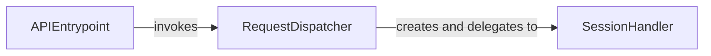

## Component Details

This component overview describes the high-level architecture of the Public API subsystem, which provides user-friendly functions for making HTTP requests. The main flow involves an API entry point that dispatches requests to a central request handler, which in turn utilizes a session management component to prepare, send, and manage the lifecycle of HTTP requests, including handling redirects and cookies.

### APIEntrypoint
Provides the primary interface for users to initiate various types of HTTP requests (GET, POST, etc.) without needing to manage sessions explicitly. These functions serve as convenient wrappers for the central request dispatching logic.

**Related Classes/Methods**:

- <a href="https://github.com/psf/requests/blob/master/src/requests/api.py#L62-L73" target="_blank" rel="noopener noreferrer">`requests.src.requests.api:get` (62:73)</a>
- <a href="https://github.com/psf/requests/blob/master/src/requests/api.py#L76-L85" target="_blank" rel="noopener noreferrer">`requests.src.requests.api:options` (76:85)</a>
- <a href="https://github.com/psf/requests/blob/master/src/requests/api.py#L88-L100" target="_blank" rel="noopener noreferrer">`requests.src.requests.api:head` (88:100)</a>
- <a href="https://github.com/psf/requests/blob/master/src/requests/api.py#L103-L115" target="_blank" rel="noopener noreferrer">`requests.src.requests.api:post` (103:115)</a>
- <a href="https://github.com/psf/requests/blob/master/src/requests/api.py#L118-L130" target="_blank" rel="noopener noreferrer">`requests.src.requests.api:put` (118:130)</a>
- <a href="https://github.com/psf/requests/blob/master/src/requests/api.py#L133-L145" target="_blank" rel="noopener noreferrer">`requests.src.requests.api:patch` (133:145)</a>
- <a href="https://github.com/psf/requests/blob/master/src/requests/api.py#L148-L157" target="_blank" rel="noopener noreferrer">`requests.src.requests.api:delete` (148:157)</a>

### RequestDispatcher
Acts as an intermediary, creating a session instance and delegating the responsibility of sending the HTTP request to the session's request handling mechanism. This central function orchestrates the initial setup for a request.

**Related Classes/Methods**:

- <a href="https://github.com/psf/requests/blob/master/src/requests/api.py#L14-L59" target="_blank" rel="noopener noreferrer">`requests.src.requests.api:request` (14:59)</a>

### SessionHandler
Manages the lifecycle of HTTP requests within a session, handling request preparation, merging settings, sending requests, and managing redirects and cookies. It encapsulates the core logic for persistent connections and request execution.

**Related Classes/Methods**:

- <a href="https://github.com/psf/requests/blob/master/src/requests/sessions.py#L356-L816" target="_blank" rel="noopener noreferrer">`requests.src.requests.sessions.Session` (356:816)</a>
- <a href="https://github.com/psf/requests/blob/master/src/requests/sessions.py#L500-L591" target="_blank" rel="noopener noreferrer">`requests.src.requests.sessions.Session.request` (500:591)</a>
- <a href="https://github.com/psf/requests/blob/master/src/requests/sessions.py#L457-L498" target="_blank" rel="noopener noreferrer">`requests.src.requests.sessions.Session.prepare_request` (457:498)</a>
- <a href="https://github.com/psf/requests/blob/master/src/requests/sessions.py#L673-L748" target="_blank" rel="noopener noreferrer">`requests.src.requests.sessions.Session.send` (673:748)</a>
- <a href="https://github.com/psf/requests/blob/master/src/requests/sessions.py#L106-L353" target="_blank" rel="noopener noreferrer">`requests.src.requests.sessions.SessionRedirectMixin` (106:353)</a>
- <a href="https://github.com/psf/requests/blob/master/src/requests/sessions.py#L107-L125" target="_blank" rel="noopener noreferrer">`requests.src.requests.sessions.SessionRedirectMixin.get_redirect_target` (107:125)</a>
- <a href="https://github.com/psf/requests/blob/master/src/requests/sessions.py#L127-L157" target="_blank" rel="noopener noreferrer">`requests.src.requests.sessions.SessionRedirectMixin.should_strip_auth` (127:157)</a>
- <a href="https://github.com/psf/requests/blob/master/src/requests/sessions.py#L159-L280" target="_blank" rel="noopener noreferrer">`requests.src.requests.sessions.SessionRedirectMixin.resolve_redirects` (159:280)</a>
- <a href="https://github.com/psf/requests/blob/master/src/requests/sessions.py#L282-L300" target="_blank" rel="noopener noreferrer">`requests.src.requests.sessions.SessionRedirectMixin.rebuild_auth` (282:300)</a>
- <a href="https://github.com/psf/requests/blob/master/src/requests/sessions.py#L302-L331" target="_blank" rel="noopener noreferrer">`requests.src.requests.sessions.SessionRedirectMixin.rebuild_proxies` (302:331)</a>
- <a href="https://github.com/psf/requests/blob/master/src/requests/sessions.py#L333-L353" target="_blank" rel="noopener noreferrer">`requests.src.requests.sessions.SessionRedirectMixin.rebuild_method` (333:353)</a>

### [FAQ](https://github.com/CodeBoarding/GeneratedOnBoardings/tree/main?tab=readme-ov-file#faq)