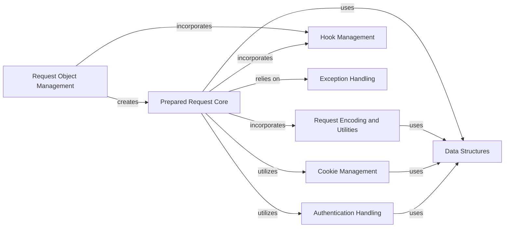

## Component Details

The Request Management subsystem in `requests` is responsible for the entire lifecycle of an HTTP request before it is sent over the network. This involves the initial creation of a `Request` object from user-defined parameters, its subsequent transformation into a `PreparedRequest` which includes detailed preparation steps like URL encoding, header setup, body handling (including file uploads and JSON), and the integration of authentication and cookie data. The subsystem also incorporates a robust hook management system, allowing for custom logic to be injected at various stages of the request preparation. Error handling for invalid request parameters and network issues is also a key part of this subsystem.

### Request Object Management
This component handles the initial creation of HTTP requests, transforming user-defined parameters into a `Request` object. It also provides the mechanism to prepare this `Request` into a `PreparedRequest`.

**Related Classes/Methods**:

- <a href="https://github.com/psf/requests/blob/master/src/requests/models.py#L230-L310" target="_blank" rel="noopener noreferrer">`requests.src.requests.models.Request` (230:310)</a>
- <a href="https://github.com/psf/requests/blob/master/src/requests/models.py#L258-L290" target="_blank" rel="noopener noreferrer">`requests.src.requests.models.Request:__init__` (258:290)</a>
- <a href="https://github.com/psf/requests/blob/master/src/requests/models.py#L295-L310" target="_blank" rel="noopener noreferrer">`requests.src.requests.models.Request:prepare` (295:310)</a>

### Prepared Request Core
This component encapsulates the comprehensive logic for preparing all aspects of an HTTP request, such as method, URL, headers, body, authentication, and cookies, by incorporating encoding and hook management functionalities, before it is sent over the network.

**Related Classes/Methods**:

- <a href="https://github.com/psf/requests/blob/master/src/requests/models.py#L313-L637" target="_blank" rel="noopener noreferrer">`requests.src.requests.models.PreparedRequest` (313:637)</a>
- <a href="https://github.com/psf/requests/blob/master/src/requests/models.py#L334-L349" target="_blank" rel="noopener noreferrer">`requests.src.requests.models.PreparedRequest:__init__` (334:349)</a>
- <a href="https://github.com/psf/requests/blob/master/src/requests/models.py#L351-L377" target="_blank" rel="noopener noreferrer">`requests.src.requests.models.PreparedRequest:prepare` (351:377)</a>
- <a href="https://github.com/psf/requests/blob/master/src/requests/models.py#L382-L391" target="_blank" rel="noopener noreferrer">`requests.src.requests.models.PreparedRequest:copy` (382:391)</a>
- <a href="https://github.com/psf/requests/blob/master/src/requests/models.py#L393-L397" target="_blank" rel="noopener noreferrer">`requests.src.requests.models.PreparedRequest:prepare_method` (393:397)</a>
- <a href="https://github.com/psf/requests/blob/master/src/requests/models.py#L409-L481" target="_blank" rel="noopener noreferrer">`requests.src.requests.models.PreparedRequest:prepare_url` (409:481)</a>
- <a href="https://github.com/psf/requests/blob/master/src/requests/models.py#L483-L492" target="_blank" rel="noopener noreferrer">`requests.src.requests.models.PreparedRequest:prepare_headers` (483:492)</a>
- <a href="https://github.com/psf/requests/blob/master/src/requests/models.py#L494-L570" target="_blank" rel="noopener noreferrer">`requests.src.requests.models.PreparedRequest:prepare_body` (494:570)</a>
- <a href="https://github.com/psf/requests/blob/master/src/requests/models.py#L572-L586" target="_blank" rel="noopener noreferrer">`requests.src.requests.models.PreparedRequest:prepare_content_length` (572:586)</a>
- <a href="https://github.com/psf/requests/blob/master/src/requests/models.py#L588-L608" target="_blank" rel="noopener noreferrer">`requests.src.requests.models.PreparedRequest:prepare_auth` (588:608)</a>
- <a href="https://github.com/psf/requests/blob/master/src/requests/models.py#L610-L628" target="_blank" rel="noopener noreferrer">`requests.src.requests.models.PreparedRequest:prepare_cookies` (610:628)</a>
- <a href="https://github.com/psf/requests/blob/master/src/requests/models.py#L630-L637" target="_blank" rel="noopener noreferrer">`requests.src.requests.models.PreparedRequest:prepare_hooks` (630:637)</a>
- <a href="https://github.com/psf/requests/blob/master/src/requests/models.py#L400-L407" target="_blank" rel="noopener noreferrer">`requests.src.requests.models.PreparedRequest._get_idna_encoded_host` (400:407)</a>

### Request Encoding and Utilities
This component provides utility functions for encoding request parameters and files, handling general string and data manipulations, and validating headers. Its `RequestEncodingMixin` is incorporated into `PreparedRequest` to handle encoding during preparation.

**Related Classes/Methods**:

- <a href="https://github.com/psf/requests/blob/master/src/requests/models.py#L84-L203" target="_blank" rel="noopener noreferrer">`requests.src.requests.models.RequestEncodingMixin` (84:203)</a>
- <a href="https://github.com/psf/requests/blob/master/src/requests/models.py#L107-L134" target="_blank" rel="noopener noreferrer">`requests.src.requests.models.RequestEncodingMixin:_encode_params` (107:134)</a>
- <a href="https://github.com/psf/requests/blob/master/src/requests/models.py#L137-L203" target="_blank" rel="noopener noreferrer">`requests.src.requests.models.RequestEncodingMixin:_encode_files` (137:203)</a>
- <a href="https://github.com/psf/requests/blob/master/src/requests/utils.py#L348-L374" target="_blank" rel="noopener noreferrer">`requests.src.requests.utils.to_key_val_list` (348:374)</a>
- <a href="https://github.com/psf/requests/blob/master/src/requests/utils.py#L264-L268" target="_blank" rel="noopener noreferrer">`requests.src.requests.utils.guess_filename` (264:268)</a>
- <a href="https://github.com/psf/requests/blob/master/src/requests/utils.py#L136-L204" target="_blank" rel="noopener noreferrer">`requests.src.requests.utils.super_len` (136:204)</a>
- <a href="https://github.com/psf/requests/blob/master/src/requests/utils.py#L663-L682" target="_blank" rel="noopener noreferrer">`requests.src.requests.utils.requote_uri` (663:682)</a>
- <a href="https://github.com/psf/requests/blob/master/src/requests/utils.py#L1037-L1045" target="_blank" rel="noopener noreferrer">`requests.src.requests.utils.check_header_validity` (1037:1045)</a>
- <a href="https://github.com/psf/requests/blob/master/src/requests/utils.py#L1021-L1034" target="_blank" rel="noopener noreferrer">`requests.src.requests.utils.get_auth_from_url` (1021:1034)</a>
- <a href="https://github.com/psf/requests/blob/master/src/requests/_internal_utils.py#L25-L35" target="_blank" rel="noopener noreferrer">`requests.src.requests._internal_utils.to_native_string` (25:35)</a>
- <a href="https://github.com/psf/requests/blob/master/src/requests/_internal_utils.py#L38-L50" target="_blank" rel="noopener noreferrer">`requests.src.requests._internal_utils.unicode_is_ascii` (38:50)</a>

### Hook Management
This component manages the registration and execution of hooks, allowing custom logic to be injected at various stages of the request preparation process. Its `RequestHooksMixin` is incorporated into both `Request` and `PreparedRequest`.

**Related Classes/Methods**:

- <a href="https://github.com/psf/requests/blob/master/src/requests/hooks.py#L15-L16" target="_blank" rel="noopener noreferrer">`requests.src.requests.hooks.default_hooks` (15:16)</a>
- <a href="https://github.com/psf/requests/blob/master/src/requests/models.py#L206-L227" target="_blank" rel="noopener noreferrer">`requests.src.requests.models.RequestHooksMixin` (206:227)</a>
- <a href="https://github.com/psf/requests/blob/master/src/requests/models.py#L207-L216" target="_blank" rel="noopener noreferrer">`requests.src.requests.models.RequestHooksMixin.register_hook` (207:216)</a>

### Exception Handling
This component defines and handles various exceptions that can occur during the creation and preparation of a request, such as invalid URLs, missing schemas, or malformed JSON.

**Related Classes/Methods**:

- <a href="https://github.com/psf/requests/blob/master/src/requests/exceptions.py#L107-L108" target="_blank" rel="noopener noreferrer">`requests.src.requests.exceptions.InvalidURL` (107:108)</a>
- <a href="https://github.com/psf/requests/blob/master/src/requests/exceptions.py#L99-L100" target="_blank" rel="noopener noreferrer">`requests.src.requests.exceptions.MissingSchema` (99:100)</a>
- <a href="https://github.com/psf/requests/blob/master/src/requests/exceptions.py#L27-L28" target="_blank" rel="noopener noreferrer">`requests.src.requests.exceptions.InvalidJSONError` (27:28)</a>
- <a href="https://github.com/psf/requests/blob/master/src/requests/exceptions.py#L12-L24" target="_blank" rel="noopener noreferrer">`requests.src.requests.exceptions.RequestException` (12:24)</a>

### Cookie Management
This component provides functionalities for managing HTTP cookies, including copying cookie jars, creating cookie jars from dictionaries, and generating cookie headers, which are utilized during request preparation.

**Related Classes/Methods**:

- <a href="https://github.com/psf/requests/blob/master/src/requests/cookies.py#L440-L452" target="_blank" rel="noopener noreferrer">`requests.src.requests.cookies._copy_cookie_jar` (440:452)</a>
- <a href="https://github.com/psf/requests/blob/master/src/requests/cookies.py#L521-L539" target="_blank" rel="noopener noreferrer">`requests.src.requests.cookies.cookiejar_from_dict` (521:539)</a>
- <a href="https://github.com/psf/requests/blob/master/src/requests/cookies.py#L140-L148" target="_blank" rel="noopener noreferrer">`requests.src.requests.cookies.get_cookie_header` (140:148)</a>
- <a href="https://github.com/psf/requests/blob/master/src/requests/cookies.py#L176-L437" target="_blank" rel="noopener noreferrer">`requests.src.requests.cookies.RequestsCookieJar` (176:437)</a>

### Authentication Handling
This component deals with different authentication mechanisms, specifically handling basic HTTP authentication, which is applied during request preparation.

**Related Classes/Methods**:

- <a href="https://github.com/psf/requests/blob/master/src/requests/auth.py#L76-L96" target="_blank" rel="noopener noreferrer">`requests.src.requests.auth.HTTPBasicAuth` (76:96)</a>
- <a href="https://github.com/psf/requests/blob/master/src/requests/auth.py#L69-L73" target="_blank" rel="noopener noreferrer">`requests.src.requests.auth.AuthBase` (69:73)</a>

### Data Structures
This component provides specialized data structures used within the requests library, such as a case-insensitive dictionary for headers, which are utilized by request objects.

**Related Classes/Methods**:

- <a href="https://github.com/psf/requests/blob/master/src/requests/structures.py#L13-L80" target="_blank" rel="noopener noreferrer">`requests.src.requests.structures.CaseInsensitiveDict` (13:80)</a>

### [FAQ](https://github.com/CodeBoarding/GeneratedOnBoardings/tree/main?tab=readme-ov-file#faq)