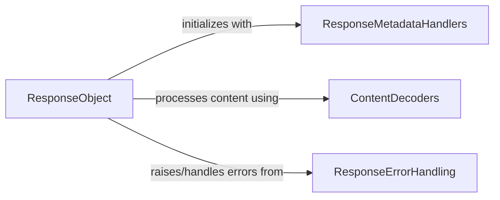

## Component Details

This component overview details the 'Response Handling' subsystem within the project, focusing on how HTTP responses are processed, their content accessed, and errors managed. The core of this subsystem is the `ResponseObject`, which encapsulates the entire HTTP response. It interacts with `ResponseMetadataHandlers` for managing headers and cookies, `ContentDecoders` for parsing and decoding response content, and `ResponseErrorHandling` for managing and raising various HTTP-related exceptions. The main flow involves the `ResponseObject` receiving a raw HTTP response, then using the other components to provide structured access to its data and to handle potential errors.

### ResponseObject
This component encapsulates the core functionality of an HTTP response, managing its lifecycle, content access, status checks, and resource cleanup. It provides methods for iterating over content, parsing JSON, extracting links, and raising errors based on the HTTP status code.

**Related Classes/Methods**:

- <a href="https://github.com/psf/requests/blob/master/src/requests/models.py#L640-L1039" target="_blank" rel="noopener noreferrer">`requests.src.requests.models.Response` (640:1039)</a>
- <a href="https://github.com/psf/requests/blob/master/src/requests/models.py#L658-L703" target="_blank" rel="noopener noreferrer">`requests.src.requests.models.Response:__init__` (658:703)</a>
- <a href="https://github.com/psf/requests/blob/master/src/requests/models.py#L708-L709" target="_blank" rel="noopener noreferrer">`requests.src.requests.models.Response:__exit__` (708:709)</a>
- <a href="https://github.com/psf/requests/blob/master/src/requests/models.py#L750-L752" target="_blank" rel="noopener noreferrer">`requests.src.requests.models.Response:__iter__` (750:752)</a>
- <a href="https://github.com/psf/requests/blob/master/src/requests/models.py#L755-L767" target="_blank" rel="noopener noreferrer">`requests.src.requests.models.Response:ok` (755:767)</a>
- <a href="https://github.com/psf/requests/blob/master/src/requests/models.py#L799-L855" target="_blank" rel="noopener noreferrer">`requests.src.requests.models.Response:iter_content` (799:855)</a>
- <a href="https://github.com/psf/requests/blob/master/src/requests/models.py#L857-L888" target="_blank" rel="noopener noreferrer">`requests.src.requests.models.Response:iter_lines` (857:888)</a>
- <a href="https://github.com/psf/requests/blob/master/src/requests/models.py#L891-L907" target="_blank" rel="noopener noreferrer">`requests.src.requests.models.Response:content` (891:907)</a>
- <a href="https://github.com/psf/requests/blob/master/src/requests/models.py#L947-L980" target="_blank" rel="noopener noreferrer">`requests.src.requests.models.Response:json` (947:980)</a>
- <a href="https://github.com/psf/requests/blob/master/src/requests/models.py#L983-L997" target="_blank" rel="noopener noreferrer">`requests.src.requests.models.Response:links` (983:997)</a>
- <a href="https://github.com/psf/requests/blob/master/src/requests/models.py#L999-L1026" target="_blank" rel="noopener noreferrer">`requests.src.requests.models.Response:raise_for_status` (999:1026)</a>
- <a href="https://github.com/psf/requests/blob/master/src/requests/models.py#L1028-L1039" target="_blank" rel="noopener noreferrer">`requests.src.requests.models.Response.close` (1028:1039)</a>

### ResponseMetadataHandlers
This component is responsible for handling and structuring the metadata associated with an HTTP response, specifically managing case-insensitive headers and converting cookie dictionaries into a CookieJar object.

**Related Classes/Methods**:

- <a href="https://github.com/psf/requests/blob/master/src/requests/structures.py#L13-L80" target="_blank" rel="noopener noreferrer">`requests.src.requests.structures.CaseInsensitiveDict` (13:80)</a>
- <a href="https://github.com/psf/requests/blob/master/src/requests/cookies.py#L521-L539" target="_blank" rel="noopener noreferrer">`requests.src.requests.cookies.cookiejar_from_dict` (521:539)</a>

### ContentDecoders
This component provides utility functions for processing and decoding the raw content stream of an HTTP response. It includes functionalities for slicing content into chunks, decoding unicode streams, guessing JSON encoding, and parsing HTTP header links.

**Related Classes/Methods**:

- <a href="https://github.com/psf/requests/blob/master/src/requests/utils.py#L584-L591" target="_blank" rel="noopener noreferrer">`requests.src.requests.utils.iter_slices` (584:591)</a>
- <a href="https://github.com/psf/requests/blob/master/src/requests/utils.py#L567-L581" target="_blank" rel="noopener noreferrer">`requests.src.requests.utils.stream_decode_response_unicode` (567:581)</a>
- <a href="https://github.com/psf/requests/blob/master/src/requests/utils.py#L960-L989" target="_blank" rel="noopener noreferrer">`requests.src.requests.utils.guess_json_utf` (960:989)</a>
- <a href="https://github.com/psf/requests/blob/master/src/requests/utils.py#L917-L951" target="_blank" rel="noopener noreferrer">`requests.src.requests.utils.parse_header_links` (917:951)</a>

### ResponseErrorHandling
This component defines and manages various types of exceptions that can occur during the processing of an HTTP response. It covers errors related to encoding, content decoding, network connections, SSL, stream consumption, HTTP status codes, and JSON parsing.

**Related Classes/Methods**:

- <a href="https://github.com/psf/requests/blob/master/src/requests/exceptions.py#L119-L120" target="_blank" rel="noopener noreferrer">`requests.src.requests.exceptions.ChunkedEncodingError` (119:120)</a>
- <a href="https://github.com/psf/requests/blob/master/src/requests/exceptions.py#L123-L124" target="_blank" rel="noopener noreferrer">`requests.src.requests.exceptions.ContentDecodingError` (123:124)</a>
- <a href="https://github.com/psf/requests/blob/master/src/requests/exceptions.py#L59-L60" target="_blank" rel="noopener noreferrer">`requests.src.requests.exceptions.ConnectionError` (59:60)</a>
- <a href="https://github.com/psf/requests/blob/master/src/requests/exceptions.py#L67-L68" target="_blank" rel="noopener noreferrer">`requests.src.requests.exceptions.SSLError` (67:68)</a>
- <a href="https://github.com/psf/requests/blob/master/src/requests/exceptions.py#L127-L128" target="_blank" rel="noopener noreferrer">`requests.src.requests.exceptions.StreamConsumedError` (127:128)</a>
- <a href="https://github.com/psf/requests/blob/master/src/requests/exceptions.py#L55-L56" target="_blank" rel="noopener noreferrer">`requests.src.requests.exceptions.HTTPError` (55:56)</a>
- <a href="https://github.com/psf/requests/blob/master/src/requests/exceptions.py#L31-L52" target="_blank" rel="noopener noreferrer">`requests.src.requests.exceptions.JSONDecodeError` (31:52)</a>

### [FAQ](https://github.com/CodeBoarding/GeneratedOnBoardings/tree/main?tab=readme-ov-file#faq)