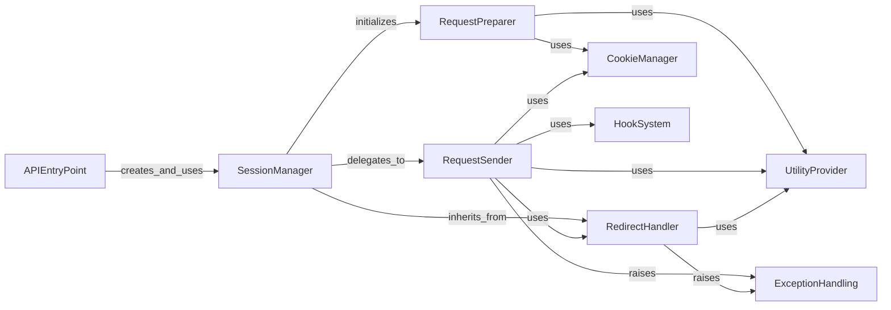

## Component Details

Provides persistent HTTP sessions, enabling features like cookie persistence, connection pooling, and redirect handling across multiple requests. It orchestrates the entire request-response lifecycle, preparing requests, sending them via adapters, and resolving redirects.

### SessionManager
This component is responsible for managing persistent settings across multiple HTTP requests, including cookies, authentication, and proxies. It acts as the central orchestrator for preparing and sending requests, and handling responses.

**Related Classes/Methods**:

- <a href="https://github.com/psf/requests/blob/master/src/requests/sessions.py#L356-L816" target="_blank" rel="noopener noreferrer">`requests.sessions.Session` (356:816)</a>
- <a href="https://github.com/psf/requests/blob/master/src/requests/sessions.py#L819-L831" target="_blank" rel="noopener noreferrer">`requests.sessions.session` (819:831)</a>
- <a href="https://github.com/psf/requests/blob/master/src/requests/sessions.py#L61-L88" target="_blank" rel="noopener noreferrer">`requests.sessions.merge_setting` (61:88)</a>
- <a href="https://github.com/psf/requests/blob/master/src/requests/sessions.py#L91-L103" target="_blank" rel="noopener noreferrer">`requests.sessions.merge_hooks` (91:103)</a>
- <a href="https://github.com/psf/requests/blob/master/src/requests/sessions.py#L390-L449" target="_blank" rel="noopener noreferrer">`requests.sessions.Session.__init__` (390:449)</a>
- <a href="https://github.com/psf/requests/blob/master/src/requests/sessions.py#L454-L455" target="_blank" rel="noopener noreferrer">`requests.sessions.Session.__exit__` (454:455)</a>
- <a href="https://github.com/psf/requests/blob/master/src/requests/sessions.py#L794-L797" target="_blank" rel="noopener noreferrer">`requests.sessions.Session.close` (794:797)</a>
- <a href="https://github.com/psf/requests/blob/master/src/requests/sessions.py#L799-L808" target="_blank" rel="noopener noreferrer">`requests.sessions.Session.mount` (799:808)</a>
- <a href="https://github.com/psf/requests/blob/master/src/requests/sessions.py#L593-L602" target="_blank" rel="noopener noreferrer">`requests.sessions.Session.get` (593:602)</a>
- <a href="https://github.com/psf/requests/blob/master/src/requests/sessions.py#L604-L613" target="_blank" rel="noopener noreferrer">`requests.sessions.Session.options` (604:613)</a>
- <a href="https://github.com/psf/requests/blob/master/src/requests/sessions.py#L615-L624" target="_blank" rel="noopener noreferrer">`requests.sessions.Session.head` (615:624)</a>
- <a href="https://github.com/psf/requests/blob/master/src/requests/sessions.py#L626-L637" target="_blank" rel="noopener noreferrer">`requests.sessions.Session.post` (626:637)</a>
- <a href="https://github.com/psf/requests/blob/master/src/requests/sessions.py#L639-L649" target="_blank" rel="noopener noreferrer">`requests.sessions.Session.put` (639:649)</a>
- <a href="https://github.com/psf/requests/blob/master/src/requests/sessions.py#L651-L661" target="_blank" rel="noopener noreferrer">`requests.sessions.Session.patch` (651:661)</a>
- <a href="https://github.com/psf/requests/blob/master/src/requests/sessions.py#L663-L671" target="_blank" rel="noopener noreferrer">`requests.sessions.Session.delete` (663:671)</a>

### RequestPreparer
This component focuses on transforming a raw Request object into a PreparedRequest, which includes merging session settings, handling cookies, and applying authentication, making it ready for transmission.

**Related Classes/Methods**:

- <a href="https://github.com/psf/requests/blob/master/src/requests/sessions.py#L457-L498" target="_blank" rel="noopener noreferrer">`requests.sessions.Session.prepare_request` (457:498)</a>
- <a href="https://github.com/psf/requests/blob/master/src/requests/models.py#L230-L310" target="_blank" rel="noopener noreferrer">`requests.models.Request` (230:310)</a>
- <a href="https://github.com/psf/requests/blob/master/src/requests/models.py#L313-L637" target="_blank" rel="noopener noreferrer">`requests.models.PreparedRequest` (313:637)</a>
- <a href="https://github.com/psf/requests/blob/master/src/requests/models.py#L351-L377" target="_blank" rel="noopener noreferrer">`requests.models.PreparedRequest.prepare` (351:377)</a>

### RequestSender
This component is responsible for sending the prepared request over the network and receiving the raw response. It delegates the actual network communication to adapters and manages the response, including cookie extraction and hook dispatching.

**Related Classes/Methods**:

- <a href="https://github.com/psf/requests/blob/master/src/requests/sessions.py#L500-L591" target="_blank" rel="noopener noreferrer">`requests.sessions.Session.request` (500:591)</a>
- <a href="https://github.com/psf/requests/blob/master/src/requests/sessions.py#L673-L748" target="_blank" rel="noopener noreferrer">`requests.sessions.Session.send` (673:748)</a>
- <a href="https://github.com/psf/requests/blob/master/src/requests/sessions.py#L750-L779" target="_blank" rel="noopener noreferrer">`requests.sessions.Session.merge_environment_settings` (750:779)</a>
- <a href="https://github.com/psf/requests/blob/master/src/requests/sessions.py#L781-L792" target="_blank" rel="noopener noreferrer">`requests.sessions.Session.get_adapter` (781:792)</a>
- <a href="https://github.com/psf/requests/blob/master/src/requests/adapters.py#L167-L719" target="_blank" rel="noopener noreferrer">`requests.adapters.HTTPAdapter` (167:719)</a>

### RedirectHandler
This component manages the logic for following HTTP redirects, including determining redirect targets, rebuilding requests for redirects, and handling authentication and proxy changes during redirects.

**Related Classes/Methods**:

- <a href="https://github.com/psf/requests/blob/master/src/requests/sessions.py#L106-L353" target="_blank" rel="noopener noreferrer">`requests.sessions.SessionRedirectMixin` (106:353)</a>
- <a href="https://github.com/psf/requests/blob/master/src/requests/sessions.py#L107-L125" target="_blank" rel="noopener noreferrer">`requests.sessions.SessionRedirectMixin.get_redirect_target` (107:125)</a>
- <a href="https://github.com/psf/requests/blob/master/src/requests/sessions.py#L159-L280" target="_blank" rel="noopener noreferrer">`requests.sessions.SessionRedirectMixin.resolve_redirects` (159:280)</a>
- <a href="https://github.com/psf/requests/blob/master/src/requests/sessions.py#L282-L300" target="_blank" rel="noopener noreferrer">`requests.sessions.SessionRedirectMixin.rebuild_auth` (282:300)</a>
- <a href="https://github.com/psf/requests/blob/master/src/requests/sessions.py#L302-L331" target="_blank" rel="noopener noreferrer">`requests.sessions.SessionRedirectMixin.rebuild_proxies` (302:331)</a>
- <a href="https://github.com/psf/requests/blob/master/src/requests/sessions.py#L333-L353" target="_blank" rel="noopener noreferrer">`requests.sessions.SessionRedirectMixin.rebuild_method` (333:353)</a>
- <a href="https://github.com/psf/requests/blob/master/src/requests/sessions.py#L127-L157" target="_blank" rel="noopener noreferrer">`requests.sessions.SessionRedirectMixin.should_strip_auth` (127:157)</a>

### CookieManager
This component handles the creation, merging, and extraction of HTTP cookies from requests and responses, ensuring proper cookie persistence across interactions.

**Related Classes/Methods**:

- <a href="https://github.com/psf/requests/blob/master/src/requests/cookies.py#L521-L539" target="_blank" rel="noopener noreferrer">`requests.cookies.cookiejar_from_dict` (521:539)</a>
- <a href="https://github.com/psf/requests/blob/master/src/requests/cookies.py#L542-L561" target="_blank" rel="noopener noreferrer">`requests.cookies.merge_cookies` (542:561)</a>
- <a href="https://github.com/psf/requests/blob/master/src/requests/cookies.py#L124-L137" target="_blank" rel="noopener noreferrer">`requests.cookies.extract_cookies_to_jar` (124:137)</a>
- <a href="https://github.com/psf/requests/blob/master/src/requests/cookies.py#L176-L437" target="_blank" rel="noopener noreferrer">`requests.cookies.RequestsCookieJar` (176:437)</a>

### UtilityProvider
This component offers a collection of helper functions used across the requests library for common tasks such as handling headers, resolving proxies, retrieving authentication details, and manipulating URIs.

**Related Classes/Methods**:

- <a href="https://github.com/psf/requests/blob/master/src/requests/utils.py#L348-L374" target="_blank" rel="noopener noreferrer">`requests.utils.to_key_val_list` (348:374)</a>
- <a href="https://github.com/psf/requests/blob/master/src/requests/utils.py#L903-L914" target="_blank" rel="noopener noreferrer">`requests.utils.default_headers` (903:914)</a>
- <a href="https://github.com/psf/requests/blob/master/src/requests/utils.py#L207-L261" target="_blank" rel="noopener noreferrer">`requests.utils.get_netrc_auth` (207:261)</a>
- <a href="https://github.com/psf/requests/blob/master/src/requests/utils.py#L663-L682" target="_blank" rel="noopener noreferrer">`requests.utils.requote_uri` (663:682)</a>
- <a href="https://github.com/psf/requests/blob/master/src/requests/utils.py#L867-L891" target="_blank" rel="noopener noreferrer">`requests.utils.resolve_proxies` (867:891)</a>
- <a href="https://github.com/psf/requests/blob/master/src/requests/utils.py#L1021-L1034" target="_blank" rel="noopener noreferrer">`requests.utils.get_auth_from_url` (1021:1034)</a>
- <a href="https://github.com/psf/requests/blob/master/src/requests/utils.py#L1084-L1099" target="_blank" rel="noopener noreferrer">`requests.utils.rewind_body` (1084:1099)</a>
- <a href="https://github.com/psf/requests/blob/master/src/requests/utils.py#L829-L838" target="_blank" rel="noopener noreferrer">`requests.utils.get_environ_proxies` (829:838)</a>
- <a href="https://github.com/psf/requests/blob/master/src/requests/_internal_utils.py#L25-L35" target="_blank" rel="noopener noreferrer">`requests._internal_utils.to_native_string` (25:35)</a>
- <a href="https://github.com/psf/requests/blob/master/src/requests/auth.py#L25-L66" target="_blank" rel="noopener noreferrer">`requests.auth._basic_auth_str` (25:66)</a>

### APIEntryPoint
This component provides a simplified, top-level interface for making HTTP requests without explicitly creating and managing a Session object, offering convenience for single request operations.

**Related Classes/Methods**:

- <a href="https://github.com/psf/requests/blob/master/src/requests/api.py#L14-L59" target="_blank" rel="noopener noreferrer">`requests.api.request` (14:59)</a>

### HookSystem
This component is responsible for managing and dispatching custom callback functions (hooks) at various stages of the request-response lifecycle, allowing for extensible behavior.

**Related Classes/Methods**:

- <a href="https://github.com/psf/requests/blob/master/src/requests/hooks.py#L15-L16" target="_blank" rel="noopener noreferrer">`requests.hooks.default_hooks` (15:16)</a>
- <a href="https://github.com/psf/requests/blob/master/src/requests/hooks.py#L22-L33" target="_blank" rel="noopener noreferrer">`requests.hooks.dispatch_hook` (22:33)</a>

### ExceptionHandling
This component defines and manages specific exceptions that can occur during the HTTP request process, such as exceeding redirect limits or encountering invalid schema configurations.

**Related Classes/Methods**:

- <a href="https://github.com/psf/requests/blob/master/src/requests/exceptions.py#L95-L96" target="_blank" rel="noopener noreferrer">`requests.exceptions.TooManyRedirects` (95:96)</a>
- <a href="https://github.com/psf/requests/blob/master/src/requests/exceptions.py#L103-L104" target="_blank" rel="noopener noreferrer">`requests.exceptions.InvalidSchema` (103:104)</a>

### [FAQ](https://github.com/CodeBoarding/GeneratedOnBoardings/tree/main?tab=readme-ov-file#faq)