```mermaid
graph LR
    Request_Management["Request Management"]
    Response_Handling["Response Handling"]
    Session_Management["Session Management"]
    Public_API["Public API"]
    Authentication["Authentication"]
    HTTP_Transport["HTTP Transport"]
    Cookie_Management["Cookie Management"]
    Core_Utilities["Core Utilities"]
    Error_Handling["Error Handling"]
    Public_API -- "initiates requests via" --> Session_Management
    Session_Management -- "prepares requests using" --> Request_Management
    Session_Management -- "sends requests via" --> HTTP_Transport
    Session_Management -- "handles redirects using" --> Session_Management
    Session_Management -- "manages cookies with" --> Cookie_Management
    Session_Management -- "applies authentication via" --> Authentication
    Session_Management -- "utilizes" --> Core_Utilities
    Request_Management -- "prepares data with" --> Core_Utilities
    Request_Management -- "integrates authentication from" --> Authentication
    Request_Management -- "integrates cookies from" --> Cookie_Management
    Response_Handling -- "processes responses from" --> Core_Utilities
    Response_Handling -- "extracts cookies using" --> Cookie_Management
    Response_Handling -- "raises" --> Error_Handling
    HTTP_Transport -- "builds responses for" --> Response_Handling
    HTTP_Transport -- "utilizes" --> Core_Utilities
    HTTP_Transport -- "applies authentication via" --> Authentication
    HTTP_Transport -- "handles cookies with" --> Cookie_Management
    HTTP_Transport -- "raises" --> Error_Handling
    Authentication -- "uses" --> Core_Utilities
    Cookie_Management -- "uses" --> Core_Utilities
    Cookie_Management -- "raises" --> Error_Handling
    Request_Management -- "raises" --> Error_Handling
    Core_Utilities -- "uses" --> Error_Handling
    Core_Utilities -- "uses" --> Cookie_Management
    click Request_Management href "https://github.com/CodeBoarding/GeneratedOnBoardings/blob/main/requests/Request Management.md" "Details"
    click Response_Handling href "https://github.com/CodeBoarding/GeneratedOnBoardings/blob/main/requests/Response Handling.md" "Details"
    click Session_Management href "https://github.com/CodeBoarding/GeneratedOnBoardings/blob/main/requests/Session Management.md" "Details"
    click Public_API href "https://github.com/CodeBoarding/GeneratedOnBoardings/blob/main/requests/Public API.md" "Details"
    click Authentication href "https://github.com/CodeBoarding/GeneratedOnBoardings/blob/main/requests/Authentication.md" "Details"
    click HTTP_Transport href "https://github.com/CodeBoarding/GeneratedOnBoardings/blob/main/requests/HTTP Transport.md" "Details"
    click Cookie_Management href "https://github.com/CodeBoarding/GeneratedOnBoardings/blob/main/requests/Cookie Management.md" "Details"
    click Core_Utilities href "https://github.com/CodeBoarding/GeneratedOnBoardings/blob/main/requests/Core Utilities.md" "Details"
    click Error_Handling href "https://github.com/CodeBoarding/GeneratedOnBoardings/blob/main/requests/Error Handling.md" "Details"
```

## Component Details

The `requests` library provides a high-level, user-friendly interface for making HTTP requests. The main flow involves the `Public API` initiating requests, which are then managed by `Session Management` for persistence and pooling. `Session Management` prepares requests using `Request Management`, which handles encoding, headers, authentication, and cookies. The prepared request is then sent via `HTTP Transport`, which performs the low-level communication. The received response is processed by `Response Handling`, which decodes content and extracts information. Various `Core Utilities` support these components, while `Authentication`, `Cookie Management`, and `Error Handling` provide specialized functionalities throughout the request-response lifecycle.

### Request Management
Encompasses the creation, preparation, and encoding of HTTP requests, transforming user-defined requests into a `PreparedRequest` for sending, including parameter encoding, file uploads, header setup, and integrating authentication and cookie data. It also manages hooks.

**Related Classes/Methods**:

- <a href="https://github.com/psf/requests/blob/master/src/requests/models.py#L230-L310" target="_blank" rel="noopener noreferrer">`requests.src.requests.models.Request` (230:310)</a>
- <a href="https://github.com/psf/requests/blob/master/src/requests/models.py#L313-L637" target="_blank" rel="noopener noreferrer">`requests.src.requests.models.PreparedRequest` (313:637)</a>
- <a href="https://github.com/psf/requests/blob/master/src/requests/models.py#L84-L203" target="_blank" rel="noopener noreferrer">`requests.src.requests.models.RequestEncodingMixin` (84:203)</a>
- <a href="https://github.com/psf/requests/blob/master/src/requests/models.py#L206-L227" target="_blank" rel="noopener noreferrer">`requests.src.requests.models.RequestHooksMixin` (206:227)</a>
- <a href="https://github.com/psf/requests/blob/master/src/requests/hooks.py#L15-L16" target="_blank" rel="noopener noreferrer">`requests.src.requests.hooks.default_hooks` (15:16)</a>

### Response Handling
Manages the processing of HTTP responses received from the server, providing methods to access content (text, bytes, JSON), status codes, headers, and handling content decoding and error checking.

**Related Classes/Methods**:

- <a href="https://github.com/psf/requests/blob/master/src/requests/models.py#L640-L1039" target="_blank" rel="noopener noreferrer">`requests.src.requests.models.Response` (640:1039)</a>

### Session Management
Provides persistent HTTP sessions, enabling features like cookie persistence, connection pooling, and redirect handling across multiple requests. It orchestrates the entire request-response lifecycle, preparing requests, sending them via adapters, and resolving redirects.

**Related Classes/Methods**:

- <a href="https://github.com/psf/requests/blob/master/src/requests/sessions.py#L356-L816" target="_blank" rel="noopener noreferrer">`requests.src.requests.sessions.Session` (356:816)</a>
- <a href="https://github.com/psf/requests/blob/master/src/requests/sessions.py#L106-L353" target="_blank" rel="noopener noreferrer">`requests.src.requests.sessions.SessionRedirectMixin` (106:353)</a>

### Public API
Offers the high-level, user-friendly functions for making common HTTP requests (GET, POST, PUT, DELETE, etc.), serving as the primary entry point for most users by abstracting away underlying session and request preparation details.

**Related Classes/Methods**:

- <a href="https://github.com/psf/requests/blob/master/src/requests/api.py#L14-L59" target="_blank" rel="noopener noreferrer">`requests.src.requests.api.request` (14:59)</a>
- <a href="https://github.com/psf/requests/blob/master/src/requests/api.py#L62-L73" target="_blank" rel="noopener noreferrer">`requests.src.requests.api.get` (62:73)</a>
- <a href="https://github.com/psf/requests/blob/master/src/requests/api.py#L76-L85" target="_blank" rel="noopener noreferrer">`requests.src.requests.api.options` (76:85)</a>
- <a href="https://github.com/psf/requests/blob/master/src/requests/api.py#L88-L100" target="_blank" rel="noopener noreferrer">`requests.src.requests.api.head` (88:100)</a>
- <a href="https://github.com/psf/requests/blob/master/src/requests/api.py#L103-L115" target="_blank" rel="noopener noreferrer">`requests.src.requests.api.post` (103:115)</a>
- <a href="https://github.com/psf/requests/blob/master/src/requests/api.py#L118-L130" target="_blank" rel="noopener noreferrer">`requests.src.requests.api.put` (118:130)</a>
- <a href="https://github.com/psf/requests/blob/master/src/requests/api.py#L133-L145" target="_blank" rel="noopener noreferrer">`requests.src.requests.api.patch` (133:145)</a>
- <a href="https://github.com/psf/requests/blob/master/src/requests/api.py#L148-L157" target="_blank" rel="noopener noreferrer">`requests.src.requests.api.delete` (148:157)</a>

### Authentication
Provides various HTTP authentication schemes (e.g., Basic, Digest, Proxy), containing the logic for generating and applying the necessary authentication headers to outgoing requests.

**Related Classes/Methods**:

- <a href="https://github.com/psf/requests/blob/master/src/requests/auth.py#L69-L73" target="_blank" rel="noopener noreferrer">`requests.src.requests.auth.AuthBase` (69:73)</a>
- <a href="https://github.com/psf/requests/blob/master/src/requests/auth.py#L76-L96" target="_blank" rel="noopener noreferrer">`requests.src.requests.auth.HTTPBasicAuth` (76:96)</a>
- <a href="https://github.com/psf/requests/blob/master/src/requests/auth.py#L99-L104" target="_blank" rel="noopener noreferrer">`requests.src.requests.auth.HTTPProxyAuth` (99:104)</a>
- <a href="https://github.com/psf/requests/blob/master/src/requests/auth.py#L107-L314" target="_blank" rel="noopener noreferrer">`requests.src.requests.auth.HTTPDigestAuth` (107:314)</a>

### HTTP Transport
Responsible for the actual low-level communication with HTTP servers, managing connection pools, handling proxy settings, verifying SSL certificates, and building the final response object from raw network data.

**Related Classes/Methods**:

- <a href="https://github.com/psf/requests/blob/master/src/requests/adapters.py#L167-L719" target="_blank" rel="noopener noreferrer">`requests.src.requests.adapters.HTTPAdapter` (167:719)</a>

### Cookie Management
Handles HTTP cookies, including parsing, storing, and attaching them to requests, ensuring cookies are correctly managed across redirects and subsequent requests within a session.

**Related Classes/Methods**:

- <a href="https://github.com/psf/requests/blob/master/src/requests/cookies.py#L176-L437" target="_blank" rel="noopener noreferrer">`requests.src.requests.cookies.RequestsCookieJar` (176:437)</a>
- <a href="https://github.com/psf/requests/blob/master/src/requests/cookies.py#L521-L539" target="_blank" rel="noopener noreferrer">`requests.src.requests.cookies.cookiejar_from_dict` (521:539)</a>
- <a href="https://github.com/psf/requests/blob/master/src/requests/cookies.py#L140-L148" target="_blank" rel="noopener noreferrer">`requests.src.requests.cookies.get_cookie_header` (140:148)</a>

### Core Utilities
Provides a collection of general-purpose utility functions and data structures used across various parts of the requests library, including header parsing, URL manipulation, proxy resolution, case-insensitive dictionaries, and HTTP status code mappings.

**Related Classes/Methods**:

- <a href="https://github.com/psf/requests/blob/master/src/requests/utils.py#L1-L800" target="_blank" rel="noopener noreferrer">`requests.src.requests.utils` (1:800)</a>
- <a href="https://github.com/psf/requests/blob/master/src/requests/_internal_utils.py#L1-L20" target="_blank" rel="noopener noreferrer">`requests.src.requests._internal_utils` (1:20)</a>
- <a href="https://github.com/psf/requests/blob/master/src/requests/structures.py#L13-L80" target="_blank" rel="noopener noreferrer">`requests.src.requests.structures.CaseInsensitiveDict` (13:80)</a>
- <a href="https://github.com/psf/requests/blob/master/src/requests/status_codes.py#L10-L200" target="_blank" rel="noopener noreferrer">`requests.src.requests.status_codes.codes` (10:200)</a>

### Error Handling
Defines and manages the custom exception types used throughout the requests library, providing specific error information for various network, HTTP, and parsing failures, allowing for robust error management.

**Related Classes/Methods**:

- <a href="https://github.com/psf/requests/blob/master/src/requests/exceptions.py#L12-L24" target="_blank" rel="noopener noreferrer">`requests.src.requests.exceptions.RequestException` (12:24)</a>
- <a href="https://github.com/psf/requests/blob/master/src/requests/exceptions.py#L55-L56" target="_blank" rel="noopener noreferrer">`requests.src.requests.exceptions.HTTPError` (55:56)</a>
- <a href="https://github.com/psf/requests/blob/master/src/requests/exceptions.py#L59-L60" target="_blank" rel="noopener noreferrer">`requests.src.requests.exceptions.ConnectionError` (59:60)</a>
- <a href="https://github.com/psf/requests/blob/master/src/requests/exceptions.py#L63-L64" target="_blank" rel="noopener noreferrer">`requests.src.requests.exceptions.ProxyError` (63:64)</a>
- <a href="https://github.com/psf/requests/blob/master/src/requests/exceptions.py#L67-L68" target="_blank" rel="noopener noreferrer">`requests.src.requests.exceptions.SSLError` (67:68)</a>
- <a href="https://github.com/psf/requests/blob/master/src/requests/exceptions.py#L71-L77" target="_blank" rel="noopener noreferrer">`requests.src.requests.exceptions.Timeout` (71:77)</a>
- <a href="https://github.com/psf/requests/blob/master/src/requests/exceptions.py#L91-L92" target="_blank" rel="noopener noreferrer">`requests.src.requests.exceptions.URLRequired` (91:92)</a>
- <a href="https://github.com/psf/requests/blob/master/src/requests/exceptions.py#L95-L96" target="_blank" rel="noopener noreferrer">`requests.src.requests.exceptions.TooManyRedirects` (95:96)</a>
- <a href="https://github.com/psf/requests/blob/master/src/requests/exceptions.py#L99-L100" target="_blank" rel="noopener noreferrer">`requests.src.requests.exceptions.MissingSchema` (99:100)</a>
- <a href="https://github.com/psf/requests/blob/master/src/requests/exceptions.py#L103-L104" target="_blank" rel="noopener noreferrer">`requests.src.requests.exceptions.InvalidSchema` (103:104)</a>
- <a href="https://github.com/psf/requests/blob/master/src/requests/exceptions.py#L107-L108" target="_blank" rel="noopener noreferrer">`requests.src.requests.exceptions.InvalidURL` (107:108)</a>
- <a href="https://github.com/psf/requests/blob/master/src/requests/exceptions.py#L111-L112" target="_blank" rel="noopener noreferrer">`requests.src.requests.exceptions.InvalidHeader` (111:112)</a>
- <a href="https://github.com/psf/requests/blob/master/src/requests/exceptions.py#L119-L120" target="_blank" rel="noopener noreferrer">`requests.src.requests.exceptions.ChunkedEncodingError` (119:120)</a>
- <a href="https://github.com/psf/requests/blob/master/src/requests/exceptions.py#L123-L124" target="_blank" rel="noopener noreferrer">`requests.src.requests.exceptions.ContentDecodingError` (123:124)</a>
- <a href="https://github.com/psf/requests/blob/master/src/requests/exceptions.py#L127-L128" target="_blank" rel="noopener noreferrer">`requests.src.requests.exceptions.StreamConsumedError` (127:128)</a>
- <a href="https://github.com/psf/requests/blob/master/src/requests/exceptions.py#L131-L132" target="_blank" rel="noopener noreferrer">`requests.src.requests.exceptions.RetryError` (131:132)</a>
- <a href="https://github.com/psf/requests/blob/master/src/requests/exceptions.py#L135-L136" target="_blank" rel="noopener noreferrer">`requests.src.requests.exceptions.UnrewindableBodyError` (135:136)</a>
- <a href="https://github.com/psf/requests/blob/master/src/requests/exceptions.py#L27-L28" target="_blank" rel="noopener noreferrer">`requests.src.requests.exceptions.InvalidJSONError` (27:28)</a>
- <a href="https://github.com/psf/requests/blob/master/src/requests/exceptions.py#L31-L52" target="_blank" rel="noopener noreferrer">`requests.src.requests.exceptions.JSONDecodeError` (31:52)</a>

### [FAQ](https://github.com/CodeBoarding/GeneratedOnBoardings/tree/main?tab=readme-ov-file#faq)