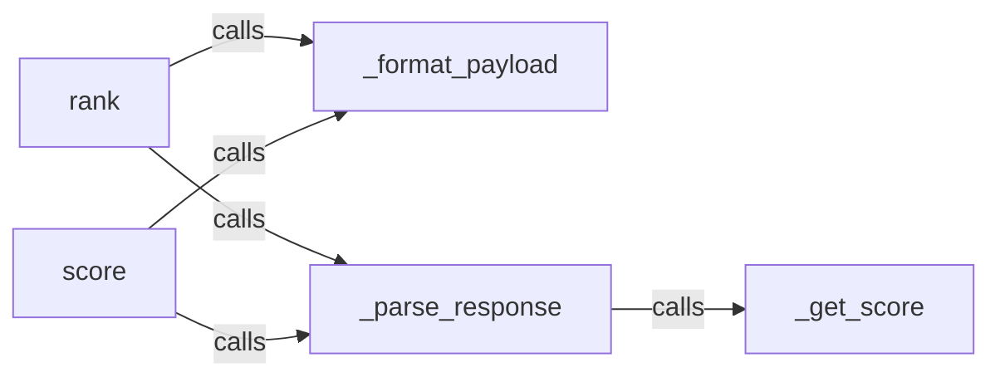

## Details

The API Reranker Clients subsystem is primarily encapsulated within the rerankers.models.api_rankers module, specifically the api_rankers.py file. This module is responsible for handling all interactions with external reranking APIs, including request formatting, execution, and response parsing.

### rank
The primary public interface for performing a full reranking operation by orchestrating the entire process of payload formatting, API request execution, and response parsing. It acts as a facade for the complex API interaction logic.

**Related Classes/Methods**:

- <a href="https://github.com/AnswerDotAI/rerankers/blob/main/rerankers/results.py" target="_blank" rel="noopener noreferrer">`rank`</a>

### score
A public interface providing a more granular method to obtain a single reranking score for a given query-document pair from an external API. It leverages the same underlying formatting and parsing mechanisms as rank.

**Related Classes/Methods**:

- <a href="https://github.com/AnswerDotAI/rerankers/blob/main/rerankers/results.py" target="_blank" rel="noopener noreferrer">`score`</a>

### _format_payload
An internal helper component responsible for transforming the internal data structures (query, documents) into the specific request format (e.g., JSON) required by the target external reranking API. It ensures compatibility with various API specifications.

**Related Classes/Methods**:

- <a href="https://github.com/AnswerDotAI/rerankers/blob/main/rerankers/models/api_rankers.py#L118-L136" target="_blank" rel="noopener noreferrer">`_format_payload`:118-136</a>

### _parse_response
An internal helper component that handles the deserialization and initial interpretation of the raw API response received from external reranking services. It converts the external API's response into a usable internal representation.

**Related Classes/Methods**:

- <a href="https://github.com/AnswerDotAI/rerankers/blob/main/rerankers/models/api_rankers.py#L87-L102" target="_blank" rel="noopener noreferrer">`_parse_response`:87-102</a>

### _get_score
A specialized internal helper component, called by _parse_response, designed specifically to extract the numerical reranking score from the parsed API response data. It isolates the logic for score retrieval.

**Related Classes/Methods**:

- <a href="https://github.com/AnswerDotAI/rerankers/blob/main/rerankers/models/api_rankers.py#L83-L85" target="_blank" rel="noopener noreferrer">`_get_score`:83-85</a>

### [FAQ](https://github.com/CodeBoarding/GeneratedOnBoardings/tree/main?tab=readme-ov-file#faq)