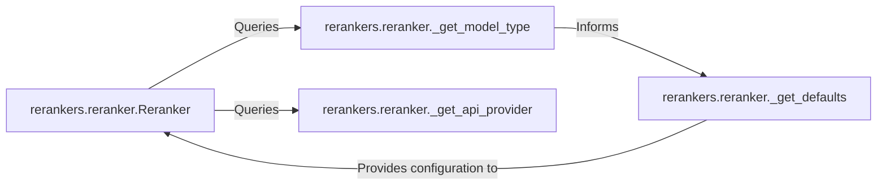

## Details

The `rerankers` subsystem is centered around the `Reranker` component, which serves as the primary interface for all reranking operations. This component dynamically determines the appropriate reranking strategy by querying `_get_model_type` to identify the model type and `_get_api_provider` to ascertain any required external API services. The `_get_model_type` component, in turn, informs `_get_defaults`, allowing for the generation of context-specific default configurations. These tailored defaults are then provided back to the `Reranker`, enabling it to initialize and execute the correct reranking logic, abstracting the underlying complexities from the user.

### rerankers.reranker.Reranker
This is the central entry point and the primary facade for the entire reranking library. It provides a unified `rank()` method, abstracting away the complexities of various underlying reranker implementations. It acts as a factory, dynamically selecting and instantiating the correct reranker strategy (e.g., CrossEncoder, API-based) based on configuration and identified model type.

**Related Classes/Methods**:

- <a href="https://github.com/AnswerDotAI/rerankers/blob/main/rerankers/reranker.py#L196-L247" target="_blank" rel="noopener noreferrer">`rerankers.reranker.Reranker`:196-247</a>

### rerankers.reranker._get_model_type
This internal helper function is responsible for identifying and returning the specific type of reranker model intended for use (e.g., CrossEncoder, T5, API-based). This determination is crucial for the `Reranker` component to select and instantiate the appropriate concrete reranker strategy.

**Related Classes/Methods**:

- <a href="https://github.com/AnswerDotAI/rerankers/blob/main/rerankers/reranker.py#L92-L169" target="_blank" rel="noopener noreferrer">`rerankers.reranker._get_model_type`:92-169</a>

### rerankers.reranker._get_api_provider
This internal helper function determines and returns the specific external API provider (e.g., Cohere, Jina, MixedBread) that should be utilized if the reranking operation involves an external service. It ensures the correct API client is identified for external reranking tasks.

**Related Classes/Methods**:

- <a href="https://github.com/AnswerDotAI/rerankers/blob/main/rerankers/reranker.py#L73-L90" target="_blank" rel="noopener noreferrer">`rerankers.reranker._get_api_provider`:73-90</a>

### rerankers.reranker._get_defaults
This internal helper function provides default configuration parameters for the reranker. It ensures sensible baseline settings are applied, potentially tailoring them based on the identified model type, thus simplifying user configuration.

**Related Classes/Methods**:

- <a href="https://github.com/AnswerDotAI/rerankers/blob/main/rerankers/reranker.py#L171-L194" target="_blank" rel="noopener noreferrer">`rerankers.reranker._get_defaults`:171-194</a>

### [FAQ](https://github.com/CodeBoarding/GeneratedOnBoardings/tree/main?tab=readme-ov-file#faq)