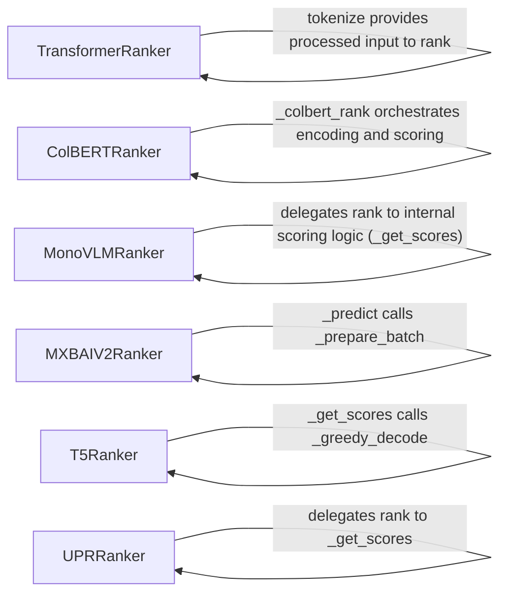

## Details

The `rerankers` subsystem provides a modular framework for various transformer-based reranking models. At its core, the `TransformerRanker` serves as a generic base, handling common operations like tokenization and the overall ranking process. Specialized rerankers, such as `ColBERTRanker`, `MonoVLMRanker`, `MXBAIV2Ranker`, `T5Ranker`, and `UPRRanker`, extend this functionality by implementing their unique model-specific inference and scoring mechanisms. For instance, `ColBERTRanker` delegates its primary `rank` operation to an internal `_colbert_rank` method, which then orchestrates the distinct encoding of queries and documents, followed by interaction-based scoring. Similarly, `MXBAIV2Ranker` relies on an internal `_predict` method, which in turn prepares batches for efficient processing. This design ensures that each reranker component encapsulates its specific logic while leveraging a common interface for integration.

### TransformerRanker
Implements a generic reranking strategy for transformer models (e.g., CrossEncoder). It handles the core logic for model loading, tokenization, and inference common to many transformer-based rerankers.

**Related Classes/Methods**:

- <a href="https://github.com/AnswerDotAI/rerankers/blob/main/rerankers/models/transformer_ranker.py" target="_blank" rel="noopener noreferrer">`rerankers.models.transformer_ranker.TransformerRanker:rank`</a>
- <a href="https://github.com/AnswerDotAI/rerankers/blob/main/rerankers/models/transformer_ranker.py" target="_blank" rel="noopener noreferrer">`rerankers.models.transformer_ranker.TransformerRanker:tokenize`</a>

### ColBERTRanker
Provides a specific reranking strategy based on the ColBERT architecture, including distinct query and document encoding, and interaction-based scoring.

**Related Classes/Methods**:

- <a href="https://github.com/AnswerDotAI/rerankers/blob/main/rerankers/models/colbert_ranker.py" target="_blank" rel="noopener noreferrer">`rerankers.models.colbert_ranker.ColBERTRanker:rank`</a>
- <a href="https://github.com/AnswerDotAI/rerankers/blob/main/rerankers/models/colbert_ranker.py" target="_blank" rel="noopener noreferrer">`rerankers.models.colbert_ranker.ColBERTRanker:_colbert_rank`</a>
- <a href="https://github.com/AnswerDotAI/rerankers/blob/main/rerankers/models/colbert_ranker.py" target="_blank" rel="noopener noreferrer">`rerankers.models.colbert_ranker.ColBERTRanker:_query_encode`</a>
- <a href="https://github.com/AnswerDotAI/rerankers/blob/main/rerankers/models/colbert_ranker.py" target="_blank" rel="noopener noreferrer">`rerankers.models.colbert_ranker.ColBERTRanker:_document_encode`</a>
- <a href="https://github.com/AnswerDotAI/rerankers/blob/main/rerankers/models/colbert_ranker.py" target="_blank" rel="noopener noreferrer">`rerankers.models.colbert_ranker.ColBERTRanker:_to_embs`</a>
- <a href="https://github.com/AnswerDotAI/rerankers/blob/main/rerankers/models/colbert_ranker.py" target="_blank" rel="noopener noreferrer">`rerankers.models.colbert_ranker.ColBERTRanker:_colbert_score`</a>

### MonoVLMRanker
Implements the reranking strategy for MonoVLM models, focusing on their specific inference and scoring mechanisms.

**Related Classes/Methods**:

- <a href="https://github.com/AnswerDotAI/rerankers/blob/main/rerankers/models/monovlm_ranker.py" target="_blank" rel="noopener noreferrer">`rerankers.models.monovlm_ranker.MonoVLMRanker:rank`</a>
- <a href="https://github.com/AnswerDotAI/rerankers/blob/main/rerankers/models/monovlm_ranker.py" target="_blank" rel="noopener noreferrer">`rerankers.models.monovlm_ranker.MonoVLMRanker:_get_scores`</a>

### MXBAIV2Ranker
Encapsulates the reranking logic for MXBAI V2 models, managing batch preparation and prediction.

**Related Classes/Methods**:

- <a href="https://github.com/AnswerDotAI/rerankers/blob/main/rerankers/models/mxbai_v2.py" target="_blank" rel="noopener noreferrer">`rerankers.models.mxbai_v2.MXBAIV2Ranker:rank`</a>
- <a href="https://github.com/AnswerDotAI/rerankers/blob/main/rerankers/models/mxbai_v2.py" target="_blank" rel="noopener noreferrer">`rerankers.models.mxbai_v2.MXBAIV2Ranker:_predict`</a>
- <a href="https://github.com/AnswerDotAI/rerankers/blob/main/rerankers/models/mxbai_v2.py" target="_blank" rel="noopener noreferrer">`rerankers.models.mxbai_v2.MXBAIV2Ranker:_prepare_batch`</a>

### T5Ranker
Implements the reranking strategy specific to T5 models, including their unique scoring mechanism via decoding.

**Related Classes/Methods**:

- <a href="https://github.com/AnswerDotAI/rerankers/blob/main/rerankers/models/t5ranker.py" target="_blank" rel="noopener noreferrer">`rerankers.models.t5ranker.T5Ranker:rank`</a>
- <a href="https://github.com/AnswerDotAI/rerankers/blob/main/rerankers/models/t5ranker.py" target="_blank" rel="noopener noreferrer">`rerankers.models.t5ranker.T5Ranker:_get_scores`</a>
- <a href="https://github.com/AnswerDotAI/rerankers/blob/main/rerankers/models/t5ranker.py" target="_blank" rel="noopener noreferrer">`rerankers.models.t5ranker.T5Ranker:_greedy_decode`</a>

### UPRRanker
Implements the reranking strategy for UPR (Unsupervised Passage Reranking) models, focusing on their distinct scoring methodology.

**Related Classes/Methods**:

- <a href="https://github.com/AnswerDotAI/rerankers/blob/main/rerankers/models/upr.py" target="_blank" rel="noopener noreferrer">`rerankers.models.upr.UPRRanker:rank`</a>
- <a href="https://github.com/AnswerDotAI/rerankers/blob/main/rerankers/models/upr.py" target="_blank" rel="noopener noreferrer">`rerankers.models.upr.UPRRanker:_get_scores`</a>

### [FAQ](https://github.com/CodeBoarding/GeneratedOnBoardings/tree/main?tab=readme-ov-file#faq)