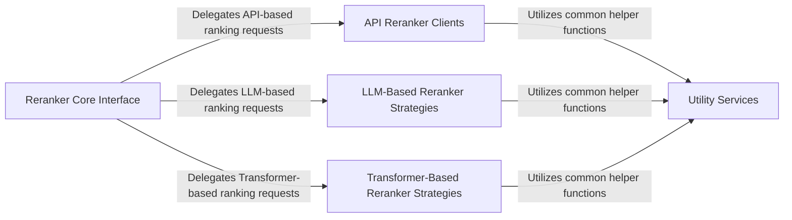

## Details

The `rerankers` library employs a robust, extensible architecture designed for diverse reranking needs. At its heart, the `Reranker Core Interface` serves as a central facade, providing a unified entry point for all reranking operations. This interface intelligently dispatches requests to specialized strategy components: `API Reranker Clients` for seamless integration with external reranking services, `LLM-Based Reranker Strategies` for advanced reranking powered by large language models, and `Transformer-Based Reranker Strategies` for efficient local inference using various transformer models. All these specialized components consistently interact with a `Utility Services` module, which provides essential helper functions and common data structures, ensuring a clean separation of concerns and promoting code reusability. This design allows for easy expansion with new reranking models and APIs while maintaining a consistent and intuitive user experience.

### Reranker Core Interface [[Expand]](./Reranker_Core_Interface.md)
The central entry point and factory for the entire library, providing a unified Reranker function. It dynamically selects and instantiates the correct reranker strategy.

**Related Classes/Methods**:

- <a href="https://github.com/AnswerDotAI/rerankers/blob/main/rerankers/reranker.py#L196-L247" target="_blank" rel="noopener noreferrer">`rerankers.reranker.Reranker`:196-247</a>
- <a href="https://github.com/AnswerDotAI/rerankers/blob/main/rerankers/reranker.py#L73-L90" target="_blank" rel="noopener noreferrer">`rerankers.reranker._get_api_provider`:73-90</a>
- <a href="https://github.com/AnswerDotAI/rerankers/blob/main/rerankers/reranker.py#L171-L194" target="_blank" rel="noopener noreferrer">`rerankers.reranker._get_defaults`:171-194</a>
- <a href="https://github.com/AnswerDotAI/rerankers/blob/main/rerankers/reranker.py#L92-L169" target="_blank" rel="noopener noreferrer">`rerankers.reranker._get_model_type`:92-169</a>

### API Reranker Clients [[Expand]](./API_Reranker_Clients.md)
Handles interactions with external reranking APIs (e.g., Cohere, Jina, MixedBread, Pinecone, Isaacus, OpenAI, Voyage AI, HuggingFace TEI), managing request formatting and response parsing.

**Related Classes/Methods**:

- <a href="https://github.com/AnswerDotAI/rerankers/blob/main/rerankers/models/api_rankers.py#L104-L115" target="_blank" rel="noopener noreferrer">`rerankers.models.api_rankers.rank`:104-115</a>
- <a href="https://github.com/AnswerDotAI/rerankers/blob/main/rerankers/models/api_rankers.py#L138-L142" target="_blank" rel="noopener noreferrer">`rerankers.models.api_rankers.score`:138-142</a>
- <a href="https://github.com/AnswerDotAI/rerankers/blob/main/rerankers/models/api_rankers.py#L118-L136" target="_blank" rel="noopener noreferrer">`rerankers.models.api_rankers._format_payload`:118-136</a>
- <a href="https://github.com/AnswerDotAI/rerankers/blob/main/rerankers/models/api_rankers.py#L87-L102" target="_blank" rel="noopener noreferrer">`rerankers.models.api_rankers._parse_response`:87-102</a>

### LLM-Based Reranker Strategies
Implements reranking logic leveraging Large Language Models (LLMs), including techniques like layer-wise ranking, relevance filtering, and permutation-based ranking (e.g., RankGPT, RankLLM).

**Related Classes/Methods**:

- <a href="https://github.com/AnswerDotAI/rerankers/blob/main/rerankers/models/llm_layerwise_ranker.py#L138-L187" target="_blank" rel="noopener noreferrer">`rerankers.models.llm_layerwise_ranker.rank`:138-187</a>
- <a href="https://github.com/AnswerDotAI/rerankers/blob/main/rerankers/models/llm_relevance_filter.py#L157-L193" target="_blank" rel="noopener noreferrer">`rerankers.models.llm_relevance_filter.rank`:157-193</a>
- <a href="https://github.com/AnswerDotAI/rerankers/blob/main/rerankers/models/rankgpt_rankers.py#L126-L160" target="_blank" rel="noopener noreferrer">`rerankers.models.rankgpt_rankers.rank`:126-160</a>

### Transformer-Based Reranker Strategies [[Expand]](./Transformer_Based_Reranker_Strategies.md)
Implements reranking logic based on various transformer architectures (e.g., CrossEncoder, ColBERT, MonoVLM, T5, MXBAI V2, UPR), handling model loading, tokenization, and inference.

**Related Classes/Methods**:

- <a href="https://github.com/AnswerDotAI/rerankers/blob/main/rerankers/models/transformer_ranker.py#L57-L96" target="_blank" rel="noopener noreferrer">`rerankers.models.transformer_ranker.rank`:57-96</a>
- <a href="https://github.com/AnswerDotAI/rerankers/blob/main/rerankers/models/colbert_ranker.py#L257-L273" target="_blank" rel="noopener noreferrer">`rerankers.models.colbert_ranker.rank`:257-273</a>
- <a href="https://github.com/AnswerDotAI/rerankers/blob/main/rerankers/models/monovlm_ranker.py#L145-L160" target="_blank" rel="noopener noreferrer">`rerankers.models.monovlm_ranker.rank`:145-160</a>
- <a href="https://github.com/AnswerDotAI/rerankers/blob/main/rerankers/models/mxbai_v2.py#L358-L413" target="_blank" rel="noopener noreferrer">`rerankers.models.mxbai_v2.rank`:358-413</a>
- <a href="https://github.com/AnswerDotAI/rerankers/blob/main/rerankers/models/t5ranker.py#L160-L178" target="_blank" rel="noopener noreferrer">`rerankers.models.t5ranker.rank`:160-178</a>
- <a href="https://github.com/AnswerDotAI/rerankers/blob/main/rerankers/models/upr.py#L84-L108" target="_blank" rel="noopener noreferrer">`rerankers.models.upr.rank`:84-108</a>

### Utility Services
Provides common helper functions and utilities used across different reranker implementations, such as verbose output, data preprocessing, and common data structures.

**Related Classes/Methods**:

- <a href="https://github.com/AnswerDotAI/rerankers/blob/main/rerankers/utils.py#L11-L13" target="_blank" rel="noopener noreferrer">`rerankers.utils.vprint`:11-13</a>

### [FAQ](https://github.com/CodeBoarding/GeneratedOnBoardings/tree/main?tab=readme-ov-file#faq)