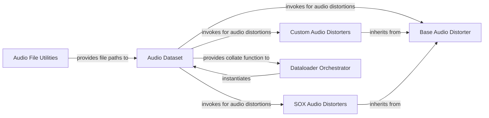

## Details

The `Audio Data Pipeline` subsystem is primarily defined by the `resemble_enhance/data/` package. Its boundaries encompass the modules responsible for locating and loading raw audio files, applying various preprocessing and augmentation techniques, and preparing the data for consumption by machine learning models. Key files and directories defining this boundary include `resemble_enhance/data/dataset.py`, the `resemble_enhance/data/distorter/` directory, and `resemble_enhance/data/utils.py`.

### Audio File Utilities
Handles file system interactions, specifically locating and listing audio files within specified directories. It acts as the initial entry point for raw audio data into the pipeline. This component is fundamental for any data-driven ML application, providing the raw input.

**Related Classes/Methods**:

- <a href="https://github.com/resemble-ai/resemble-enhance/blob/main/resemble_enhance/data/utils.py#L1-L1000" target="_blank" rel="noopener noreferrer">`resemble_enhance.data.utils`:1-1000</a>

### Audio Dataset
Serves as the primary data source. It is responsible for loading raw audio samples, applying initial normalization (e.g., resampling, amplitude normalization), and orchestrating data augmentation by invoking audio distorters. It prepares individual audio samples for subsequent batching. This component is crucial for abstracting data loading and preprocessing, a core pattern in PyTorch-based ML libraries.

**Related Classes/Methods**:

- <a href="https://github.com/resemble-ai/resemble-enhance/blob/main/resemble_enhance/data/dataset.py#L1-L1000" target="_blank" rel="noopener noreferrer">`resemble_enhance.data.dataset`:1-1000</a>

### Base Audio Distorter
Defines a common interface and foundational mechanisms for all audio distortion operations. It promotes extensibility and allows for chaining multiple distortion effects. This component embodies the Modular Design principle by abstracting distortion logic, allowing for flexible data augmentation strategies.

**Related Classes/Methods**:

- <a href="https://github.com/resemble-ai/resemble-enhance/blob/main/resemble_enhance/data/distorter/base.py#L1-L1000" target="_blank" rel="noopener noreferrer">`resemble_enhance.data.distorter.base`:1-1000</a>

### Custom Audio Distorters
Implements project-specific audio distortion techniques, such as adding random Gaussian noise or applying Room Impulse Responses (RIRs). These are concrete implementations extending `Base Audio Distorter`, showcasing the extensibility of the data augmentation pipeline.

**Related Classes/Methods**:

- <a href="https://github.com/resemble-ai/resemble-enhance/blob/main/resemble_enhance/data/distorter/custom.py#L1-L1000" target="_blank" rel="noopener noreferrer">`resemble_enhance.data.distorter.custom`:1-1000</a>

### SOX Audio Distorters
Integrates and applies a wide range of audio effects available through the external SoX command-line utility. This component demonstrates the system's ability to leverage external tools within the data pipeline, enhancing its capabilities beyond pure Python implementations.

**Related Classes/Methods**:

- <a href="https://github.com/resemble-ai/resemble-enhance/blob/main/resemble_enhance/data/distorter/sox.py#L1-L1000" target="_blank" rel="noopener noreferrer">`resemble_enhance.data.distorter.sox`:1-1000</a>

### Dataloader Orchestrator
Orchestrates the creation of PyTorch DataLoader instances. It integrates the `Audio Dataset` and its `collate_fn` to efficiently prepare data batches, which are then consumed by the ML models for training or inference. This component is crucial for the Training Pipeline aspect of the project, bridging the gap between raw data and model input.

**Related Classes/Methods**:

- <a href="https://github.com/resemble-ai/resemble-enhance/blob/main/resemble_enhance/data/__init__.py#L1-L1000" target="_blank" rel="noopener noreferrer">`resemble_enhance.data`:1-1000</a>

### [FAQ](https://github.com/CodeBoarding/GeneratedOnBoardings/tree/main?tab=readme-ov-file#faq)