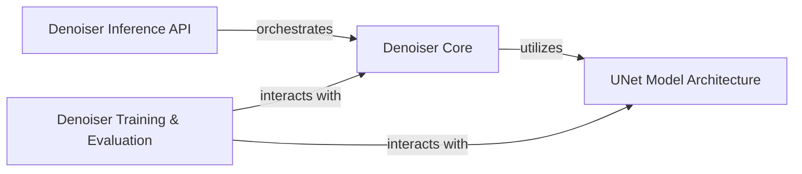

## Details

The `resemble-enhance` denoiser subsystem is structured around a core `Denoiser` component, which orchestrates the audio denoising process. This `Denoiser Core` leverages a `UNet Model Architecture` for the actual noise prediction. The system provides a `Denoiser Inference API` for applying the trained model to new audio, serving as the primary entry point for external usage. Additionally, a `Denoiser Training & Evaluation` component manages the model's lifecycle, including training, evaluation, and performance assessment, interacting with both the `Denoiser Core` and the `UNet Model Architecture`. This modular design separates the core denoising logic from the neural network architecture and the training/inference workflows, promoting maintainability and scalability.

### Denoiser Core
This component serves as the central orchestrator of the denoising process. It encapsulates the signal processing pipeline, including Short-Time Fourier Transform (STFT), Inverse STFT (ISTFT), and the separation of magnitude and phase. Its primary role is to integrate and utilize the `UNet` neural network for predicting and removing noise from audio signals. It represents the core "Model" logic of the denoising functionality.

**Related Classes/Methods**:

- <a href="https://github.com/resemble-ai/resemble-enhance/blob/main/resemble_enhance/denoiser/denoiser.py#L18-L181" target="_blank" rel="noopener noreferrer">`resemble_enhance.denoiser.denoiser.Denoiser`:18-181</a>

### UNet Model Architecture
This component is solely responsible for defining and constructing the specific UNet neural network architecture used by the denoiser. It provides the trainable backbone—the deep learning model itself—that learns to predict noise characteristics from Mel Spectrogram representations.

**Related Classes/Methods**:

- <a href="https://github.com/resemble-ai/resemble-enhance/blob/main/resemble_enhance/denoiser/unet.py#L53-L135" target="_blank" rel="noopener noreferrer">`resemble_enhance.denoiser.unet.UNet`:53-135</a>

### Denoiser Inference API
This component provides the public interface for applying a trained denoiser model to new, unseen audio data. It handles the loading of pre-trained models and orchestrates the execution of the `Denoiser Core` component for inference. This component acts as the primary entry point for external interactions, serving both the CLI tool and potential web demo integrations.

**Related Classes/Methods**:

- <a href="https://github.com/resemble-ai/resemble-enhance/blob/main/resemble_enhance/denoiser/denoiser.py" target="_blank" rel="noopener noreferrer">`resemble_enhance.denoiser.denoiser`</a>

### Denoiser Training & Evaluation
This component encompasses the functions and utilities necessary for the entire lifecycle management of the denoiser model, including training, evaluation, and performance assessment. It also handles saving processed audio during training or evaluation phases. This component directly supports the "ML Toolkit/Library" aspect by providing the infrastructure for model development and improvement.

**Related Classes/Methods**:

- <a href="https://github.com/resemble-ai/resemble-enhance/blob/main/resemble_enhance/denoiser/denoiser.py" target="_blank" rel="noopener noreferrer">`resemble_enhance.denoiser.denoiser`</a>
- <a href="https://github.com/resemble-ai/resemble-enhance/blob/main/resemble_enhance/denoiser/unet.py" target="_blank" rel="noopener noreferrer">`resemble_enhance.denoiser.unet`</a>

### [FAQ](https://github.com/CodeBoarding/GeneratedOnBoardings/tree/main?tab=readme-ov-file#faq)