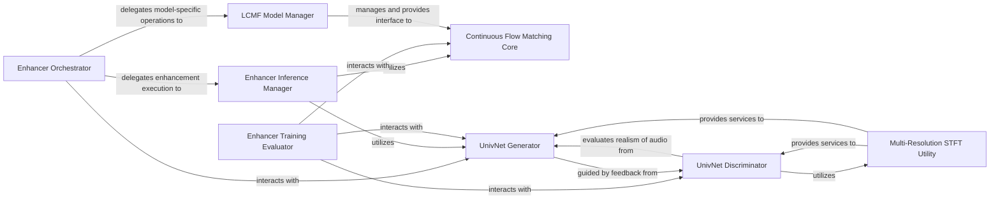

## Details

The Enhancer Model subsystem is a critical part of the resemble-enhance project, focusing on improving audio quality. It operates primarily on Mel Spectrograms and integrates various neural network architectures to achieve its goal.

### Enhancer Orchestrator
Coordinates the overall audio enhancement process. It acts as the high-level entry point, managing model loading, Mel spectrogram conversion, and integrating with other components for the enhancement pipeline.

**Related Classes/Methods**:

- <a href="https://github.com/resemble-ai/resemble-enhance/blob/main/resemble_enhance/enhancer/enhancer.py#L1-L9999" target="_blank" rel="noopener noreferrer">`resemble_enhance.enhancer.enhancer`:1-9999</a>

### Enhancer Inference Manager
Manages the inference pipeline for the enhancer model. This includes handling model loading, computing signal offsets, and merging processed audio chunks to produce the final enhanced output.

**Related Classes/Methods**:

- <a href="https://github.com/resemble-ai/resemble-enhance/blob/main/resemble_enhance/enhancer/inference.py#L1-L9999" target="_blank" rel="noopener noreferrer">`resemble_enhance.enhancer.inference`:1-9999</a>

### Enhancer Training Evaluator
Contains evaluation functions specific to the training loop of the enhancer models. Its responsibilities include saving enhanced audio for monitoring progress and calculating various metrics to assess model performance during training.

**Related Classes/Methods**:

- <a href="https://github.com/resemble-ai/resemble-enhance/blob/main/resemble_enhance/enhancer/train.py#L1-L9999" target="_blank" rel="noopener noreferrer">`resemble_enhance.enhancer.train`:1-9999</a>

### LCMF Model Manager
Manages the operational mode and state of the LCMF (Latent Continuous Flow Matching) model. It handles freezing parameters and provides access to global training steps, serving as an interface to the core LCMF model.

**Related Classes/Methods**:

- <a href="https://github.com/resemble-ai/resemble-enhance/blob/main/resemble_enhance/enhancer/lcfm/lcfm.py#L1-L9999" target="_blank" rel="noopener noreferrer">`resemble_enhance.enhancer.lcfm.lcfm`:1-9999</a>

### Continuous Flow Matching Core
Implements the core mathematical framework for Continuous Flow Matching. This primary neural network component is responsible for solving differential equations, computing various loss components, and sampling, forming the backbone of the LCMF enhancement.

**Related Classes/Methods**:

- <a href="https://github.com/resemble-ai/resemble-enhance/blob/main/resemble_enhance/enhancer/lcfm/cfm.py#L1-L9999" target="_blank" rel="noopener noreferrer">`resemble_enhance.enhancer.lcfm.cfm`:1-9999</a>

### UnivNet Generator
Serves as the generator component within the UnivNet architecture. It transforms input features (e.g., Mel spectrograms) into enhanced audio waveforms, acting as a primary neural network responsible for synthesizing the output.

**Related Classes/Methods**:

- <a href="https://github.com/resemble-ai/resemble-enhance/blob/main/resemble_enhance/enhancer/univnet/univnet.py#L1-L9999" target="_blank" rel="noopener noreferrer">`resemble_enhance.enhancer.univnet.univnet`:1-9999</a>

### UnivNet Discriminator
Functions as the discriminator in the UnivNet adversarial network. Its role is to evaluate the realism and quality of the audio generated by the UnivNet Generator against real audio samples, guiding the generator's training.

**Related Classes/Methods**:

- <a href="https://github.com/resemble-ai/resemble-enhance/blob/main/resemble_enhance/enhancer/univnet/discriminator.py#L1-L9999" target="_blank" rel="noopener noreferrer">`resemble_enhance.enhancer.univnet.discriminator`:1-9999</a>

### Multi-Resolution STFT Utility
Provides multi-resolution Short-Time Fourier Transform (STFT) capabilities. This utility is crucial for feature extraction and for defining spectral losses, particularly within the UnivNet architecture, enabling detailed frequency analysis.

**Related Classes/Methods**:

- <a href="https://github.com/resemble-ai/resemble-enhance/blob/main/resemble_enhance/enhancer/univnet/mrstft.py#L1-L9999" target="_blank" rel="noopener noreferrer">`resemble_enhance.enhancer.univnet.mrstft`:1-9999</a>

### [FAQ](https://github.com/CodeBoarding/GeneratedOnBoardings/tree/main?tab=readme-ov-file#faq)