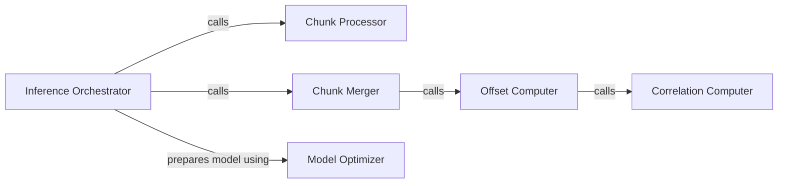

## Details

Architectural analysis of the `resemble-enhance` project's core audio enhancement functionality within the `inference` module, focusing on concrete, fully qualified code references (QNames).

### Inference Orchestrator
The top-level entry point for performing audio enhancement. It orchestrates the entire inference pipeline, including model preparation, audio chunking, processing each chunk, and merging the results.

**Related Classes/Methods**:

- <a href="https://github.com/resemble-ai/resemble-enhance/blob/main/resemble_enhance/inference.py#L123-L163" target="_blank" rel="noopener noreferrer">`resemble_enhance.inference.inference`:123-163</a>

### Chunk Processor
Processes individual segments (chunks) of audio data using the loaded ML model (Denoiser and/or Enhancer). It's the core processing unit for audio enhancement on a per-chunk basis.

**Related Classes/Methods**:

- <a href="https://github.com/resemble-ai/resemble-enhance/blob/main/resemble_enhance/inference.py#L16-L32" target="_blank" rel="noopener noreferrer">`resemble_enhance.inference.inference_chunk`:16-32</a>

### Chunk Merger
Combines processed audio chunks into a single, coherent output, ensuring proper alignment and handling overlaps. It aggregates and reconstructs the full enhanced audio from processed segments.

**Related Classes/Methods**:

- <a href="https://github.com/resemble-ai/resemble-enhance/blob/main/resemble_enhance/inference.py#L77-L112" target="_blank" rel="noopener noreferrer">`resemble_enhance.inference.merge_chunks`:77-112</a>

### Model Optimizer
Modifies the loaded deep learning model by recursively removing weight normalization layers, which is often a pre-inference optimization step to improve performance or compatibility.

**Related Classes/Methods**:

- <a href="https://github.com/resemble-ai/resemble-enhance/blob/main/resemble_enhance/inference.py#L115-L120" target="_blank" rel="noopener noreferrer">`resemble_enhance.inference.remove_weight_norm_recursively`:115-120</a>

### Offset Computer
Utility function to determine correct merging points for audio chunks, crucial for seamless reconstruction.

**Related Classes/Methods**:

- <a href="https://github.com/resemble-ai/resemble-enhance/blob/main/resemble_enhance/inference.py#L39-L74" target="_blank" rel="noopener noreferrer">`resemble_enhance.inference.compute_offset`:39-74</a>

### Correlation Computer
Utility function for correlation calculation, likely used in determining optimal chunk overlaps or alignment.

**Related Classes/Methods**:

- <a href="https://github.com/resemble-ai/resemble-enhance/blob/main/resemble_enhance/inference.py#L35-L36" target="_blank" rel="noopener noreferrer">`resemble_enhance.inference.compute_corr`:35-36</a>

### [FAQ](https://github.com/CodeBoarding/GeneratedOnBoardings/tree/main?tab=readme-ov-file#faq)