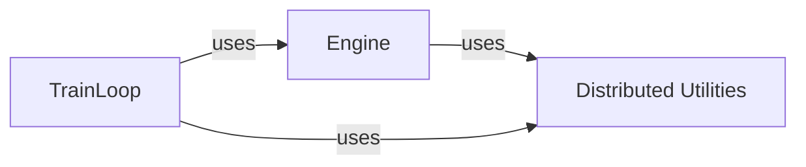

## Details

The `Training Orchestration` subsystem encompasses the core components responsible for managing the end-to-end training process of deep learning models. This includes setting up the training environment, iterating through data, handling distributed training, and managing model checkpoints. Its primary focus is on the operational aspects of model training rather than the model architecture or data preprocessing itself.

### Engine
The `Engine` component acts as the central coordinator and state manager for the entire training environment. It is responsible for initializing and managing the distributed training setup, loading and saving model checkpoints, and ensuring attribute synchronization across different distributed processes. It maintains the overall state and context of a training run.

**Related Classes/Methods**:

- <a href="https://github.com/resemble-ai/resemble-enhance/blob/main/resemble_enhance/utils/engine.py" target="_blank" rel="noopener noreferrer">`resemble_enhance.utils.engine`</a>

### TrainLoop
The `TrainLoop` component orchestrates the iterative training process. It encapsulates the core training logic, managing individual training steps (forward pass, backward pass, optimization), triggering periodic evaluation phases, handling checkpointing at specified intervals, and preparing paths for visualization outputs. It defines the sequential flow of operations within each training epoch.

**Related Classes/Methods**:

- <a href="https://github.com/resemble-ai/resemble-enhance/blob/main/resemble_enhance/utils/train_loop.py" target="_blank" rel="noopener noreferrer">`resemble_enhance.utils.train_loop`</a>

### Distributed Utilities
The `Distributed Utilities` component provides foundational utilities for setting up and managing distributed training environments. This includes initializing the distributed process group, configuring necessary environment variables, and determining the roles of different processes (e.g., local leader, global leader). It abstracts away the complexities of inter-process communication and synchronization, providing a robust environment for scalable training.

**Related Classes/Methods**:

- <a href="https://github.com/resemble-ai/resemble-enhance/blob/main/resemble_enhance/utils/distributed.py" target="_blank" rel="noopener noreferrer">`resemble_enhance.utils.distributed`</a>

### [FAQ](https://github.com/CodeBoarding/GeneratedOnBoardings/tree/main?tab=readme-ov-file#faq)