```mermaid
graph LR
    User_Interface_CLI_Web_["User Interface (CLI/Web)"]
    Configuration_Management["Configuration Management"]
    Audio_Data_Pipeline["Audio Data Pipeline"]
    Mel_Spectrogram_Processor["Mel Spectrogram Processor"]
    Denoiser_Model["Denoiser Model"]
    Enhancer_Model["Enhancer Model"]
    Training_Orchestration["Training Orchestration"]
    Inference_Orchestration["Inference Orchestration"]
    User_Interface_CLI_Web_ -- "triggers" --> Training_Orchestration
    User_Interface_CLI_Web_ -- "triggers" --> Inference_Orchestration
    Configuration_Management -- "configures" --> Audio_Data_Pipeline
    Configuration_Management -- "configures" --> Mel_Spectrogram_Processor
    Configuration_Management -- "configures" --> Denoiser_Model
    Configuration_Management -- "configures" --> Enhancer_Model
    Configuration_Management -- "configures" --> Training_Orchestration
    Configuration_Management -- "configures" --> Inference_Orchestration
    Audio_Data_Pipeline -- "supplies data to" --> Mel_Spectrogram_Processor
    Audio_Data_Pipeline -- "supplies data to" --> Training_Orchestration
    Audio_Data_Pipeline -- "supplies data to" --> Inference_Orchestration
    Inference_Orchestration -- "provides results to" --> User_Interface_CLI_Web_
    Mel_Spectrogram_Processor -- "transforms for" --> Denoiser_Model
    Mel_Spectrogram_Processor -- "transforms for" --> Enhancer_Model
    Denoiser_Model -- "outputs to" --> Mel_Spectrogram_Processor
    Enhancer_Model -- "outputs to" --> Mel_Spectrogram_Processor
    Training_Orchestration -- "manages training of" --> Denoiser_Model
    Training_Orchestration -- "manages training of" --> Enhancer_Model
    Training_Orchestration -- "feeds data to" --> Mel_Spectrogram_Processor
    Inference_Orchestration -- "utilizes" --> Denoiser_Model
    Inference_Orchestration -- "utilizes" --> Enhancer_Model
    Inference_Orchestration -- "orchestrates" --> Mel_Spectrogram_Processor
    click Audio_Data_Pipeline href "https://github.com/CodeBoarding/GeneratedOnBoardings/blob/main/resemble-enhance/Audio_Data_Pipeline.md" "Details"
    click Denoiser_Model href "https://github.com/CodeBoarding/GeneratedOnBoardings/blob/main/resemble-enhance/Denoiser_Model.md" "Details"
    click Enhancer_Model href "https://github.com/CodeBoarding/GeneratedOnBoardings/blob/main/resemble-enhance/Enhancer_Model.md" "Details"
    click Training_Orchestration href "https://github.com/CodeBoarding/GeneratedOnBoardings/blob/main/resemble-enhance/Training_Orchestration.md" "Details"
    click Inference_Orchestration href "https://github.com/CodeBoarding/GeneratedOnBoardings/blob/main/resemble-enhance/Inference_Orchestration.md" "Details"
```

## Details

The resemble-enhance project is structured around a core set of components designed for audio denoising and enhancement using deep learning. At its highest level, the system is initiated via the User Interface (CLI/Web), which serves as the primary interaction point for users to trigger either training or inference tasks. All operational parameters across the system are centrally managed by the Configuration Management component, ensuring consistent behavior. Audio data, whether for training or inference, is meticulously handled by the Audio Data Pipeline, which encompasses everything from raw file ingestion to preprocessing and batch preparation. A specialized Mel Spectrogram Processor acts as a crucial intermediary, converting audio signals into the frequency-domain representations required by the deep learning models and vice-versa. The core intelligence resides in two distinct neural network components: the Denoiser Model for noise reduction and the Enhancer Model for audio quality improvement. These models are trained and managed by the Training Orchestration component, which oversees the entire training lifecycle, including data feeding and distributed processing. For live application, the Inference Orchestration component takes charge, loading trained models, processing new audio data through the denoiser and/or enhancer, and delivering the final processed audio back to the user interface. This modular design ensures clear separation of concerns, facilitating maintainability and scalability.

### User Interface (CLI/Web)
Provides the command-line and web-based entry points for users to interact with the system, initiating training or inference tasks.

**Related Classes/Methods**:

- <a href="https://github.com/resemble-ai/resemble-enhance/blob/main/resemble_enhance/denoiser/__main__.py" target="_blank" rel="noopener noreferrer">`resemble_enhance/denoiser/__main__.py`</a>
- <a href="https://github.com/resemble-ai/resemble-enhance/blob/main/resemble_enhance/enhancer/__main__.py" target="_blank" rel="noopener noreferrer">`resemble_enhance/enhancer/__main__.py`</a>

### Configuration Management
Centralized component responsible for loading, parsing, and providing access to all system hyperparameters and configuration settings, typically from YAML files.

**Related Classes/Methods**:

- <a href="https://github.com/resemble-ai/resemble-enhance/blob/main/resemble_enhance/hparams.py" target="_blank" rel="noopener noreferrer">`resemble_enhance/hparams.py`</a>

### Audio Data Pipeline [[Expand]](./Audio_Data_Pipeline.md)
Manages the entire lifecycle of audio data, including reading raw audio files, applying preprocessing steps, and preparing data batches for training or inference.

**Related Classes/Methods**:

- <a href="https://github.com/resemble-ai/resemble-enhance/blob/main/resemble_enhance/data/dataset.py" target="_blank" rel="noopener noreferrer">`resemble_enhance/data/dataset.py`</a>
- <a href="https://github.com/resemble-ai/resemble-enhance/blob/main/resemble_enhance/data/distorter/" target="_blank" rel="noopener noreferrer">`resemble_enhance/data/distorter/`</a>
- <a href="https://github.com/resemble-ai/resemble-enhance/blob/main/resemble_enhance/data/utils.py" target="_blank" rel="noopener noreferrer">`resemble_enhance/data/utils.py`</a>

### Mel Spectrogram Processor
A dedicated utility for transforming time-domain audio signals into frequency-domain Mel Spectrograms and vice-versa, serving as a crucial intermediary for the deep learning models.

**Related Classes/Methods**:

- <a href="https://github.com/resemble-ai/resemble-enhance/blob/main/resemble_enhance/melspec.py" target="_blank" rel="noopener noreferrer">`resemble_enhance/melspec.py`</a>

### Denoiser Model [[Expand]](./Denoiser_Model.md)
The primary neural network component focused on removing noise from audio signals, operating on Mel Spectrogram representations.

**Related Classes/Methods**:

- <a href="https://github.com/resemble-ai/resemble-enhance/blob/main/resemble_enhance/denoiser/denoiser.py" target="_blank" rel="noopener noreferrer">`resemble_enhance/denoiser/denoiser.py`</a>
- <a href="https://github.com/resemble-ai/resemble-enhance/blob/main/resemble_enhance/denoiser/unet.py" target="_blank" rel="noopener noreferrer">`resemble_enhance/denoiser/unet.py`</a>
- <a href="https://github.com/resemble-ai/resemble-enhance/blob/main/resemble_enhance/denoiser/inference.py" target="_blank" rel="noopener noreferrer">`resemble_enhance/denoiser/inference.py`</a>
- <a href="https://github.com/resemble-ai/resemble-enhance/blob/main/resemble_enhance/denoiser/train.py" target="_blank" rel="noopener noreferrer">`resemble_enhance/denoiser/train.py`</a>

### Enhancer Model [[Expand]](./Enhancer_Model.md)
The primary neural network component responsible for enhancing the quality and clarity of audio signals, often applied after denoising, also operating on Mel Spectrograms.

**Related Classes/Methods**:

- <a href="https://github.com/resemble-ai/resemble-enhance/blob/main/resemble_enhance/enhancer/enhancer.py" target="_blank" rel="noopener noreferrer">`resemble_enhance/enhancer/enhancer.py`</a>
- <a href="https://github.com/resemble-ai/resemble-enhance/blob/main/resemble_enhance/enhancer/lcfm/" target="_blank" rel="noopener noreferrer">`resemble_enhance/enhancer/lcfm/`</a>
- <a href="https://github.com/resemble-ai/resemble-enhance/blob/main/resemble_enhance/enhancer/univnet/" target="_blank" rel="noopener noreferrer">`resemble_enhance/enhancer/univnet/`</a>
- <a href="https://github.com/resemble-ai/resemble-enhance/blob/main/resemble_enhance/enhancer/inference.py" target="_blank" rel="noopener noreferrer">`resemble_enhance/enhancer/inference.py`</a>
- <a href="https://github.com/resemble-ai/resemble-enhance/blob/main/resemble_enhance/enhancer/train.py" target="_blank" rel="noopener noreferrer">`resemble_enhance/enhancer/train.py`</a>

### Training Orchestration [[Expand]](./Training_Orchestration.md)
Manages the end-to-end training process for the deep learning models, including data iteration, distributed training setup, and checkpoint management.

**Related Classes/Methods**:

- <a href="https://github.com/resemble-ai/resemble-enhance/blob/main/resemble_enhance/utils/engine.py" target="_blank" rel="noopener noreferrer">`resemble_enhance/utils/engine.py`</a>
- <a href="https://github.com/resemble-ai/resemble-enhance/blob/main/resemble_enhance/utils/train_loop.py" target="_blank" rel="noopener noreferrer">`resemble_enhance/utils/train_loop.py`</a>
- <a href="https://github.com/resemble-ai/resemble-enhance/blob/main/resemble_enhance/utils/distributed.py" target="_blank" rel="noopener noreferrer">`resemble_enhance/utils/distributed.py`</a>

### Inference Orchestration [[Expand]](./Inference_Orchestration.md)
Oversees the process of running trained models on new audio data, handling model loading, audio chunking, processing through the Denoiser and/or Enhancer, and merging results.

**Related Classes/Methods**:

- <a href="https://github.com/resemble-ai/resemble-enhance/blob/main/resemble_enhance/inference.py" target="_blank" rel="noopener noreferrer">`resemble_enhance/inference.py`</a>

### [FAQ](https://github.com/CodeBoarding/GeneratedOnBoardings/tree/main?tab=readme-ov-file#faq)