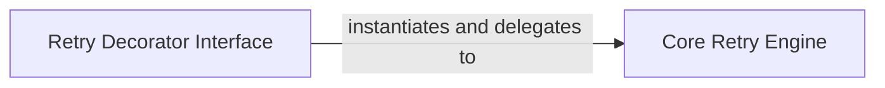

## Details

The `retrying` library provides a robust mechanism for adding retry capabilities to Python functions. At its core, the `Retry Decorator Interface` (`retrying.retry`) serves as the primary entry entry point, allowing developers to easily apply retry logic using a decorator pattern. This decorator, in turn, instantiates and delegates the actual retry orchestration to the `Core Retry Engine` (`retrying.Retrying`). The `Core Retry Engine` is responsible for managing the retry loop, handling exceptions, and applying configured stop and wait strategies, ensuring fault tolerance for the decorated functions.

### Retry Decorator Interface [[Expand]](./Retry_Decorator_Interface.md)
The public API for applying retry logic to functions. It acts as the entry point for users to configure retry behavior. This component embodies the Decorator Pattern, providing a clean and idiomatic Pythonic way to enhance function behavior without modifying their source code.

**Related Classes/Methods**:

- <a href="https://github.com/rholder/retrying/blob/master/retrying.py#L32-L59" target="_blank" rel="noopener noreferrer">`retrying.retry`:32-59</a>

### Core Retry Engine
Handles the internal orchestration of the retry loop, exception handling, and application of stop/wait strategies. This component is the heart of the library, implementing the fault tolerance logic. It acts as the central coordinator for all retry-related operations.

**Related Classes/Methods**:

- <a href="https://github.com/rholder/retrying/blob/master/retrying.py#L62-L250" target="_blank" rel="noopener noreferrer">`retrying.Retrying`:62-250</a>

### [FAQ](https://github.com/CodeBoarding/GeneratedOnBoardings/tree/main?tab=readme-ov-file#faq)