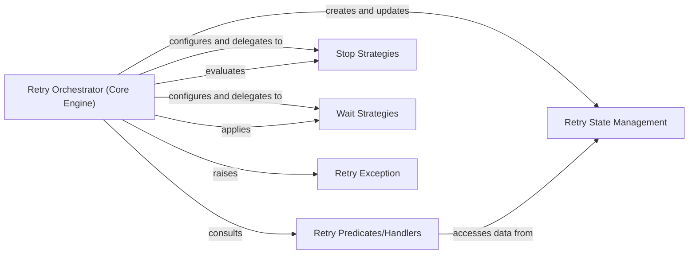

## Details

The `retrying` subsystem provides a robust and flexible mechanism for automatically re-attempting failed operations. At its core, the **Retry Orchestrator (Core Engine)** (`retrying.Retrying`) acts as a decorator, managing the entire retry lifecycle. It integrates **Stop Strategies** to define termination conditions and **Wait Strategies** to control inter-attempt delays. **Retry Predicates/Handlers** determine if a retry is necessary based on the outcome of each attempt, leveraging data from **Retry State Management** (`retrying.Attempt`). Should all retry attempts fail, the system signals this definitive failure by raising a **Retry Exception** (`retrying.RetryError`). This architecture ensures configurable and resilient execution of potentially flaky operations.

### Retry Orchestrator (Core Engine)
Initializes the retry mechanism with configured strategies, wraps the target function, and manages the retry loop. It invokes the function, evaluates retry conditions, applies wait strategies, and handles exceptions.

**Related Classes/Methods**:

- <a href="https://github.com/rholder/retrying/blob/master/retrying.py#L62-L250" target="_blank" rel="noopener noreferrer">`retrying.Retrying`:62-250</a>

### Retry Predicates/Handlers
Define the conditions under which a retry should occur. They evaluate the outcome of a function call (result or exception) against predefined criteria to determine if the current attempt should be rejected, triggering another retry.

**Related Classes/Methods**:

### Stop Strategies
Provide various mechanisms to terminate the retry process, preventing infinite loops. Examples include stopping after a certain number of attempts or a maximum elapsed time.

**Related Classes/Methods**:

### Wait Strategies
Define the duration to pause between retry attempts. These strategies implement different backoff algorithms (e.g., fixed, random, exponential) to manage the pacing of retries.

**Related Classes/Methods**:

### Retry State Management
Encapsulates the state of a single retry attempt, including the attempt number, the result or exception from the function call, and whether an exception occurred.

**Related Classes/Methods**:

- <a href="https://github.com/rholder/retrying/blob/master/retrying.py#L253-L283" target="_blank" rel="noopener noreferrer">`retrying.Attempt`:253-283</a>

### Retry Exception
A custom exception (`RetryError`) raised when the retry mechanism fails to achieve a successful outcome after exhausting all attempts or meeting a stop condition.

**Related Classes/Methods**:

- <a href="https://github.com/rholder/retrying/blob/master/retrying.py#L286-L295" target="_blank" rel="noopener noreferrer">`retrying.RetryError`:286-295</a>

### [FAQ](https://github.com/CodeBoarding/GeneratedOnBoardings/tree/main?tab=readme-ov-file#faq)