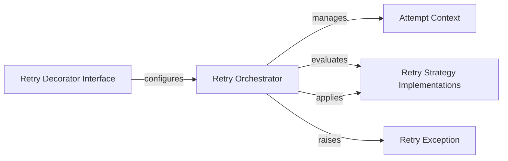

## Details

The `retrying` library provides a robust mechanism for adding retry logic to Python functions. At its core, the `Retry Decorator Interface` serves as the primary entry point, allowing developers to easily configure retry behavior for their functions. This decorator, in turn, `configures` the `Retry Orchestrator`, which is the central component responsible for managing the entire retry lifecycle. The `Retry Orchestrator` `manages` the `Attempt Context`, which encapsulates the state of each individual function execution attempt. During the retry process, the `Orchestrator` `evaluates` various `Retry Strategy Implementations` (e.g., stop conditions, retry conditions) to determine if another attempt is warranted. If so, it `applies` other `Retry Strategy Implementations` (e.g., wait intervals) before the next attempt. Should all retry attempts be exhausted without success, the `Retry Orchestrator` `raises` a `Retry Exception`, signaling the ultimate failure of the decorated operation. This modular design ensures clear separation of concerns, making the retry mechanism flexible and extensible.

### Retry Decorator Interface [[Expand]](./Retry_Decorator_Interface.md)
The public API for applying retry logic to functions. It acts as the entry point for users to configure retry behavior.

**Related Classes/Methods**:

- <a href="https://github.com/rholder/retrying/blob/master/retrying.py#L32-L59" target="_blank" rel="noopener noreferrer">`retrying.retry`:32-59</a>

### Retry Orchestrator [[Expand]](./Retry_Orchestrator.md)
The central engine that manages the entire retry lifecycle, including the retry loop, function invocation, and application of strategies.

**Related Classes/Methods**:

- <a href="https://github.com/rholder/retrying/blob/master/retrying.py#L62-L250" target="_blank" rel="noopener noreferrer">`retrying.Retrying`:62-250</a>

### Attempt Context
A data structure that encapsulates the state of a single execution attempt of the decorated function.

**Related Classes/Methods**:

- <a href="https://github.com/rholder/retrying/blob/master/retrying.py#L253-L283" target="_blank" rel="noopener noreferrer">`retrying.Attempt`:253-283</a>

### Retry Strategy Implementations
A collection of pluggable components that define the conditions for stopping retries, the duration of pauses between retries, and the criteria for triggering a retry.

**Related Classes/Methods**:

- <a href="https://github.com/rholder/retrying/blob/master/retrying.py#L26-L29" target="_blank" rel="noopener noreferrer">`retrying._retry_if_exception_of_type`:26-29</a>

### Retry Exception
A custom exception raised when all retry attempts have been exhausted and the decorated function still fails.

**Related Classes/Methods**:

- <a href="https://github.com/rholder/retrying/blob/master/retrying.py#L286-L295" target="_blank" rel="noopener noreferrer">`retrying.RetryError`:286-295</a>

### [FAQ](https://github.com/CodeBoarding/GeneratedOnBoardings/tree/main?tab=readme-ov-file#faq)