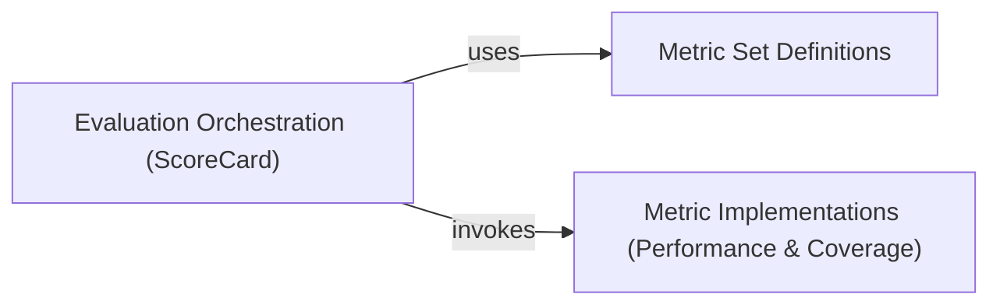

## Details

These components are fundamental because they represent a clear separation of concerns in the evaluation toolkit: What to evaluate (Metric Set Definitions), How to evaluate (Metric Implementations), and Orchestrating the evaluation (Evaluation Orchestration). This modular design aligns perfectly with the "Machine Learning/Data Science Utility Library" pattern, emphasizing reusability, extensibility, and a clear, intuitive API for users.

### Evaluation Orchestration (ScoreCard)
This is the core component responsible for driving the evaluation process. It takes input data and a defined set of metrics, computes the scores, and aggregates them into a structured scorecard. It acts as a facade, simplifying the interaction with various metric implementations and metric sets. `CoverageScoreCard` extends `ScoreCard` to specifically handle coverage-related evaluations.

**Related Classes/Methods**:

- <a href="https://github.com/AstraZeneca/rexmex/blob/main/rexmex/scorecard.py#L13-L93" target="_blank" rel="noopener noreferrer">`rexmex.scorecard.ScoreCard` (13:93)</a>
- <a href="https://github.com/AstraZeneca/rexmex/blob/main/rexmex/scorecard.py#L96-L158" target="_blank" rel="noopener noreferrer">`rexmex.scorecard.CoverageScoreCard` (96:158)</a>

### Metric Set Definitions
This component defines collections of metrics that can be applied together for a specific evaluation context (e.g., classification, ranking, coverage, rating). Classes like `rexmex.metricset.ClassificationMetricSet`, `CoverageMetricSet`, `RankingMetricSet`, and `RatingMetricSet` (all inheriting from `rexmex.metricset.MetricSet`) encapsulate these predefined sets.

**Related Classes/Methods**:

- <a href="https://github.com/AstraZeneca/rexmex/blob/main/rexmex/metricset.py#L77-L108" target="_blank" rel="noopener noreferrer">`rexmex.metricset.ClassificationMetricSet` (77:108)</a>
- <a href="https://github.com/AstraZeneca/rexmex/blob/main/rexmex/metricset.py#L151-L166" target="_blank" rel="noopener noreferrer">`rexmex.metricset.CoverageMetricSet` (151:166)</a>
- <a href="https://github.com/AstraZeneca/rexmex/blob/main/rexmex/metricset.py#L169-L179" target="_blank" rel="noopener noreferrer">`rexmex.metricset.RankingMetricSet` (169:179)</a>
- <a href="https://github.com/AstraZeneca/rexmex/blob/main/rexmex/metricset.py#L111-L148" target="_blank" rel="noopener noreferrer">`rexmex.metricset.RatingMetricSet` (111:148)</a>
- <a href="https://github.com/AstraZeneca/rexmex/blob/main/rexmex/metricset.py#L16-L74" target="_blank" rel="noopener noreferrer">`rexmex.metricset.MetricSet` (16:74)</a>

### Metric Implementations (Performance & Coverage)
These components provide the concrete algorithms and functions for calculating individual performance and coverage metrics. Examples include metrics found within `rexmex.metrics.performance` (e.g., precision, recall) and `rexmex.metrics.coverage` (e.g., catalog coverage, diversity).

**Related Classes/Methods**:

- `rexmex.metrics.performance` (-1:-1)
- <a href="https://github.com/AstraZeneca/rexmex/blob/main/rexmex/metrics/coverage.py#L-1-L-1" target="_blank" rel="noopener noreferrer">`rexmex.metrics.coverage` (-1:-1)</a>

### [FAQ](https://github.com/CodeBoarding/GeneratedOnBoardings/tree/main?tab=readme-ov-file#faq)