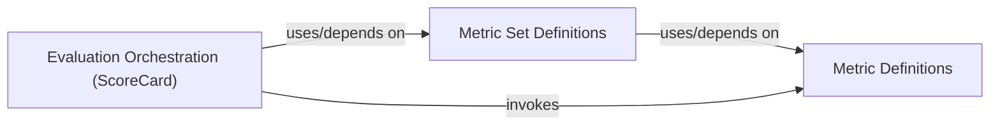

## Details

Abstract Components Overview of rexmex project

### Metric Definitions [[Expand]](./Metric_Definitions.md)
This component provides the concrete implementations of individual evaluation metrics. It's the foundational layer for all quantitative assessments within rexmex, housing the algorithms for various metric types.

**Related Classes/Methods**:

- `rexmex.metrics` (1:1)
- <a href="https://github.com/AstraZeneca/rexmex/blob/main/rexmex/metrics/classification.py#L1-L1" target="_blank" rel="noopener noreferrer">`rexmex.metrics.classification` (1:1)</a>
- <a href="https://github.com/AstraZeneca/rexmex/blob/main/rexmex/metrics/ranking.py#L1-L1" target="_blank" rel="noopener noreferrer">`rexmex.metrics.ranking` (1:1)</a>
- <a href="https://github.com/AstraZeneca/rexmex/blob/main/rexmex/metrics/rating.py#L1-L1" target="_blank" rel="noopener noreferrer">`rexmex.metrics.rating` (1:1)</a>
- <a href="https://github.com/AstraZeneca/rexmex/blob/main/rexmex/metrics/coverage.py#L1-L1" target="_blank" rel="noopener noreferrer">`rexmex.metrics.coverage` (1:1)</a>

### Metric Set Definitions
This component defines collections of related metrics, allowing for the evaluation of specific aspects of recommender systems (e.g., a set of classification metrics). It leverages the individual metric implementations from Metric Definitions.

**Related Classes/Methods**:

- <a href="https://github.com/AstraZeneca/rexmex/blob/main/rexmex/metricset.py#L1-L1" target="_blank" rel="noopener noreferrer">`rexmex.metricset` (1:1)</a>

### Evaluation Orchestration (ScoreCard)
This component is responsible for orchestrating the evaluation process. It takes metric sets and data, computes the metrics, and generates comprehensive reports or scorecards.

**Related Classes/Methods**:

- <a href="https://github.com/AstraZeneca/rexmex/blob/main/rexmex/scorecard.py#L1-L1" target="_blank" rel="noopener noreferrer">`rexmex.scorecard` (1:1)</a>

### [FAQ](https://github.com/CodeBoarding/GeneratedOnBoardings/tree/main?tab=readme-ov-file#faq)